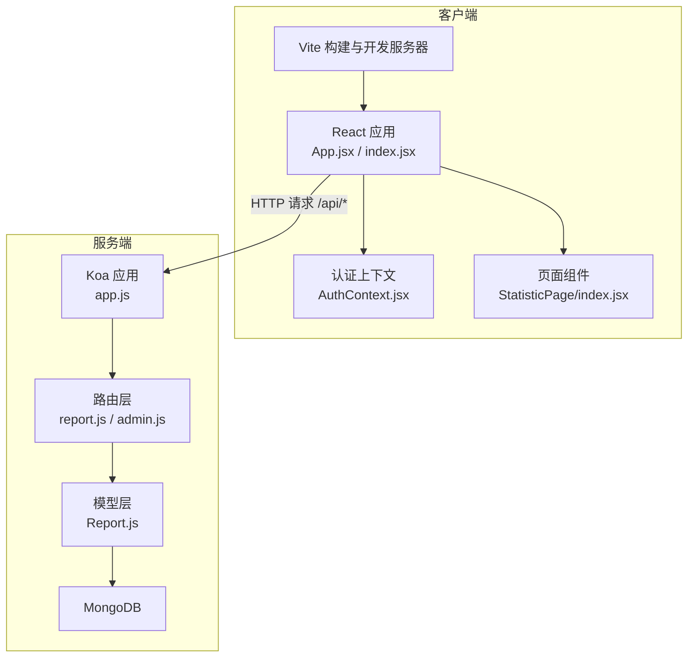
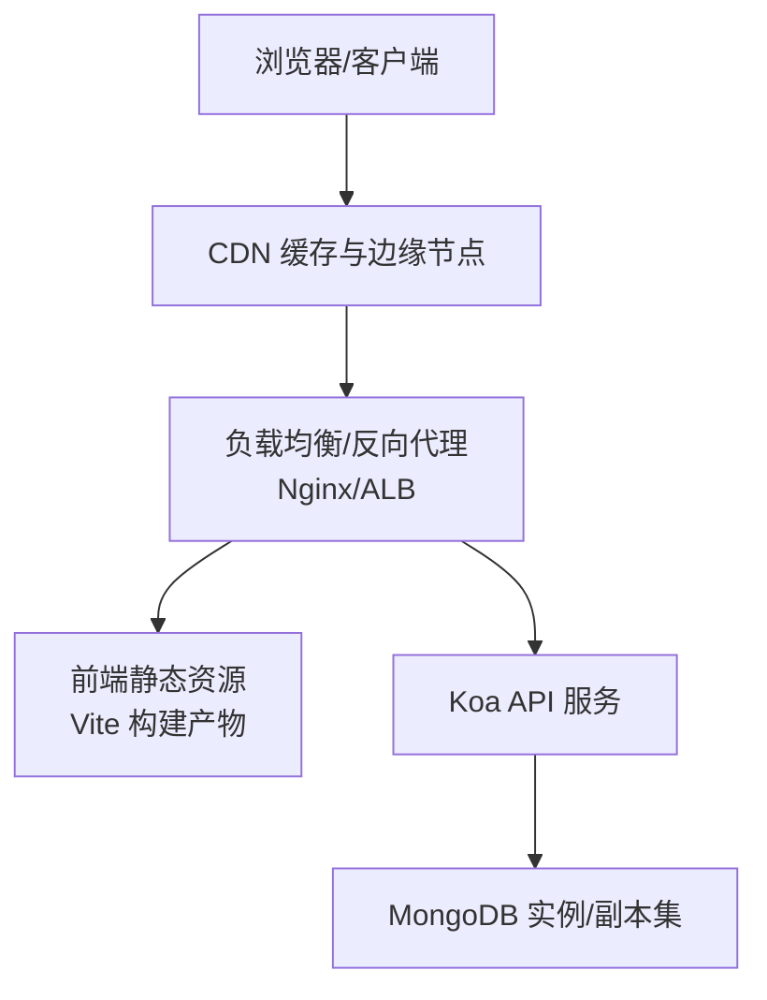
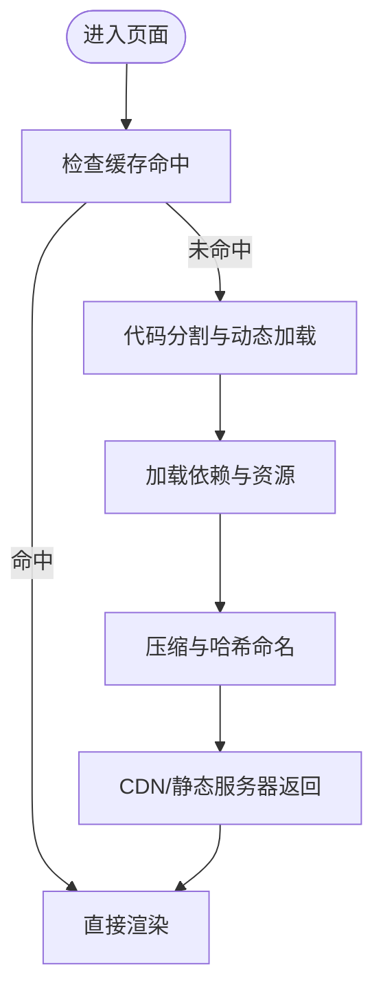
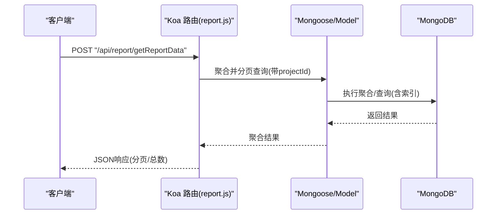
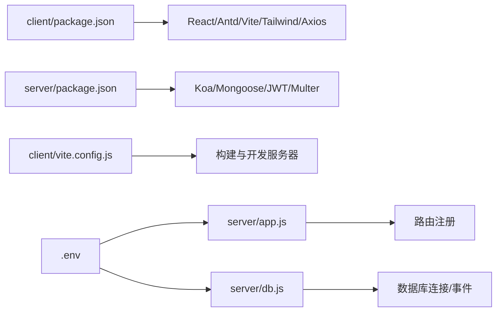

# 生产环境优化

<cite>
**本文引用的文件**
- [README.md](file://README.md)
- [client/package.json](file://client/package.json)
- [client/vite.config.js](file://client/vite.config.js)
- [client/src/App.jsx](file://client/src/App.jsx)
- [client/src/index.jsx](file://client/src/index.jsx)
- [client/public/manifest.json](file://client/public/manifest.json)
- [client/src/context/AuthContext.jsx](file://client/src/context/AuthContext.jsx)
- [client/src/pages/StatisticPage/index.jsx](file://client/src/pages/StatisticPage/index.jsx)
- [server/package.json](file://server/package.json)
- [server/app.js](file://server/app.js)
- [server/db.js](file://server/db.js)
- [server/.env](file://server/.env)
- [server/routes/report.js](file://server/routes/report.js)
- [server/models/Report.js](file://server/models/Report.js)
- [server/routes/admin.js](file://server/routes/admin.js)
</cite>

## 目录
1. [简介](#简介)
2. [项目结构](#项目结构)
3. [核心组件](#核心组件)
4. [架构总览](#架构总览)
5. [详细组件分析](#详细组件分析)
6. [依赖关系分析](#依赖关系分析)
7. [性能考虑](#性能考虑)
8. [故障排查指南](#故障排查指南)
9. [结论](#结论)
10. [附录](#附录)

## 简介
本指南面向WoaX生产环境的系统化优化，覆盖前端性能优化（代码分割、懒加载、资源压缩与缓存）、后端性能调优（数据库索引、连接池与内存管理）、CDN与静态资源托管、网络优化、监控与基准测试、安全加固与访问控制、容量规划与扩展性设计以及灾难恢复方案。文档基于仓库现有实现进行分析，并提出可落地的优化建议。

## 项目结构
WoaX采用前后端分离架构：前端使用Vite构建的React应用，后端使用Koa框架配合MongoDB。前端通过代理将/api前缀转发至后端；后端提供REST风格接口，负责业务路由与数据持久化。

**图示来源**
- [client/vite.config.js](file://client/vite.config.js#L1-L50)
- [client/src/App.jsx](file://client/src/App.jsx#L1-L253)
- [client/src/index.jsx](file://client/src/index.jsx#L1-L15)
- [client/src/context/AuthContext.jsx](file://client/src/context/AuthContext.jsx#L1-L155)
- [client/src/pages/StatisticPage/index.jsx](file://client/src/pages/StatisticPage/index.jsx#L1-L262)
- [server/app.js](file://server/app.js#L1-L61)
- [server/routes/report.js](file://server/routes/report.js#L1-L271)
- [server/models/Report.js](file://server/models/Report.js#L1-L22)

**章节来源**
- [README.md](file://README.md#L1-L44)
- [client/package.json](file://client/package.json#L1-L47)
- [client/vite.config.js](file://client/vite.config.js#L1-L50)
- [server/package.json](file://server/package.json#L1-L24)
- [server/app.js](file://server/app.js#L1-L61)

## 核心组件
- 前端应用
  - 入口与路由：React应用入口与BrowserRouter包裹，App负责菜单、项目切换与页面路由。
  - 认证体系：Axios请求拦截器统一注入Bearer Token；AuthContext提供登录弹窗、令牌校验与登出。
  - 页面与数据：StatisticPage负责聚合查询、分页与图表数据拉取，同时支持用户详情查看与删除。
- 后端服务
  - 应用与中间件：Koa应用注册CORS、bodyParser；静态文件服务处理/uploads路径；路由挂载于/api前缀。
  - 数据访问：Mongoose连接MongoDB；Report模型定义字段与集合；路由实现聚合分页、用户明细、上报与删除等接口。
  - 管理员鉴权：JWT签发与校验，受保护路由通过verifyAdmin中间件。

**章节来源**
- [client/src/index.jsx](file://client/src/index.jsx#L1-L15)
- [client/src/App.jsx](file://client/src/App.jsx#L1-L253)
- [client/src/context/AuthContext.jsx](file://client/src/context/AuthContext.jsx#L1-L155)
- [client/src/pages/StatisticPage/index.jsx](file://client/src/pages/StatisticPage/index.jsx#L1-L262)
- [server/app.js](file://server/app.js#L1-L61)
- [server/routes/report.js](file://server/routes/report.js#L1-L271)
- [server/models/Report.js](file://server/models/Report.js#L1-L22)
- [server/routes/admin.js](file://server/routes/admin.js#L1-L128)

## 架构总览
生产部署建议采用反向代理（如Nginx）前置，统一处理HTTPS、压缩、缓存与健康检查；静态资源由CDN分发；后端以容器化方式部署，启用连接池与内存限制；数据库独立运维，配置副本集与备份策略。

[本图为概念性架构示意，不直接映射具体源码文件，故无“图示来源”]

## 详细组件分析

### 前端性能优化（Vite + React）
- 代码分割与懒加载
  - 将大型页面或图表组件拆分为独立模块，结合动态import实现按需加载，减少首屏体积。
  - 对于路由级页面（如StatisticPage），可进一步拆分子组件并在需要时再加载。
- 资源压缩与打包
  - 使用Vite默认的esbuild压缩JS与CSS；生产构建开启压缩与资源哈希命名，便于长期缓存。
  - 合理配置postcss与Tailwind，避免引入冗余样式。
- 缓存策略
  - 静态资源采用强缓存（immutable）策略；HTML与动态接口设置合理的Cache-Control。
  - PWA清单文件用于离线与快速启动，建议在CDN上开启缓存。
- 网络优化
  - 启用Gzip/Brotli压缩；合理设置HTTP/2多路复用；将第三方依赖CDN化以降低首字节时间。
- 可观测性
  - 在构建阶段输出bundle分析报告，识别大体积依赖；对关键路由与组件埋点首屏耗时。

**图示来源**
- [client/vite.config.js](file://client/vite.config.js#L1-L50)
- [client/src/pages/StatisticPage/index.jsx](file://client/src/pages/StatisticPage/index.jsx#L1-L262)
- [client/public/manifest.json](file://client/public/manifest.json#L1-L25)

**章节来源**
- [client/package.json](file://client/package.json#L1-L47)
- [client/vite.config.js](file://client/vite.config.js#L1-L50)
- [client/src/pages/StatisticPage/index.jsx](file://client/src/pages/StatisticPage/index.jsx#L1-L262)
- [client/public/manifest.json](file://client/public/manifest.json#L1-L25)

### 后端性能调优（Koa + MongoDB）
- 数据库索引优化
  - 在Report集合上为常用查询字段建立复合索引：projectId + username + timestamp，以加速聚合与分页。
  - 对设备信息、版本号等高频过滤字段建立单列索引，提升筛选效率。
- 连接池配置
  - Mongoose连接池参数：设置合适的最大连接数、空闲超时与重试策略；在容器环境中根据CPU/内存限制合理分配。
  - 后端进程数建议与CPU核数匹配，启用PM2或Docker健康检查与自动重启。
- 内存管理
  - 对聚合管道使用allowDiskUse与分批处理，避免大聚合导致内存峰值过高。
  - 控制单次查询返回的数据量上限，结合分页参数防止OOM。
- 中间件与路由
  - 仅在必要时启用CORS与bodyParser；对静态文件路径明确白名单，避免不必要的中间件链路。
  - 对受保护接口启用verifyAdmin中间件，减少重复鉴权逻辑。

**图示来源**
- [server/routes/report.js](file://server/routes/report.js#L1-L271)
- [server/models/Report.js](file://server/models/Report.js#L1-L22)

**章节来源**
- [server/routes/report.js](file://server/routes/report.js#L1-L271)
- [server/models/Report.js](file://server/models/Report.js#L1-L22)
- [server/db.js](file://server/db.js#L1-L45)

### CDN配置与静态资源托管
- 静态资源分发
  - 将Vite构建产物上传至CDN，开启全球边缘缓存与回源压缩；对图片、字体、脚本设置不同TTL。
- 版本化与缓存失效
  - 采用文件名哈希策略；更新时通过新URL发布，旧URL自动过期。
- 边缘计算
  - 使用边缘函数进行简单A/B测试、头部改写与安全头注入。

[本节为通用实践说明，不直接分析具体源码文件，故无“章节来源”]

### 网络优化技术
- TLS与证书
  - 使用Let’s Encrypt自动续期；启用HSTS与现代加密套件。
- 压缩与传输
  - 启用Brotli压缩；HTTP/2多路复用；合理设置Keep-Alive。
- 跨域与安全头
  - CORS白名单与安全头（X-Frame-Options、X-Content-Type-Options、Content-Security-Policy）。

[本节为通用实践说明，不直接分析具体源码文件，故无“章节来源”]

### 监控指标与基准测试
- 指标体系
  - 前端：首屏时间、交互就绪时间、缓存命中率、错误率；后端：请求延迟P95/P99、吞吐量、连接数、慢查询、内存与CPU使用率。
- 基准测试
  - 使用Artillery/JMeter模拟并发场景；针对聚合接口与静态资源分别压测。
- 瓶颈分析
  - 结合APM（如Jaeger/Zipkin）追踪请求链路；定位数据库慢查询与热点路由。

[本节为通用实践说明，不直接分析具体源码文件，故无“章节来源”]

### 安全加固与访问控制
- 认证与授权
  - JWT令牌有效期与刷新策略；对敏感操作（删除、上报）强制管理员权限；令牌存储于HttpOnly Cookie或安全存储。
- 输入校验与限流
  - 对所有输入参数进行严格校验；对登录与鉴权接口启用速率限制与IP封禁。
- 传输与存储
  - 强制HTTPS；数据库连接使用TLS；敏感配置置于环境变量或密钥管理服务。

**章节来源**
- [server/routes/admin.js](file://server/routes/admin.js#L1-L128)
- [client/src/context/AuthContext.jsx](file://client/src/context/AuthContext.jsx#L1-L155)

### 容量规划、扩展性与灾备
- 容量规划
  - 依据QPS与数据增长预测，评估CPU、内存、磁盘与网络带宽需求；前端静态资源由CDN承载，后端API按需扩容。
- 扩展性设计
  - 无状态服务；水平扩展API节点；数据库读写分离与副本集；队列异步处理非关键任务。
- 灾难恢复
  - 数据库定期备份与异地容灾；CDN缓存回源策略；服务端健康检查与自动故障转移。

[本节为通用实践说明，不直接分析具体源码文件，故无“章节来源”]

## 依赖关系分析
- 前端依赖
  - React、React Router、Ant Design、Axios、Vite、TailwindCSS等；构建脚本与代理配置位于package.json与vite.config.js。
- 后端依赖
  - Koa、Koa Router、Koa BodyParser、CORS、Mongoose、JWT、Multer等；数据库连接与进程生命周期在db.js与app.js中集中管理。
- 环境变量
  - 服务器端口、数据库URI、上传目录与文件大小限制在.env中配置。

**图示来源**
- [client/package.json](file://client/package.json#L1-L47)
- [client/vite.config.js](file://client/vite.config.js#L1-L50)
- [server/package.json](file://server/package.json#L1-L24)
- [server/app.js](file://server/app.js#L1-L61)
- [server/db.js](file://server/db.js#L1-L45)
- [server/.env](file://server/.env#L1-L9)

**章节来源**
- [client/package.json](file://client/package.json#L1-L47)
- [client/vite.config.js](file://client/vite.config.js#L1-L50)
- [server/package.json](file://server/package.json#L1-L24)
- [server/app.js](file://server/app.js#L1-L61)
- [server/db.js](file://server/db.js#L1-L45)
- [server/.env](file://server/.env#L1-L9)

## 性能考虑
- 前端
  - 优先采用动态import进行页面级懒加载；对图表与富文本组件按需加载；启用长缓存与资源预加载策略。
  - 通过Vite的optimizeDeps与esbuild配置减少依赖体积与编译时间。
- 后端
  - 为高频查询字段建立索引；聚合查询分页与限制返回条数；连接池参数与进程数匹配硬件资源。
  - 对静态资源走CDN，减少后端I/O压力；对上传文件设置大小限制与类型校验。
- 网络
  - 启用压缩与HTTP/2；合理设置缓存头；跨域与安全头最小化暴露面。

[本节提供通用指导，不直接分析具体源码文件，故无“章节来源”]

## 故障排查指南
- 前端
  - 检查代理配置是否正确转发/api；确认Axios拦截器是否注入了Authorization头；查看浏览器Network面板与Console错误。
- 后端
  - 关注数据库连接日志与错误事件；检查路由注册顺序与静态文件中间件执行顺序；验证JWT密钥与过期时间。
- 通用
  - 启用详细的日志与错误追踪；对慢查询与高延迟接口进行采样分析；确保CDN缓存策略与回源规则一致。

**章节来源**
- [client/src/App.jsx](file://client/src/App.jsx#L1-L253)
- [client/src/context/AuthContext.jsx](file://client/src/context/AuthContext.jsx#L1-L155)
- [server/app.js](file://server/app.js#L1-L61)
- [server/db.js](file://server/db.js#L1-L45)

## 结论
WoaX具备清晰的前后端分层与基础鉴权能力。生产优化应围绕前端资源治理、后端数据库与连接池优化、CDN与网络策略、可观测性与安全加固展开。通过合理的容量规划与灾备机制，可显著提升系统稳定性与用户体验。

## 附录
- 快速检查清单
  - 前端：启用动态import、长缓存、压缩与哈希；CDN配置与回源策略；PWA清单生效。
  - 后端：数据库索引齐全、连接池参数合理、JWT安全配置、静态文件安全白名单。
  - 运维：健康检查、自动重启、备份与监控告警、应急演练。

[本节为通用实践说明，不直接分析具体源码文件，故无“章节来源”]