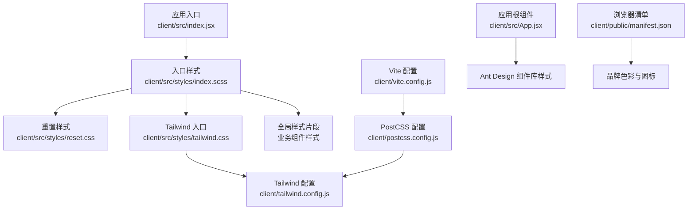
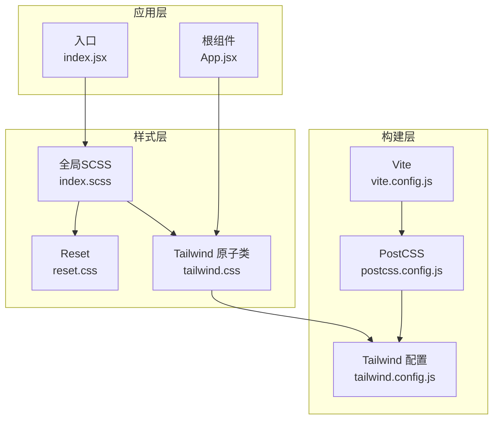
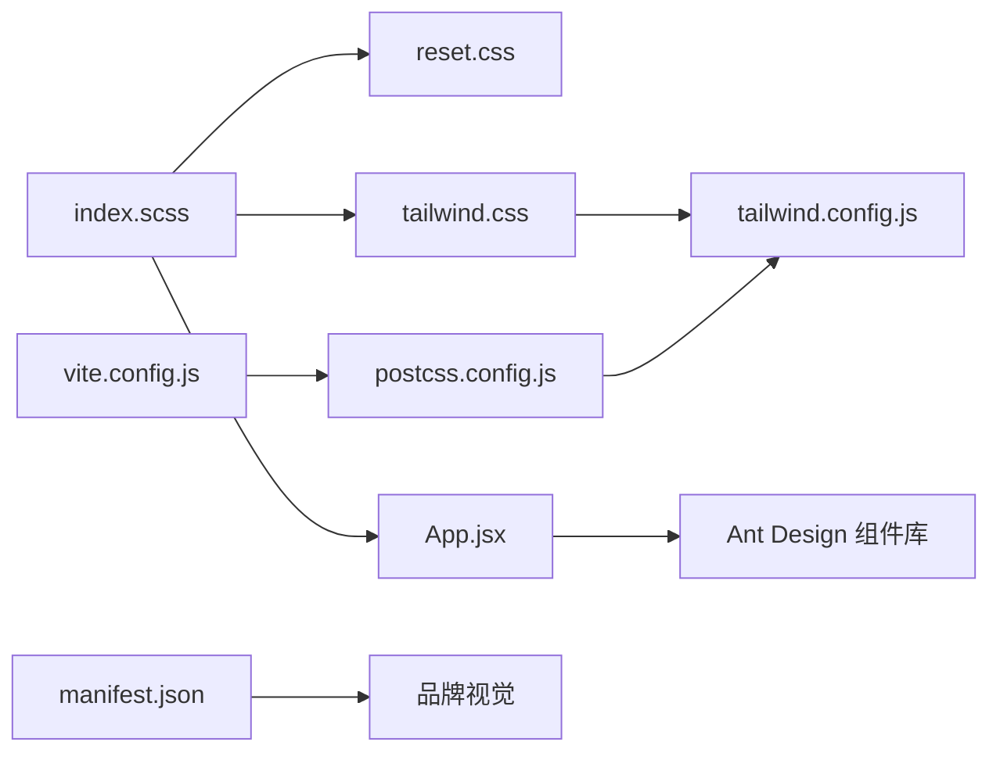

# 样式与主题

<cite>
**本文引用的文件**
- [client/src/styles/index.scss](file://client/src/styles/index.scss)
- [client/src/styles/reset.css](file://client/src/styles/reset.css)
- [client/src/styles/tailwind.css](file://client/src/styles/tailwind.css)
- [client/tailwind.config.js](file://client/tailwind.config.js)
- [client/postcss.config.js](file://client/postcss.config.js)
- [client/vite.config.js](file://client/vite.config.js)
- [client/package.json](file://client/package.json)
- [client/src/App.jsx](file://client/src/App.jsx)
- [client/src/index.jsx](file://client/src/index.jsx)
- [client/src/pages/StatisticPage/index.jsx](file://client/src/pages/StatisticPage/index.jsx)
- [client/src/context/AuthContext.jsx](file://client/src/context/AuthContext.jsx)
- [client/public/manifest.json](file://client/public/manifest.json)
</cite>

## 目录
1. [引言](#引言)
2. [项目结构](#项目结构)
3. [核心组件](#核心组件)
4. [架构总览](#架构总览)
5. [详细组件分析](#详细组件分析)
6. [依赖关系分析](#依赖关系分析)
7. [性能考量](#性能考量)
8. [故障排查指南](#故障排查指南)
9. [结论](#结论)
10. [附录](#附录)

## 引言
本文件面向WoaX项目的样式系统，系统性梳理CSS架构设计与样式组织原则，涵盖以下要点：
- SCSS预处理器的使用与模块化样式管理
- Tailwind CSS的配置与自定义（主题、响应式、组件样式）
- PostCSS集成与自动化处理流程
- 样式覆盖机制、主题切换能力现状与扩展建议
- 品牌视觉统一性策略
- 样式最佳实践、性能优化与浏览器兼容性处理
- 样式开发指南与设计系统规范建议

## 项目结构
样式体系由三部分组成：基础重置、Tailwind CSS入口与全局SCSS；构建工具通过Vite与PostCSS链路整合，确保按需生成与自动前缀。

图示来源
- [client/src/styles/index.scss](file://client/src/styles/index.scss#L1-L36)
- [client/src/styles/reset.css](file://client/src/styles/reset.css#L1-L83)
- [client/src/styles/tailwind.css](file://client/src/styles/tailwind.css#L1-L3)
- [client/tailwind.config.js](file://client/tailwind.config.js#L1-L10)
- [client/postcss.config.js](file://client/postcss.config.js#L1-L7)
- [client/vite.config.js](file://client/vite.config.js#L1-L50)
- [client/src/index.jsx](file://client/src/index.jsx#L1-L15)
- [client/src/App.jsx](file://client/src/App.jsx#L1-L253)
- [client/public/manifest.json](file://client/public/manifest.json#L1-L25)

章节来源
- [client/src/styles/index.scss](file://client/src/styles/index.scss#L1-L36)
- [client/src/styles/reset.css](file://client/src/styles/reset.css#L1-L83)
- [client/src/styles/tailwind.css](file://client/src/styles/tailwind.css#L1-L3)
- [client/tailwind.config.js](file://client/tailwind.config.js#L1-L10)
- [client/postcss.config.js](file://client/postcss.config.js#L1-L7)
- [client/vite.config.js](file://client/vite.config.js#L1-L50)
- [client/src/index.jsx](file://client/src/index.jsx#L1-L15)
- [client/src/App.jsx](file://client/src/App.jsx#L1-L253)
- [client/public/manifest.json](file://client/public/manifest.json#L1-L25)

## 核心组件
- 全局样式入口：集中引入重置与Tailwind，并定义基础布局与通用类，便于统一品牌视觉与快速复用。
- Tailwind入口：仅保留基础、组件与工具类的声明，避免无用类进入产物。
- Tailwind配置：扫描范围覆盖src与public入口HTML，主题扩展为空，便于后续按需扩展。
- PostCSS配置：启用tailwindcss与autoprefixer，保证原子类与跨浏览器兼容。
- Vite配置：在CSS阶段挂载tailwindcss插件，同时预留Sass注入点，便于变量与混入共享。
- 应用入口：在根节点引入全局样式，确保首屏样式一致。

章节来源
- [client/src/styles/index.scss](file://client/src/styles/index.scss#L1-L36)
- [client/src/styles/tailwind.css](file://client/src/styles/tailwind.css#L1-L3)
- [client/tailwind.config.js](file://client/tailwind.config.js#L1-L10)
- [client/postcss.config.js](file://client/postcss.config.js#L1-L7)
- [client/vite.config.js](file://client/vite.config.js#L1-L50)
- [client/src/index.jsx](file://client/src/index.jsx#L1-L15)

## 架构总览
样式系统采用“重置 + 原子类 + 全局SCSS”的组合模式：
- 重置层：消除浏览器默认差异，统一排版与交互基线。
- 原子类层：Tailwind提供高可组合的样式能力，减少手写CSS。
- 全局SCSS层：承载品牌级样式、布局骨架与通用组件样式。

图示来源
- [client/src/styles/reset.css](file://client/src/styles/reset.css#L1-L83)
- [client/src/styles/tailwind.css](file://client/src/styles/tailwind.css#L1-L3)
- [client/src/styles/index.scss](file://client/src/styles/index.scss#L1-L36)
- [client/postcss.config.js](file://client/postcss.config.js#L1-L7)
- [client/vite.config.js](file://client/vite.config.js#L1-L50)
- [client/tailwind.config.js](file://client/tailwind.config.js#L1-L10)
- [client/src/index.jsx](file://client/src/index.jsx#L1-L15)
- [client/src/App.jsx](file://client/src/App.jsx#L1-L253)

## 详细组件分析

### 全局样式入口（index.scss）
- 职责：引入重置与Tailwind，定义基础排版、全局容器与通用类。
- 特点：集中管理品牌字体、背景与容器高度，确保首屏一致性；为业务组件提供通用类名空间。
- 建议：将品牌色、尺寸、间距等常量迁移至Sass变量，配合Vite的Sass注入点统一维护。

章节来源
- [client/src/styles/index.scss](file://client/src/styles/index.scss#L1-L36)

### 重置样式（reset.css）
- 职责：统一HTML元素的边距、字体、列表与表格等默认表现，提升跨浏览器一致性。
- 特点：覆盖常见标签与表单控件，确保Ant Design组件在不同环境下保持一致外观。
- 建议：结合Tailwind的工具类，尽量减少自定义重置规则，避免冲突。

章节来源
- [client/src/styles/reset.css](file://client/src/styles/reset.css#L1-L83)

### Tailwind入口与配置（tailwind.css、tailwind.config.js）
- 入口：仅保留基础、组件与工具类声明，避免无用类打包。
- 配置：content扫描src与public/index.html，确保按需生成；theme.extend为空，便于后续扩展。
- 建议：在theme.extend中集中定义品牌色板、字体族、断点与间距，形成设计系统基线。

章节来源
- [client/src/styles/tailwind.css](file://client/src/styles/tailwind.css#L1-L3)
- [client/tailwind.config.js](file://client/tailwind.config.js#L1-L10)

### PostCSS与构建链路（postcss.config.js、vite.config.js）
- PostCSS：启用tailwindcss与autoprefixer，实现原子类与浏览器兼容处理。
- Vite：在css.postcss.plugins中挂载tailwindcss；在preprocessorOptions.scss中预留Sass注入点，便于全局变量与混入共享。
- 建议：生产环境可增加压缩插件（如cssnano）以进一步减小体积。

章节来源
- [client/postcss.config.js](file://client/postcss.config.js#L1-L7)
- [client/vite.config.js](file://client/vite.config.js#L1-L50)

### 应用根组件与样式覆盖（App.jsx）
- Header与Logo：通过className与内联样式的组合实现品牌展示与导航布局。
- Ant Design组件：依赖组件库样式，注意与Tailwind工具类的优先级与覆盖关系。
- 建议：优先使用Tailwind工具类控制布局与间距；对需要的主题色与尺寸，统一在Tailwind配置中定义。

章节来源
- [client/src/App.jsx](file://client/src/App.jsx#L1-L253)

### 页面组件与样式组织（StatisticPage/index.jsx）
- 结构：卡片、栅格与表格组合，强调内容分区与信息密度。
- 样式：以Ant Design组件为主，局部使用内联样式与工具类，保持简洁可控。
- 建议：将重复出现的布局与尺寸抽象为工具类或Sass变量，提升复用性。

章节来源
- [client/src/pages/StatisticPage/index.jsx](file://client/src/pages/StatisticPage/index.jsx#L1-L262)

### 认证上下文与样式交互（AuthContext.jsx）
- 登录弹窗：使用Ant Design Modal与Form，样式由组件库提供。
- 建议：若需定制弹窗样式，可在全局SCSS中通过作用域选择器或命名空间隔离。

章节来源
- [client/src/context/AuthContext.jsx](file://client/src/context/AuthContext.jsx#L1-L155)

### 品牌视觉统一性（manifest.json）
- 角色：提供图标与主题色，确保PWA与浏览器显示一致的品牌形象。
- 建议：将manifest中的颜色与字体与Tailwind主题保持一致，形成从图标到界面的完整视觉闭环。

章节来源
- [client/public/manifest.json](file://client/public/manifest.json#L1-L25)

## 依赖关系分析
样式系统依赖关系如下：

图示来源
- [client/src/styles/index.scss](file://client/src/styles/index.scss#L1-L36)
- [client/src/styles/reset.css](file://client/src/styles/reset.css#L1-L83)
- [client/src/styles/tailwind.css](file://client/src/styles/tailwind.css#L1-L3)
- [client/tailwind.config.js](file://client/tailwind.config.js#L1-L10)
- [client/postcss.config.js](file://client/postcss.config.js#L1-L7)
- [client/vite.config.js](file://client/vite.config.js#L1-L50)
- [client/src/App.jsx](file://client/src/App.jsx#L1-L253)
- [client/public/manifest.json](file://client/public/manifest.json#L1-L25)

章节来源
- [client/src/styles/index.scss](file://client/src/styles/index.scss#L1-L36)
- [client/src/styles/reset.css](file://client/src/styles/reset.css#L1-L83)
- [client/src/styles/tailwind.css](file://client/src/styles/tailwind.css#L1-L3)
- [client/tailwind.config.js](file://client/tailwind.config.js#L1-L10)
- [client/postcss.config.js](file://client/postcss.config.js#L1-L7)
- [client/vite.config.js](file://client/vite.config.js#L1-L50)
- [client/src/App.jsx](file://client/src/App.jsx#L1-L253)
- [client/public/manifest.json](file://client/public/manifest.json#L1-L25)

## 性能考量
- 按需生成：Tailwind content扫描确保仅生成实际使用的类，降低体积。
- 自动前缀：autoprefixer减少手动维护兼容性成本。
- 构建优化：建议在生产环境启用CSS压缩（如cssnano），进一步缩小体积。
- 样式拆分：将品牌变量与混入放入Sass变量区，避免重复计算与冗余代码。
- 避免全局污染：优先使用工具类与局部样式，减少全局选择器数量。

## 故障排查指南
- 类名未生效
  - 检查Tailwind content扫描范围是否包含对应文件。
  - 确认PostCSS与Vite配置中tailwindcss插件已启用。
- 浏览器兼容问题
  - 确认autoprefixer已启用并正确配置目标环境。
  - 在package.json中核对browserslist配置。
- 样式覆盖冲突
  - 优先使用Tailwind工具类；如需覆盖，使用作用域或命名空间隔离。
  - 避免在组件内使用内联样式与工具类混用导致优先级混乱。
- 主题切换
  - 当前配置未提供主题切换能力，可通过在Tailwind配置中扩展多套主题变量，并在运行时切换类名或CSS变量实现。

章节来源
- [client/tailwind.config.js](file://client/tailwind.config.js#L1-L10)
- [client/postcss.config.js](file://client/postcss.config.js#L1-L7)
- [client/vite.config.js](file://client/vite.config.js#L1-L50)
- [client/package.json](file://client/package.json#L1-L47)

## 结论
WoaX的样式系统以Tailwind原子类为核心，结合全局SCSS与重置样式，形成清晰的层次化架构。通过PostCSS与Vite的集成，实现了高效的构建与良好的浏览器兼容性。建议后续在Tailwind配置中完善品牌主题扩展，统一设计系统基线，并在生产环境引入CSS压缩以优化性能。

## 附录

### 样式开发指南
- 使用工具类优先：优先采用Tailwind工具类完成布局与样式，减少自定义CSS。
- 变量与混入：将品牌色、字体、断点与间距抽象为Sass变量，通过Vite注入点统一维护。
- 作用域与命名：为第三方组件样式设置命名空间，避免全局污染。
- 响应式策略：基于Tailwind断点与媒体查询，确保移动端体验一致。

### 设计系统规范建议
- 色彩系统：在Tailwind theme.extend中定义主色、辅色与语义色，统一品牌表达。
- 字体系统：集中定义字体族、字号与字重，确保文本层级清晰。
- 间距与网格：建立统一的间距与栅格体系，提升页面一致性。
- 组件规范：为常用组件制定样式约束与变体，减少重复实现。