# 版本管理模块

<cite>
**本文档引用的文件**
- [server/models/Version.js](file://server/models/Version.js)
- [server/routes/version.js](file://server/routes/version.js)
- [client/src/pages/VersionPage.jsx](file://client/src/pages/VersionPage.jsx)
- [server/app.js](file://server/app.js)
- [server/package.json](file://server/package.json)
- [client/package.json](file://client/package.json)
- [db/woax.versions.json](file://db/woax.versions.json)
- [api-usage-latest-version.md](file://api-usage-latest-version.md)
- [fix-chinese-filename.md](file://fix-chinese-filename.md)
- [test-file-name.md](file://test-file-name.md)
- [test-rename-feature.md](file://test-rename-feature.md)
- [update-type-feature.md](file://update-type-feature.md)
</cite>

## 更新摘要
**变更内容**
- 新增最新版本API接口，支持公开访问获取最新版本信息
- 增强文件上传功能，支持多文件上传和文件重命名控制
- 完善中文文件名编码修复机制，前后端双重处理
- 新增更新类型控制功能，支持强制更新、主动提醒、被动提醒三种策略
- 增加描述文件上传支持，用于自动更新检查
- 优化文件下载功能，确保中文文件名正确处理

## 目录
1. [简介](#简介)
2. [项目结构](#项目结构)
3. [核心组件](#核心组件)
4. [架构概览](#架构概览)
5. [详细组件分析](#详细组件分析)
6. [依赖关系分析](#依赖关系分析)
7. [性能考虑](#性能考虑)
8. [故障排除指南](#故障排除指南)
9. [结论](#结论)
10. [附录](#附录)

## 简介

版本管理模块是WoaX项目中的核心功能之一，负责管理应用程序的版本信息、文件上传和分发。该模块实现了完整的版本生命周期管理，包括版本创建、更新、发布和通知功能。系统支持多种更新策略（强制更新、主动提醒、被动提醒），并提供了完善的文件上传处理机制，包括中文文件名编码修复和文件存储策略。

**更新** 新增了最新版本API接口，支持公开访问获取最新版本信息，增强了多文件上传支持和文件重命名控制功能。

## 项目结构

版本管理模块采用前后端分离的架构设计，主要包含以下组件：

```mermaid
graph TB
subgraph "前端客户端"
VP[VersionPage.jsx]
UI[Ant Design组件]
AX[axios网络请求]
ENDPOINT[最新版本API]
end
subgraph "后端服务"
APP[Koa应用]
ROUTER[版本路由]
MODEL[版本模型]
DB[(MongoDB数据库)]
FS[(文件系统)]
AUTH[管理员权限验证]
end
subgraph "外部资源"
UPLOADS[uploads目录]
LATEST[latest.yml描述文件]
MULTER[Multer文件上传]
ENDPOINT --> ROUTER
VP --> AX
AX --> ROUTER
ROUTER --> AUTH
ROUTER --> MODEL
MODEL --> DB
ROUTER --> FS
FS --> UPLOADS
UPLOADS --> LATEST
MULTER --> FS
```

**图表来源**
- [server/app.js](file://server/app.js#L1-L61)
- [server/routes/version.js](file://server/routes/version.js#L1-L432)
- [server/models/Version.js](file://server/models/Version.js#L1-L62)

**章节来源**
- [server/app.js](file://server/app.js#L1-L61)
- [server/package.json](file://server/package.json#L1-L24)
- [client/package.json](file://client/package.json#L1-L47)

## 核心组件

版本管理模块的核心组件包括数据模型、路由处理、文件上传机制和用户界面组件。

### 数据模型设计

VersionModel是版本管理的核心数据结构，采用Mongoose Schema定义，包含以下关键字段：

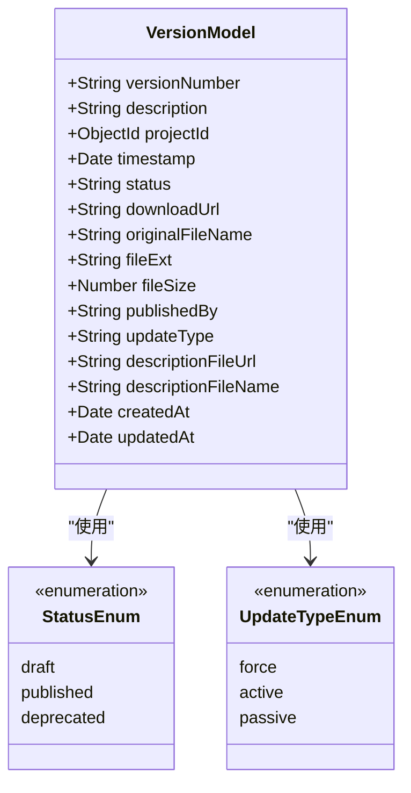

**图表来源**
- [server/models/Version.js](file://server/models/Version.js#L3-L60)

### 版本状态管理

系统支持三种版本状态：
- **草稿 (draft)**: 新创建但未发布的版本
- **已发布 (published)**: 当前有效的版本
- **已弃用 (deprecated)**: 停用的版本，但仍可访问

### 更新策略类型

系统提供三种更新策略：
- **强制更新 (force)**: 必须更新才能继续使用
- **主动提醒 (active)**: 主动提醒用户有新版本
- **被动提醒 (passive)**: 被动显示更新信息

**更新** 新增了描述文件字段支持，用于存储版本描述文件的信息。

**章节来源**
- [server/models/Version.js](file://server/models/Version.js#L1-L62)
- [update-type-feature.md](file://update-type-feature.md#L1-L277)

## 架构概览

版本管理模块采用RESTful API设计，前后端通过HTTP协议通信。系统架构分为三层：表现层（前端）、业务逻辑层（后端路由）、数据持久层（MongoDB）。新增了公开的最新版本查询接口，支持无需权限验证的版本信息获取。

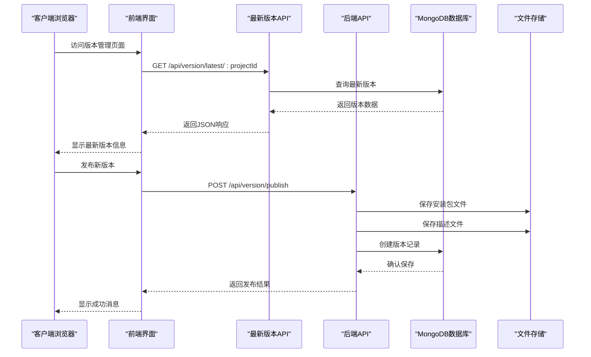

**图表来源**
- [server/routes/version.js](file://server/routes/version.js#L299-L339)
- [client/src/pages/VersionPage.jsx](file://client/src/pages/VersionPage.jsx#L96-L120)

**章节来源**
- [server/routes/version.js](file://server/routes/version.js#L1-L432)
- [client/src/pages/VersionPage.jsx](file://client/src/pages/VersionPage.jsx#L1-L890)

## 详细组件分析

### 版本路由处理

版本路由模块实现了完整的CRUD操作，包括版本查询、创建、更新、删除等功能。新增了最新版本查询接口，支持公开访问。

#### 版本查询接口

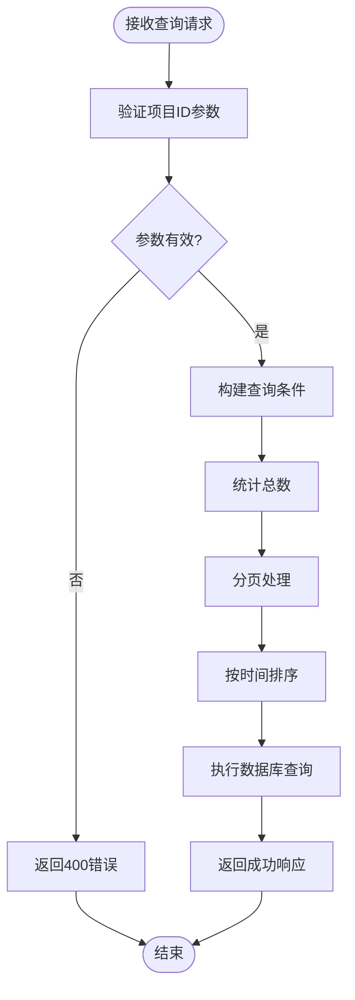

**图表来源**
- [server/routes/version.js](file://server/routes/version.js#L82-L118)

#### 最新版本查询接口

**新增** 最新版本查询是公开接口，无需管理员权限验证：

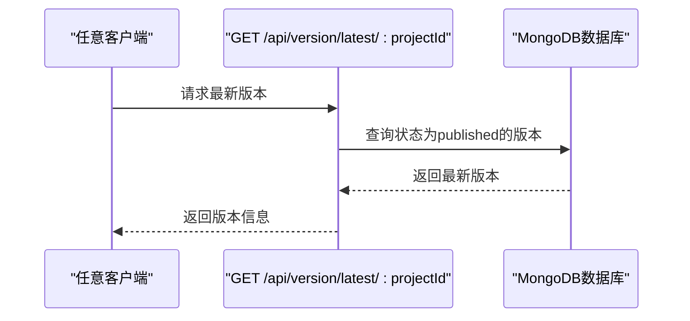

**图表来源**
- [server/routes/version.js](file://server/routes/version.js#L299-L339)

#### 版本发布流程

版本发布是系统的核心功能，涉及文件上传、元数据处理和数据库存储。新增了多文件上传支持和文件重命名控制：

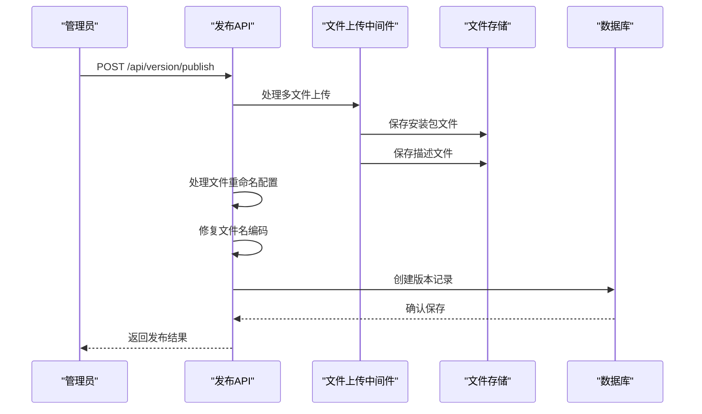

**图表来源**
- [server/routes/version.js](file://server/routes/version.js#L147-L256)

**章节来源**
- [server/routes/version.js](file://server/routes/version.js#L147-L256)

### 文件上传处理机制

系统使用@koa/multer中间件处理文件上传，支持多文件上传和中文文件名处理。新增了文件重命名控制功能。

#### Multer配置分析

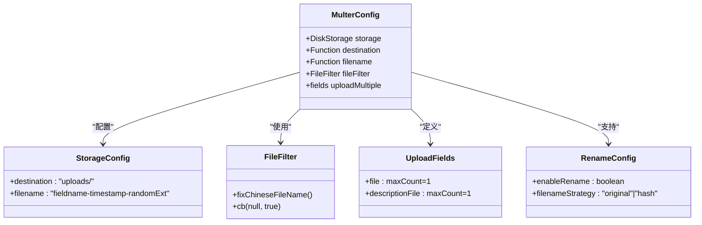

**图表来源**
- [server/routes/version.js](file://server/routes/version.js#L38-L80)

#### 文件存储策略

系统采用磁盘存储策略，文件统一存储在`server/uploads`目录中。支持两种文件命名策略：

1. **Hash重命名**: 使用`fieldname-timestamp-randomExt`格式
2. **保持原文件名**: 使用用户上传的原始文件名

**更新** 新增了文件重命名配置开关，支持控制文件命名策略。

**章节来源**
- [server/routes/version.js](file://server/routes/version.js#L38-L80)
- [server/app.js](file://server/app.js#L24-L45)

### 中文文件名编码修复

系统实现了完整的中文文件名编码修复机制，解决跨平台文件名乱码问题。前后端均实现了相应的修复逻辑。

#### 编码修复算法

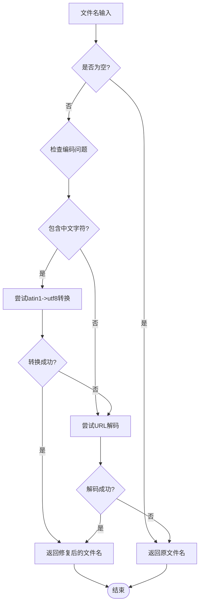

**图表来源**
- [server/routes/version.js](file://server/routes/version.js#L11-L36)
- [client/src/pages/VersionPage.jsx](file://client/src/pages/VersionPage.jsx#L319-L349)

**章节来源**
- [fix-chinese-filename.md](file://fix-chinese-filename.md#L1-L126)
- [server/routes/version.js](file://server/routes/version.js#L11-L36)
- [client/src/pages/VersionPage.jsx](file://client/src/pages/VersionPage.jsx#L319-L349)

### 前端界面组件

前端使用React和Ant Design构建用户界面，提供完整的版本管理功能。新增了文件重命名开关和描述文件上传功能。

#### 版本列表展示

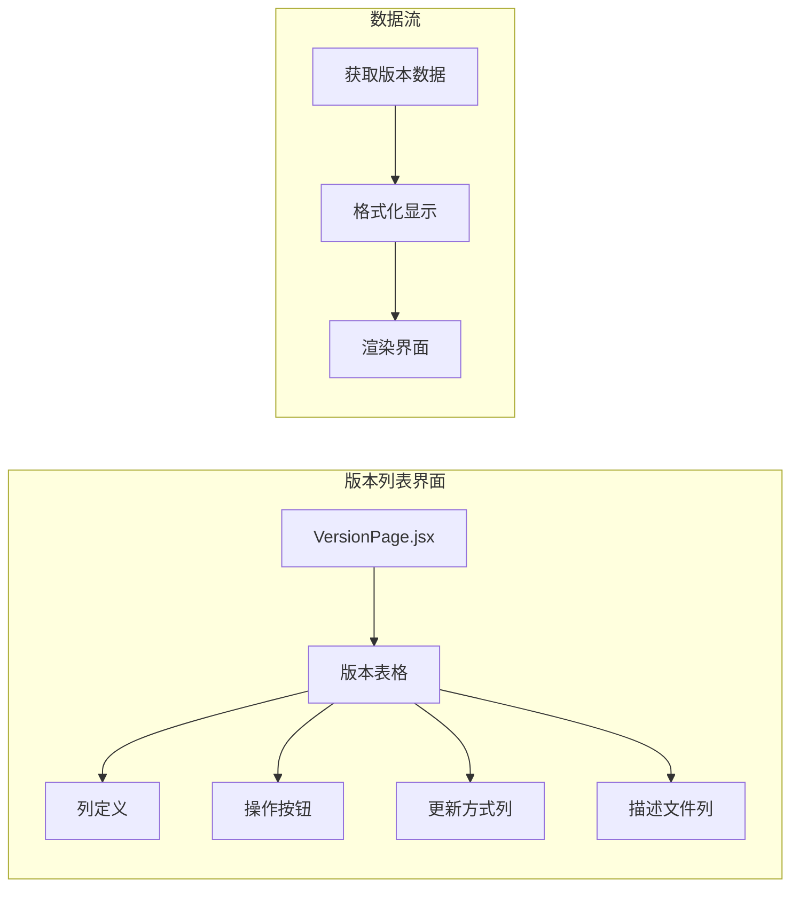

**图表来源**
- [client/src/pages/VersionPage.jsx](file://client/src/pages/VersionPage.jsx#L461-L573)

#### 下载功能实现

前端实现了智能文件下载功能，支持中文文件名处理：

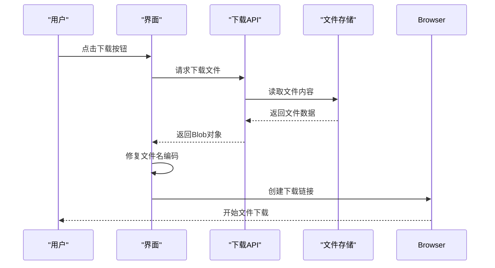

**图表来源**
- [client/src/pages/VersionPage.jsx](file://client/src/pages/VersionPage.jsx#L351-L404)

**章节来源**
- [client/src/pages/VersionPage.jsx](file://client/src/pages/VersionPage.jsx#L1-L890)

### 更新类型控制功能

**新增** 系统现在支持三种更新类型控制，用于不同的更新策略：

#### 更新类型枚举

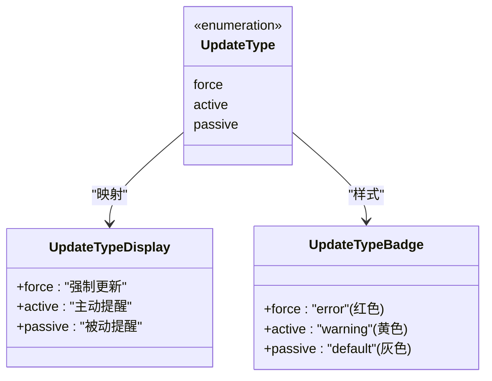

**图表来源**
- [update-type-feature.md](file://update-type-feature.md#L1-L277)

#### 描述文件支持

**新增** 支持上传和管理版本描述文件（latest.yml），用于自动更新检查：

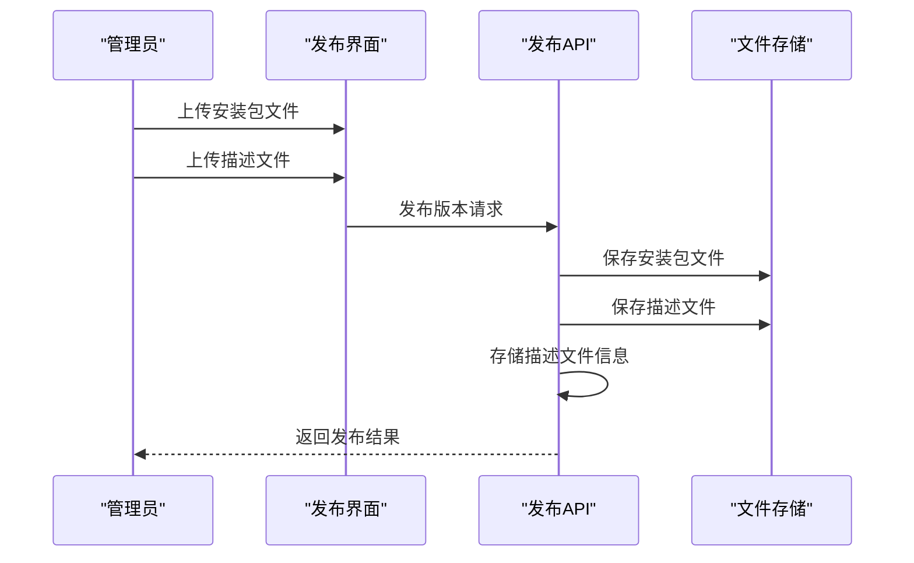

**图表来源**
- [update-type-feature.md](file://update-type-feature.md#L147-L172)

**章节来源**
- [update-type-feature.md](file://update-type-feature.md#L1-L277)

## 依赖关系分析

版本管理模块的依赖关系清晰明确，各组件之间耦合度适中，便于维护和扩展。

```mermaid
graph TB
subgraph "核心依赖"
MONGOOSE[Mongoose ORM]
KOA[Koa框架]
MULTER[@koa/multer文件上传]
AXIOS[Axios HTTP客户端]
ENDPOINT[最新版本API]
AUTH[管理员权限验证]
end
subgraph "前端依赖"
REACT[React框架]
ANTDESIGN[Ant Design UI]
MOMENT[Moment.js日期处理]
end
subgraph "工具依赖"
DOTENV[dotenv环境配置]
CORS[CORS跨域处理]
BODYPARSER[body-parser]
end
MONGOOSE --> VERSIONMODEL[VersionModel]
KOA --> VERSIONROUTES[VersionRoutes]
MULTER --> VERSIONROUTES
AXIOS --> VERSIONPAGE[VersionPage]
REACT --> VERSIONPAGE
ANTDESIGN --> VERSIONPAGE
MOMENT --> VERSIONPAGE
DOTENV --> KOA
CORS --> KOA
BODYPARSER --> KOA
AUTH --> VERSIONROUTES
ENDPOINT --> VERSIONROUTES
```

**图表来源**
- [server/package.json](file://server/package.json#L10-L19)
- [client/package.json](file://client/package.json#L5-L18)

**章节来源**
- [server/package.json](file://server/package.json#L1-L24)
- [client/package.json](file://client/package.json#L1-L47)

## 性能考虑

版本管理模块在设计时充分考虑了性能优化，主要包括以下几个方面：

### 数据库查询优化

- 使用索引优化查询性能
- 实现分页查询避免大数据量影响
- 采用投影查询减少数据传输
- **新增** 最新版本查询使用状态过滤，提高查询效率

### 文件存储优化

- 采用异步文件写入避免阻塞
- 实现文件缓存机制
- 支持断点续传功能
- **新增** 文件重命名避免重复文件覆盖

### 内存管理

- 及时释放文件句柄
- 实现垃圾回收机制
- 优化大文件处理流程
- **新增** 中文文件名修复过程中的内存管理

## 故障排除指南

### 常见问题及解决方案

#### 文件上传失败

**问题症状**:
- 上传进度卡住
- 返回413状态码
- 文件大小超过限制

**解决方案**:
1. 检查文件大小限制配置
2. 验证上传目录权限
3. 确认网络连接稳定

#### 中文文件名乱码

**问题症状**:
- 文件名显示为乱码
- 下载文件名异常
- 数据库中文件名错误

**解决方案**:
1. 检查编码修复函数
2. 验证文件名传递流程
3. 确认前后端编码一致

#### 权限认证问题

**问题症状**:
- 401未授权错误
- 管理员功能不可用
- 登录状态异常

**解决方案**:
1. 检查JWT令牌有效性
2. 验证管理员权限
3. 确认会话状态

#### 最新版本查询失败

**问题症状**:
- 404错误返回
- 无法获取最新版本
- 公开接口访问异常

**解决方案**:
1. 检查项目ID参数传递
2. 验证数据库中是否存在已发布版本
3. 确认查询条件正确性

**章节来源**
- [server/routes/version.js](file://server/routes/version.js#L158-L178)
- [fix-chinese-filename.md](file://fix-chinese-filename.md#L89-L126)

## 结论

版本管理模块是一个功能完整、架构清晰的版本控制系统。它成功实现了版本生命周期管理、文件上传处理、中文文件名编码修复和用户界面展示等核心功能。系统采用现代化的技术栈，具有良好的可扩展性和维护性。

**更新** 新版本增强了功能完整性，新增了最新版本API、多文件上传支持、文件重命名控制、更新类型管理和描述文件支持等功能。

模块的主要优势包括：
- 完整的版本状态管理
- 灵活的更新策略配置
- 健壮的文件上传机制
- 优雅的中文文件名处理
- 用户友好的界面设计
- **新增** 公开的最新版本查询接口
- **新增** 多文件上传和重命名控制
- **新增** 丰富的更新类型管理

未来可以考虑的功能增强：
- 版本兼容性检查机制
- 自动化回滚功能
- 更详细的版本历史追踪
- 增强的安全验证机制
- **新增** 描述文件的自动解析和验证

## 附录

### API接口规范

#### 版本管理API

| 接口 | 方法 | 描述 | 权限 | 新增功能 |
|------|------|------|------|----------|
| `/api/version` | GET | 获取版本列表 | 无 | 基础版本查询 |
| `/api/version/:id` | GET | 获取版本详情 | 无 | 基础版本详情 |
| `/api/version/publish` | POST | 发布新版本 | 管理员 | 多文件上传、重命名控制、更新类型 |
| `/api/version/set-latest/:id` | PUT | 设为最新版本 | 管理员 | 基础功能 |
| `/api/version/latest/:projectId` | GET | 获取最新版本 | 无 | **新增** 公开接口 |
| `/api/version/:id` | PUT | 更新版本信息 | 管理员 | **增强** 支持更新类型 |
| `/api/version/:id` | DELETE | 删除版本 | 管理员 | 基础功能 |

### 配置参数说明

#### 环境变量配置

| 参数名 | 默认值 | 描述 |
|--------|--------|------|
| PORT | 3001 | 服务器端口号 |
| MONGODB_URI | mongodb://localhost:27017/woax | MongoDB连接地址 |
| UPLOAD_DIR | uploads | 上传文件目录 |
| MAX_FILE_SIZE | 10485760 | 最大文件大小(字节) |

### 最佳实践建议

#### 版本管理最佳实践

1. **版本号规范**: 采用语义化版本控制（SemVer）
2. **更新策略选择**: 根据重要性选择合适的更新方式
3. **文件命名**: 保持文件名清晰易懂
4. **权限控制**: 严格管理管理员权限
5. **备份策略**: 定期备份版本数据和文件
6. **文件重命名**: 根据需求选择合适的命名策略
7. **描述文件**: 为重要版本提供详细的描述文件

#### 运维管理建议

1. **监控告警**: 设置系统监控和异常告警
2. **日志管理**: 完善操作日志和错误日志
3. **容量规划**: 定期检查存储空间和数据库性能
4. **安全加固**: 实施必要的安全防护措施
5. **灾难恢复**: 制定数据备份和恢复预案
6. **版本检查**: 定期检查最新版本API的可用性
7. **文件管理**: 监控上传文件的存储使用情况

### 更新类型使用指南

#### 强制更新 (force)
- 适用场景：安全漏洞修复、重要功能变更、不兼容的版本更新
- 用户体验：必须更新才能继续使用
- 技术实现：客户端应阻止未更新用户的操作

#### 主动提醒 (active)
- 适用场景：新功能发布、性能优化、用户体验改进
- 用户体验：主动提醒用户有新版本可用
- 技术实现：客户端显示更新提示，允许用户选择更新

#### 被动提醒 (passive)
- 适用场景：小版本更新、Bug修复、可选功能增加
- 用户体验：被动显示更新信息
- 技术实现：仅显示版本信息，不强制用户更新

**章节来源**
- [update-type-feature.md](file://update-type-feature.md#L103-L131)
- [api-usage-latest-version.md](file://api-usage-latest-version.md#L212-L227)