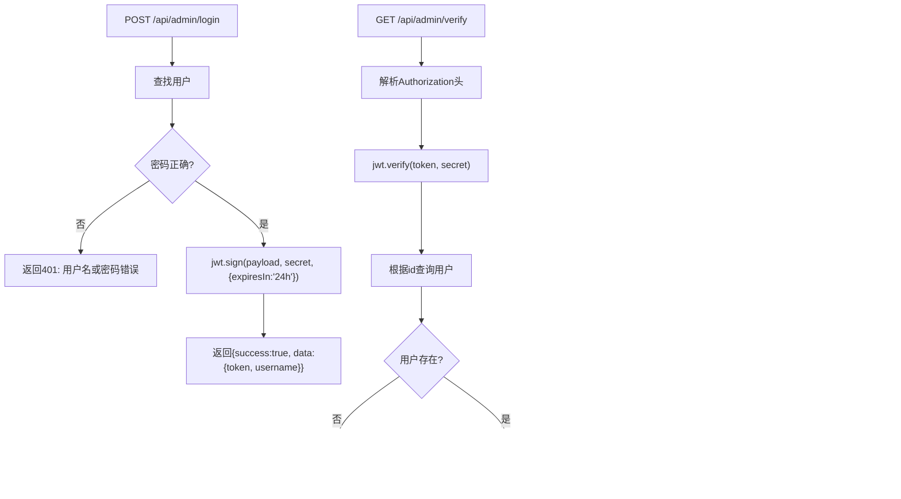

# JWT认证机制

<cite>
**本文引用的文件**
- [README.md](file://README.md)
- [client/src/App.jsx](file://client/src/App.jsx)
- [client/src/context/AuthContext.jsx](file://client/src/context/AuthContext.jsx)
- [client/src/components/AuthButton.jsx](file://client/src/components/AuthButton.jsx)
- [server/app.js](file://server/app.js)
- [server/.env](file://server/.env)
- [server/routes/admin.js](file://server/routes/admin.js)
- [server/models/Admin.js](file://server/models/Admin.js)
- [server/db.js](file://server/db.js)
- [client/package.json](file://client/package.json)
- [server/package.json](file://server/package.json)
</cite>

## 目录
1. [简介](#简介)
2. [项目结构](#项目结构)
3. [核心组件](#核心组件)
4. [架构总览](#架构总览)
5. [详细组件分析](#详细组件分析)
6. [依赖关系分析](#依赖关系分析)
7. [性能考虑](#性能考虑)
8. [故障排查指南](#故障排查指南)
9. [结论](#结论)
10. [附录](#附录)

## 简介
本文件围绕WoaX项目的JWT（JSON Web Token）认证机制进行系统化技术说明，覆盖以下主题：
- JWT工作原理：token生成、验证与过期机制
- 前端存储与管理：基于localStorage的令牌持久化策略
- 后端验证：基于Authorization头的令牌校验与中间件
- 认证流程：登录验证、令牌颁发、请求携带、服务器验证与自动刷新
- 错误处理与安全最佳实践
- 常见问题与解决方案

## 项目结构
WoaX采用前后端分离架构，前端使用React + Ant Design，后端使用Koa + MongoDB。JWT认证贯穿于登录、访问控制与权限验证环节。

图表来源
- [client/src/App.jsx](file://client/src/App.jsx#L18-L25)
- [client/src/context/AuthContext.jsx](file://client/src/context/AuthContext.jsx#L1-L155)
- [client/src/components/AuthButton.jsx](file://client/src/components/AuthButton.jsx#L1-L43)
- [server/app.js](file://server/app.js#L1-L61)
- [server/.env](file://server/.env#L1-L9)
- [server/routes/admin.js](file://server/routes/admin.js#L1-L128)
- [server/models/Admin.js](file://server/models/Admin.js#L1-L32)
- [server/db.js](file://server/db.js#L1-L45)

章节来源
- [README.md](file://README.md#L1-L44)
- [client/src/App.jsx](file://client/src/App.jsx#L1-L253)
- [server/app.js](file://server/app.js#L1-L61)

## 核心组件
- 前端认证上下文：负责初始化时读取localStorage中的令牌并验证；处理登录、登出与状态同步。
- 请求拦截器：统一为每个请求附加Authorization头，便于后端识别与鉴权。
- 后端路由与中间件：提供登录接口生成JWT，提供令牌验证接口，并通过中间件对受保护资源进行权限校验。
- 管理员模型：提供密码哈希与验证方法，确保凭据安全存储。

章节来源
- [client/src/context/AuthContext.jsx](file://client/src/context/AuthContext.jsx#L1-L155)
- [client/src/App.jsx](file://client/src/App.jsx#L18-L25)
- [server/routes/admin.js](file://server/routes/admin.js#L26-L128)
- [server/models/Admin.js](file://server/models/Admin.js#L16-L30)

## 架构总览
JWT认证在本项目中的整体流程如下：
- 登录阶段：前端提交用户名/密码至后端登录接口，后端验证成功后签发JWT（含过期时间）。
- 存储阶段：前端将token写入localStorage并在后续请求中通过请求拦截器自动附加Authorization头。
- 验证阶段：后端中间件解析Authorization头，使用密钥验证签名并查询用户信息，通过后方可访问受保护资源。
- 过期与刷新：当前实现未提供自动刷新逻辑，建议在前端增加刷新策略或缩短令牌有效期以降低风险。

图表来源
- [client/src/context/AuthContext.jsx](file://client/src/context/AuthContext.jsx#L62-L92)
- [server/routes/admin.js](file://server/routes/admin.js#L26-L98)
- [server/models/Admin.js](file://server/models/Admin.js#L16-L30)

## 详细组件分析

### 前端：认证上下文与请求拦截器
- 初始化检查：应用启动时从localStorage读取令牌并调用后端验证接口确认有效性，若无效则清理本地存储并重置状态。
- 登录流程：表单校验通过后向后端发起登录请求，成功后将token存入localStorage并更新认证状态。
- 登出流程：移除localStorage中的令牌并重置认证状态。
- 请求拦截器：自动为每个请求附加Authorization头，避免重复手动设置。

图表来源
- [client/src/context/AuthContext.jsx](file://client/src/context/AuthContext.jsx#L16-L48)
- [client/src/App.jsx](file://client/src/App.jsx#L18-L25)

章节来源
- [client/src/context/AuthContext.jsx](file://client/src/context/AuthContext.jsx#L16-L104)
- [client/src/App.jsx](file://client/src/App.jsx#L18-L25)

### 后端：登录、验证与中间件
- 登录接口：接收用户名/密码，验证通过后使用密钥签发JWT，设置过期时间为24小时。
- 验证接口：从Authorization头解析token，验证签名并查询用户，返回用户名。
- 中间件：统一从Authorization头解析token，验证签名与用户有效性，失败时返回401。

图表来源
- [server/routes/admin.js](file://server/routes/admin.js#L26-L128)
- [server/models/Admin.js](file://server/models/Admin.js#L16-L30)

章节来源
- [server/routes/admin.js](file://server/routes/admin.js#L26-L128)
- [server/models/Admin.js](file://server/models/Admin.js#L16-L30)

### 权限按钮组件
- 当用户未登录时，点击按钮会触发登录弹窗；已登录时执行原生点击回调。
- 通过上下文状态控制按钮的可用性与图标展示。

章节来源
- [client/src/components/AuthButton.jsx](file://client/src/components/AuthButton.jsx#L12-L27)

### 数据库与环境配置
- 数据库连接：通过Mongoose连接MongoDB，监听断开与错误事件。
- 环境变量：包含JWT密钥（可从环境变量读取）、端口、数据库地址等。

章节来源
- [server/db.js](file://server/db.js#L9-L24)
- [server/.env](file://server/.env#L1-L9)

## 依赖关系分析
- 前端依赖：axios用于HTTP请求，Ant Design提供UI组件与交互能力。
- 后端依赖：jsonwebtoken用于JWT生成与验证，dotenv加载环境变量，Koa/Koa-Router构建服务与路由，Mongoose连接MongoDB。
- 路由注册：后端将各模块路由挂载到统一的router上，再注册到Koa应用。

图表来源
- [client/package.json](file://client/package.json#L1-L47)
- [server/package.json](file://server/package.json#L1-L24)
- [server/app.js](file://server/app.js#L10-L55)
- [server/routes/admin.js](file://server/routes/admin.js#L1-L128)
- [server/models/Admin.js](file://server/models/Admin.js#L1-L32)
- [server/db.js](file://server/db.js#L1-L45)

章节来源
- [client/package.json](file://client/package.json#L1-L47)
- [server/package.json](file://server/package.json#L1-L24)
- [server/app.js](file://server/app.js#L10-L55)

## 性能考虑
- 令牌有效期：当前设置为24小时，建议结合业务场景调整，或引入刷新令牌机制以降低风险。
- 请求拦截器：统一注入Authorization头，减少重复代码，提升一致性。
- 中间件复用：将权限校验封装为中间件，避免在每个路由中重复实现。
- 数据库连接：监听断开与错误事件，有助于快速定位连接问题。

## 故障排查指南
- 401未提供令牌：检查前端是否正确设置Authorization头，确认localStorage中是否存在token。
- 401无效的令牌：检查JWT密钥是否一致，确认token未被篡改或过期。
- 登录失败：核对用户名/密码是否正确，查看后端日志输出。
- CORS跨域：确认后端已启用CORS中间件，前端代理配置正确。
- 数据库连接失败：检查MONGODB_URI与网络连通性，查看连接错误日志。

章节来源
- [server/routes/admin.js](file://server/routes/admin.js#L72-L97)
- [server/db.js](file://server/db.js#L27-L33)

## 结论
本项目实现了基于JWT的管理员认证方案，前端通过localStorage持久化令牌并自动附加到请求头，后端通过中间件统一验证令牌有效性。当前实现简洁清晰，建议后续增强包括：
- 引入刷新令牌机制或短期访问令牌+刷新令牌组合
- 在前端增加token过期检测与自动刷新逻辑
- 使用更严格的密钥管理与HTTPS传输
- 对敏感操作增加二次确认与审计日志

## 附录
- 默认管理员账号：用户名 admin，密码 admin123（仅用于演示）
- 端口与数据库：后端默认端口3001，MongoDB连接地址可在环境变量中配置

章节来源
- [README.md](file://README.md#L44-L44)
- [server/.env](file://server/.env#L1-L9)