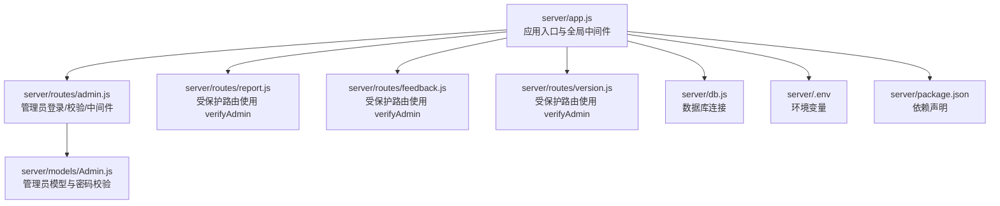
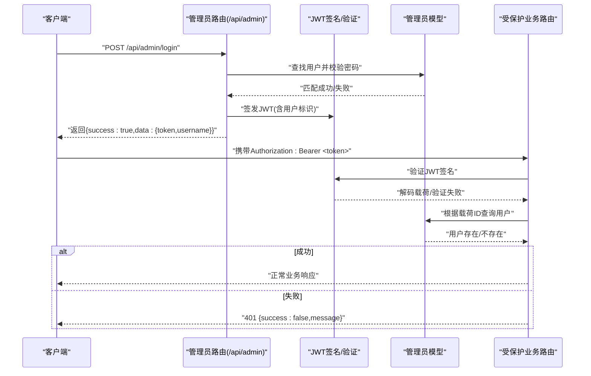
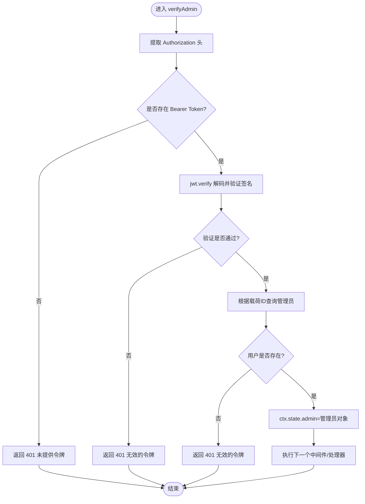
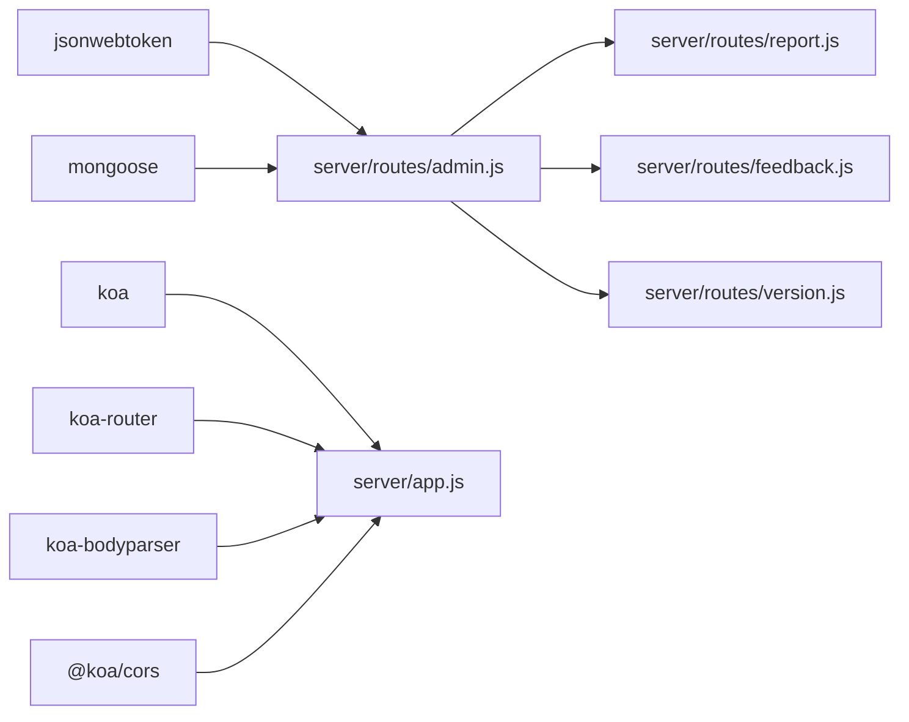

# 后端认证中间件

<cite>
**本文档引用的文件**
- [server/app.js](file://server/app.js)
- [server/.env](file://server/.env)
- [server/package.json](file://server/package.json)
- [server/db.js](file://server/db.js)
- [server/middleware/auth.js](file://server/middleware/auth.js)
- [server/models/Admin.js](file://server/models/Admin.js)
- [server/routes/admin.js](file://server/routes/admin.js)
- [server/routes/report.js](file://server/routes/report.js)
- [server/routes/feedback.js](file://server/routes/feedback.js)
- [server/routes/version.js](file://server/routes/version.js)
</cite>

## 目录
1. [简介](#简介)
2. [项目结构](#项目结构)
3. [核心组件](#核心组件)
4. [架构总览](#架构总览)
5. [详细组件分析](#详细组件分析)
6. [依赖关系分析](#依赖关系分析)
7. [性能考虑](#性能考虑)
8. [故障排除指南](#故障排除指南)
9. [结论](#结论)

## 简介
本文件面向后端开发者，系统性阐述基于 Koa 的认证中间件实现与使用，重点覆盖以下方面：
- JWT 中间件的实现原理：token 提取、解码验证、用户信息解析
- 权限检查机制：如何在路由层对管理员进行鉴权
- 错误处理流程：认证失败时的统一响应格式与状态码
- 完整的中间件代码示例路径与配置项说明
- 安全注意事项、性能优化策略与常见问题排查

## 项目结构
后端采用 Koa + Koa-Router + MongoDB 的架构，认证相关代码集中在以下位置：
- 中间件：server/middleware/auth.js（预留中间件入口）
- 管理员路由与权限中间件：server/routes/admin.js
- 路由注册与全局中间件：server/app.js
- 数据库连接与环境变量：server/db.js、server/.env
- 依赖声明：server/package.json

图表来源
- [server/app.js](file://server/app.js#L1-L61)
- [server/routes/admin.js](file://server/routes/admin.js#L1-L128)
- [server/routes/report.js](file://server/routes/report.js#L1-L271)
- [server/routes/feedback.js](file://server/routes/feedback.js#L1-L187)
- [server/routes/version.js](file://server/routes/version.js#L1-L432)
- [server/models/Admin.js](file://server/models/Admin.js#L1-L32)
- [server/db.js](file://server/db.js#L1-L45)
- [server/.env](file://server/.env#L1-L9)
- [server/package.json](file://server/package.json#L1-L24)

章节来源
- [server/app.js](file://server/app.js#L1-L61)
- [server/routes/admin.js](file://server/routes/admin.js#L1-L128)
- [server/package.json](file://server/package.json#L1-L24)

## 核心组件
- 认证中间件（verifyAdmin）：从请求头 Authorization 中提取 Bearer Token，使用 JWT 对其进行解码与签名验证，再根据载荷中的用户标识查询数据库，通过则将用户对象挂载到 ctx.state.admin 并放行，否则返回 401。
- 管理员模型（Admin）：提供密码哈希与校验方法，用于登录阶段的凭据比对。
- 登录与令牌校验接口：提供登录签发 JWT、校验 JWT 的接口，供前端调用。
- 受保护路由：在多个业务路由中通过 verifyAdmin 中间件实现权限控制。

章节来源
- [server/routes/admin.js](file://server/routes/admin.js#L100-L125)
- [server/models/Admin.js](file://server/models/Admin.js#L16-L30)
- [server/routes/admin.js](file://server/routes/admin.js#L27-L98)

## 架构总览
下图展示认证流程在系统中的位置与交互：

图表来源
- [server/routes/admin.js](file://server/routes/admin.js#L27-L98)
- [server/routes/report.js](file://server/routes/report.js#L204-L205)
- [server/routes/feedback.js](file://server/routes/feedback.js#L71-L72)
- [server/routes/version.js](file://server/routes/version.js#L146-L147)

## 详细组件分析

### JWT 中间件实现（verifyAdmin）
- 作用域：对后续业务路由进行管理员权限校验
- 请求头解析：从 Authorization 中提取 Bearer Token
- 验证流程：使用密钥对 JWT 进行解码与签名验证；若失败直接返回 401
- 用户解析：从载荷中取出用户标识，查询数据库确认用户存在
- 成功后：将用户对象挂载到 ctx.state.admin，继续执行后续中间件/处理器
- 失败处理：返回 401，统一响应体包含 success:false 与 message 字段

图表来源
- [server/routes/admin.js](file://server/routes/admin.js#L100-L125)

章节来源
- [server/routes/admin.js](file://server/routes/admin.js#L100-L125)

### 管理员模型（Admin）
- 责任：定义管理员数据结构与密码处理方法
- 关键点：
  - setPassword：生成随机盐并使用 PBKDF2 哈希密码
  - validatePassword：使用相同盐对输入密码进行哈希并与存储值比较
- 用途：登录接口中用于凭据校验

章节来源
- [server/models/Admin.js](file://server/models/Admin.js#L16-L30)

### 登录与令牌校验接口
- 登录（POST /api/admin/login）：
  - 输入：username/password
  - 流程：查找用户、校验密码、更新最后登录时间、签发 JWT（有效期 24 小时）
  - 输出：{success:true,data:{token,username}}
- 令牌校验（GET /api/admin/verify）：
  - 输入：Authorization: Bearer <token>
  - 流程：验证 JWT、查询用户、返回用户名
  - 输出：{success:true,data:{username}} 或 401

章节来源
- [server/routes/admin.js](file://server/routes/admin.js#L27-L98)

### 受保护路由使用示例
- 删除统计数据：DELETE /api/report/:id 加载 verifyAdmin
- 自主上报：POST /api/report/submit 加载 verifyAdmin
- 新增/更新/删除反馈：POST /api/feedback/, PUT /api/feedback/:id, DELETE /api/feedback/:id 加载 verifyAdmin
- 版本发布/设置最新/更新/删除：POST /api/version/publish, PUT /api/version/set-latest/:id, PUT /api/version/:id, DELETE /api/version/:id 加载 verifyAdmin

章节来源
- [server/routes/report.js](file://server/routes/report.js#L204-L205)
- [server/routes/report.js](file://server/routes/report.js#L231-L232)
- [server/routes/feedback.js](file://server/routes/feedback.js#L71-L72)
- [server/routes/feedback.js](file://server/routes/feedback.js#L113-L114)
- [server/routes/feedback.js](file://server/routes/feedback.js#L160-L161)
- [server/routes/version.js](file://server/routes/version.js#L146-L147)
- [server/routes/version.js](file://server/routes/version.js#L258-L259)
- [server/routes/version.js](file://server/routes/version.js#L341-L342)
- [server/routes/version.js](file://server/routes/version.js#L394-L395)

### 中间件代码示例与配置项
- 中间件示例路径（verifyAdmin）：[server/routes/admin.js](file://server/routes/admin.js#L100-L125)
- 登录接口示例路径：[server/routes/admin.js](file://server/routes/admin.js#L27-L67)
- 令牌校验接口示例路径：[server/routes/admin.js](file://server/routes/admin.js#L69-L98)
- 环境变量配置（JWT 密钥）：[server/.env](file://server/.env#L1-L9)
- 依赖声明（JWT、Koa、Koa-Router、Mongoose）：[server/package.json](file://server/package.json#L10-L20)

章节来源
- [server/routes/admin.js](file://server/routes/admin.js#L100-L125)
- [server/routes/admin.js](file://server/routes/admin.js#L27-L98)
- [server/.env](file://server/.env#L1-L9)
- [server/package.json](file://server/package.json#L10-L20)

## 依赖关系分析
- verifyAdmin 依赖：
  - Koa 上下文（ctx.headers、ctx.state、ctx.status、ctx.body）
  - jsonwebtoken（jwt.verify）
  - Mongoose（Admin 模型）
- 路由依赖：
  - 各业务路由通过 require('./admin').verifyAdmin 引入中间件
- 应用级依赖：
  - app.js 注册全局中间件（CORS、bodyParser、静态文件）、注册路由

图表来源
- [server/routes/admin.js](file://server/routes/admin.js#L1-L128)
- [server/routes/report.js](file://server/routes/report.js#L1-L271)
- [server/routes/feedback.js](file://server/routes/feedback.js#L1-L187)
- [server/routes/version.js](file://server/routes/version.js#L1-L432)
- [server/app.js](file://server/app.js#L1-L61)
- [server/package.json](file://server/package.json#L10-L20)

章节来源
- [server/app.js](file://server/app.js#L1-L61)
- [server/package.json](file://server/package.json#L10-L20)

## 性能考虑
- JWT 验证成本低：仅需解码与签名验证，避免频繁数据库查询
- 缓存策略：可考虑将常用用户信息缓存于内存或 Redis，减少数据库访问
- 并发控制：在高并发场景下，建议限制 JWT 密钥轮换频率与签发速率
- 路由粒度：将 verifyAdmin 放置于受保护路由前，避免无谓的数据库查询
- 日志与监控：对认证失败与异常进行统计，便于发现攻击行为

## 故障排除指南
- 401 未提供令牌
  - 检查前端是否正确在 Authorization 中附带 Bearer Token
  - 确认请求头格式为 "Bearer <token>"
- 401 无效的令牌
  - 检查 JWT 密钥是否与签发时一致（JWT_SECRET）
  - 检查令牌是否过期（默认 24 小时）
  - 检查签发方与接收方是否一致
- 用户不存在
  - 检查载荷中的用户标识是否仍存在于数据库
  - 确认管理员账户是否被删除或禁用
- 登录失败
  - 检查用户名是否存在与密码是否正确
  - 确认数据库连接正常
- 环境变量问题
  - 确认 .env 中 JWT_SECRET 已正确设置且与签发一致
  - 确认 MONGODB_URI 正确

章节来源
- [server/routes/admin.js](file://server/routes/admin.js#L70-L98)
- [server/routes/admin.js](file://server/routes/admin.js#L100-L125)
- [server/.env](file://server/.env#L1-L9)
- [server/db.js](file://server/db.js#L10-L24)

## 结论
本项目通过 Koa 中间件与 JWT 实现了简洁高效的管理员认证体系。verifyAdmin 在路由层统一拦截并完成令牌验证与用户解析，配合各业务路由形成清晰的权限边界。建议在生产环境中强化密钥管理、引入速率限制与审计日志，并持续监控认证成功率与异常模式，以提升整体安全性与稳定性。