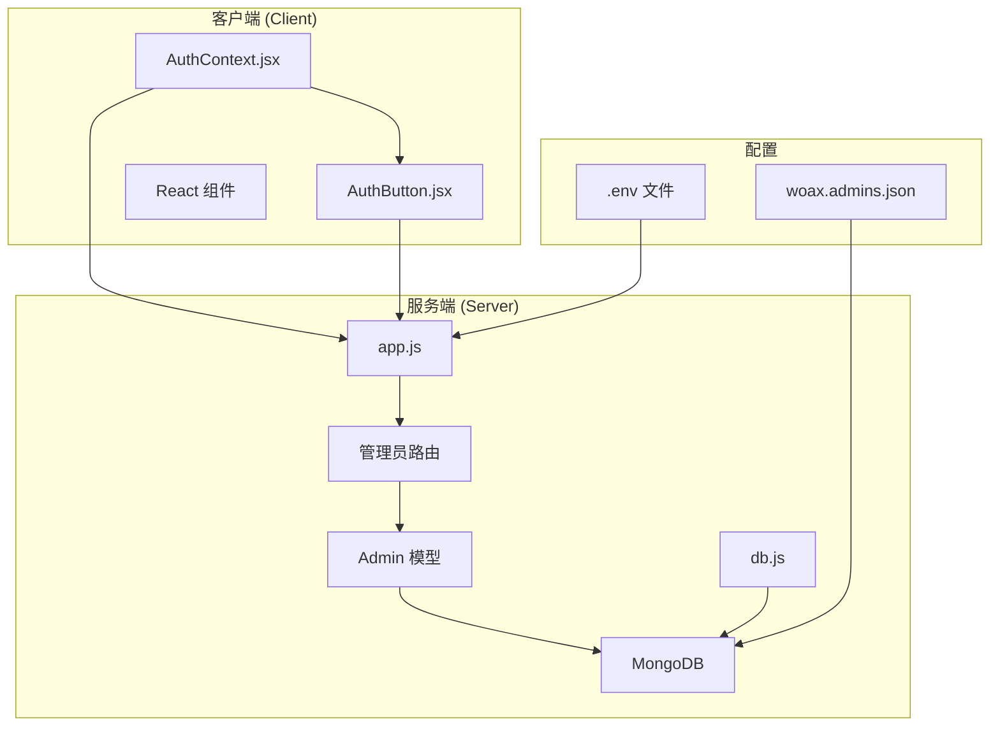
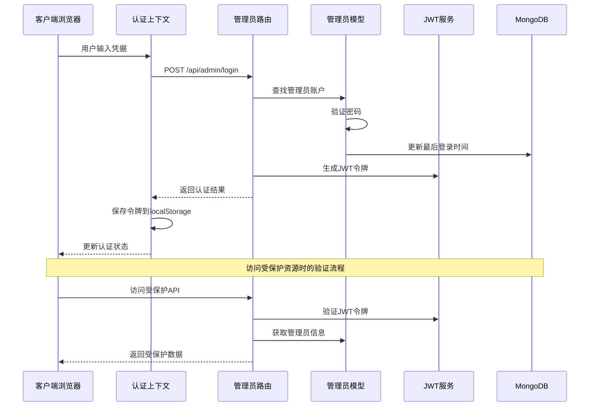
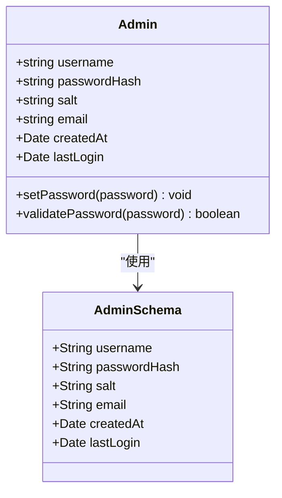
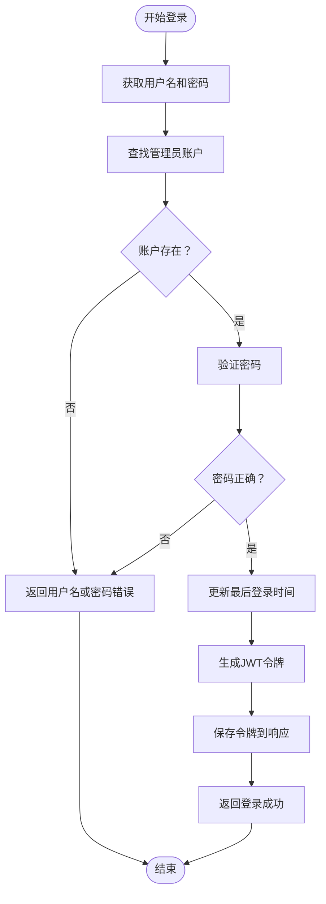
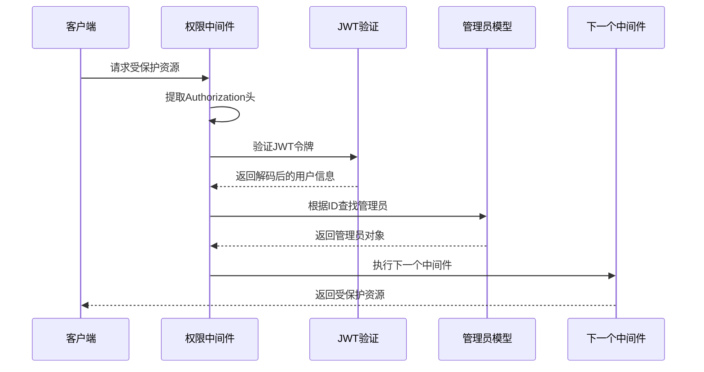
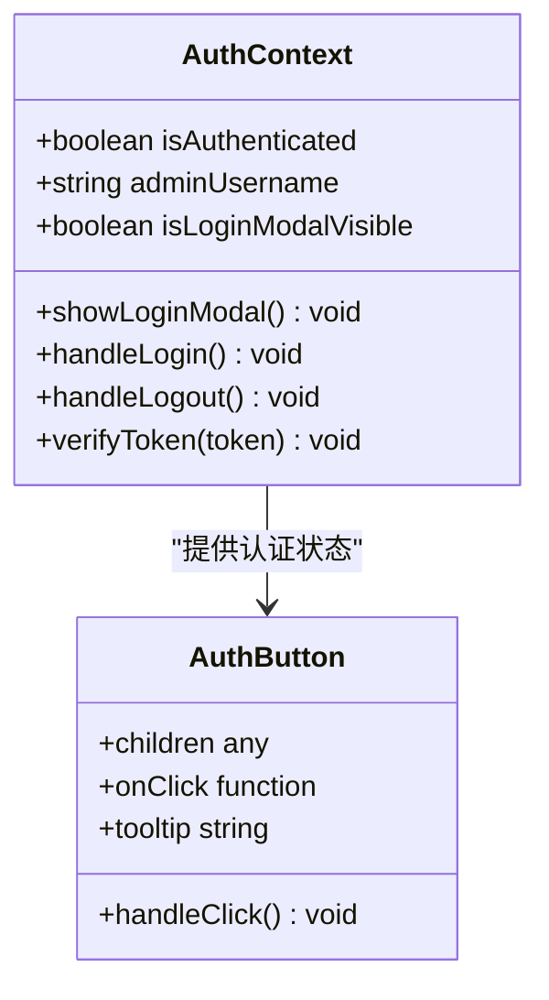
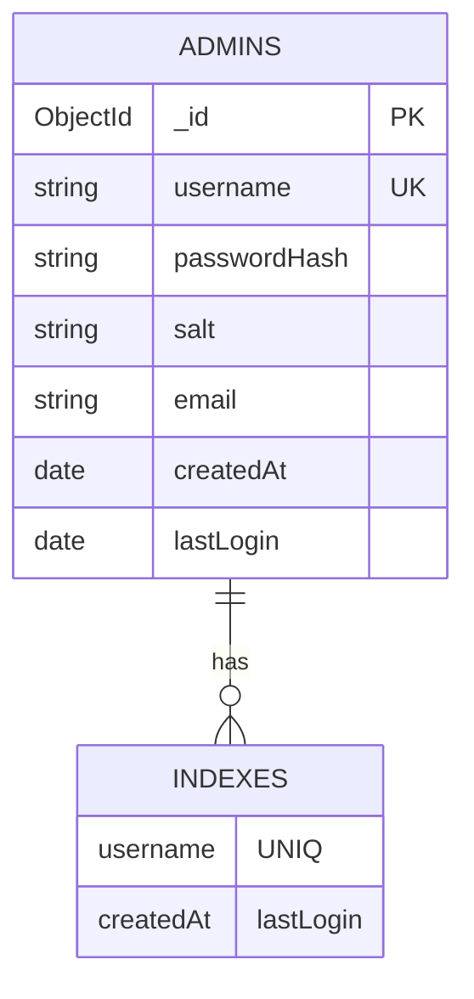
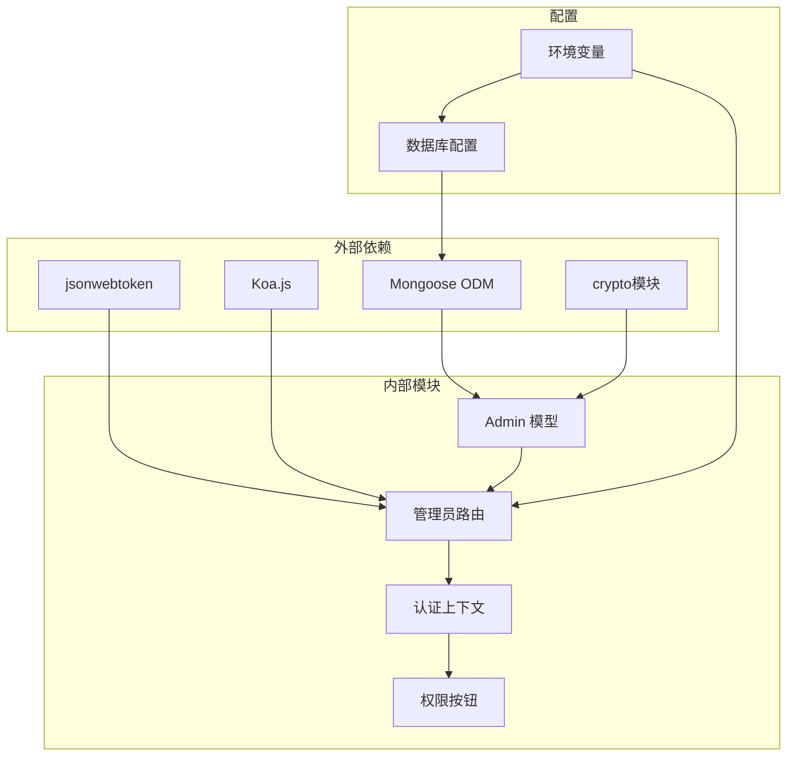

# 管理员账户管理

<cite>
**本文档引用的文件**
- [server/models/Admin.js](file://server/models/Admin.js)
- [server/routes/admin.js](file://server/routes/admin.js)
- [server/app.js](file://server/app.js)
- [server/db.js](file://server/db.js)
- [client/src/context/AuthContext.jsx](file://client/src/context/AuthContext.jsx)
- [client/src/components/AuthButton.jsx](file://client/src/components/AuthButton.jsx)
- [db/woax.admins.json](file://db/woax.admins.json)
- [server/.env](file://server/.env)
- [README.md](file://README.md)
</cite>

## 目录
1. [简介](#简介)
2. [项目结构](#项目结构)
3. [核心组件](#核心组件)
4. [架构概览](#架构概览)
5. [详细组件分析](#详细组件分析)
6. [依赖关系分析](#依赖关系分析)
7. [性能考虑](#性能考虑)
8. [故障排除指南](#故障排除指南)
9. [结论](#结论)
10. [附录](#附录)

## 简介

WoaX项目是一个基于React前端、Node.js+Koa后端和MongoDB数据库的全栈应用程序。本文档专注于管理员账户管理系统的设计与实现，深入分析了管理员账户的数据模型、密码加密机制、权限控制流程以及安全存储策略。

该系统提供了完整的管理员身份验证和授权机制，包括登录验证、JWT令牌管理、权限中间件以及前端认证状态管理。系统采用PBKDF2算法进行密码哈希加密，确保管理员密码的安全存储。

## 项目结构

WoaX项目的整体架构采用前后端分离的设计模式，管理员账户管理功能主要分布在以下模块中：



**图表来源**
- [server/app.js](file://server/app.js#L1-L61)
- [server/models/Admin.js](file://server/models/Admin.js#L1-L32)
- [server/routes/admin.js](file://server/routes/admin.js#L1-L128)

**章节来源**
- [server/app.js](file://server/app.js#L1-L61)
- [README.md](file://README.md#L1-L44)

## 核心组件

管理员账户管理系统的核心组件包括：

### 数据模型层
- **Admin 模型**: 定义管理员账户的数据结构和密码处理方法
- **MongoDB 集合**: 存储管理员账户信息的持久化存储

### 业务逻辑层
- **认证路由**: 处理管理员登录、令牌验证等HTTP请求
- **JWT 中间件**: 实现权限验证和访问控制
- **密码加密**: 使用PBKDF2算法进行安全的密码哈希

### 表现层
- **认证上下文**: 管理前端认证状态和用户会话
- **权限按钮**: 控制UI元素的可见性和可用性

**章节来源**
- [server/models/Admin.js](file://server/models/Admin.js#L1-L32)
- [server/routes/admin.js](file://server/routes/admin.js#L1-L128)
- [client/src/context/AuthContext.jsx](file://client/src/context/AuthContext.jsx#L1-L155)

## 架构概览

管理员账户管理系统的整体架构采用分层设计，确保了安全性、可维护性和扩展性：



**图表来源**
- [client/src/context/AuthContext.jsx](file://client/src/context/AuthContext.jsx#L62-L92)
- [server/routes/admin.js](file://server/routes/admin.js#L27-L67)
- [server/models/Admin.js](file://server/models/Admin.js#L25-L30)

## 详细组件分析

### 管理员数据模型设计

管理员账户的数据模型采用了精心设计的字段结构，确保了数据的完整性和安全性：



**图表来源**
- [server/models/Admin.js](file://server/models/Admin.js#L4-L14)

#### 字段定义详解

| 字段名 | 类型 | 必填 | 唯一性 | 描述 | 安全考虑 |
|--------|------|------|--------|------|----------|
| username | String | 是 | 是 | 管理员用户名 | 唯一约束防止重复账户 |
| passwordHash | String | 是 | 否 | PBKDF2哈希后的密码 | 不存储明文密码 |
| salt | String | 是 | 否 | PBKDF2盐值 | 每个用户独立的随机盐 |
| email | String | 否 | 否 | 管理员邮箱地址 | 可选字段，用于联系 |
| createdAt | Date | 否 | 否 | 账户创建时间 | 自动记录创建时间 |
| lastLogin | Date | 否 | 否 | 最后登录时间 | 用于审计和安全监控 |

#### 密码加密机制

系统采用PBKDF2算法进行密码哈希加密，具有以下安全特性：

1. **随机盐值生成**: 每个管理员账户生成16字节的随机十六进制字符串
2. **高强度迭代**: 使用1000次迭代，增加暴力破解难度
3. **SHA-512摘要**: 使用512位哈希算法确保安全性
4. **64字节输出**: 生成256位十六进制字符串表示

**章节来源**
- [server/models/Admin.js](file://server/models/Admin.js#L17-L30)

### 登录验证流程

管理员登录验证流程实现了完整的身份认证机制：



**图表来源**
- [server/routes/admin.js](file://server/routes/admin.js#L27-L67)

#### 登录流程的关键步骤

1. **账户查找**: 通过用户名在MongoDB中查找管理员账户
2. **密码验证**: 使用PBKDF2算法验证提供的密码
3. **状态更新**: 更新管理员的最后登录时间
4. **令牌生成**: 生成具有24小时有效期的JWT令牌
5. **响应返回**: 返回认证结果和用户信息

**章节来源**
- [server/routes/admin.js](file://server/routes/admin.js#L27-L67)

### 权限控制机制

系统实现了基于JWT的权限控制机制，确保只有经过认证的管理员才能访问受保护的资源：



**图表来源**
- [server/routes/admin.js](file://server/routes/admin.js#L100-L125)

#### 权限中间件的工作原理

1. **令牌提取**: 从Authorization头部提取JWT令牌
2. **令牌验证**: 使用JWT_SECRET密钥验证令牌有效性
3. **用户检索**: 根据令牌中的用户ID查找管理员信息
4. **状态注入**: 将管理员对象注入到请求上下文中
5. **继续执行**: 允许后续的业务逻辑处理

**章节来源**
- [server/routes/admin.js](file://server/routes/admin.js#L100-L125)

### 前端认证管理

前端使用React Context API管理认证状态，提供了完整的用户界面交互：



**图表来源**
- [client/src/context/AuthContext.jsx](file://client/src/context/AuthContext.jsx#L1-L155)
- [client/src/components/AuthButton.jsx](file://client/src/components/AuthButton.jsx#L1-L43)

#### 认证上下文的功能特性

1. **状态管理**: 维护用户的认证状态和管理员信息
2. **本地存储**: 使用localStorage持久化JWT令牌
3. **自动验证**: 应用启动时自动验证现有令牌
4. **表单处理**: 管理登录表单的验证和提交
5. **错误处理**: 统一处理认证过程中的各种错误

**章节来源**
- [client/src/context/AuthContext.jsx](file://client/src/context/AuthContext.jsx#L1-L155)
- [client/src/components/AuthButton.jsx](file://client/src/components/AuthButton.jsx#L1-L43)

### 数据持久化策略

管理员账户信息采用MongoDB进行持久化存储，实现了数据的可靠性和可扩展性：



**图表来源**
- [db/woax.admins.json](file://db/woax.admins.json#L1-L15)

#### 数据库设计考虑

1. **索引优化**: 为username字段建立唯一索引，确保账户唯一性
2. **时间戳字段**: 自动记录创建时间和最后登录时间
3. **安全存储**: 仅存储密码哈希和盐值，不存储明文密码
4. **扩展性**: 支持未来添加更多管理员属性

**章节来源**
- [db/woax.admins.json](file://db/woax.admins.json#L1-L15)

## 依赖关系分析

管理员账户管理系统的依赖关系体现了清晰的分层架构：



**图表来源**
- [server/models/Admin.js](file://server/models/Admin.js#L1-L2)
- [server/routes/admin.js](file://server/routes/admin.js#L1-L3)
- [client/src/context/AuthContext.jsx](file://client/src/context/AuthContext.jsx#L1-L3)

### 核心依赖关系

1. **Mongoose**: 提供MongoDB对象文档映射，简化数据库操作
2. **jsonwebtoken**: 实现JWT令牌的生成和验证
3. **crypto**: 提供密码哈希和随机数生成功能
4. **Koa-router**: 实现HTTP路由和中间件机制

**章节来源**
- [server/models/Admin.js](file://server/models/Admin.js#L1-L2)
- [server/routes/admin.js](file://server/routes/admin.js#L1-L3)

## 性能考虑

管理员账户管理系统的性能优化策略：

### 数据库查询优化
- **索引使用**: 为username字段建立唯一索引，提高查询效率
- **字段选择**: 仅查询必要的字段，避免不必要的数据传输
- **连接池**: 利用Mongoose的连接池机制，减少连接开销

### 缓存策略
- **令牌缓存**: JWT令牌在内存中验证，避免频繁的数据库查询
- **会话状态**: 使用localStorage存储令牌，减少网络往返

### 安全性能平衡
- **PBKDF2参数**: 1000次迭代在安全性和性能之间取得平衡
- **令牌过期**: 24小时有效期的JWT令牌，平衡安全性与用户体验

## 故障排除指南

### 常见问题及解决方案

#### 登录失败问题
**症状**: 用户无法登录，返回"用户名或密码错误"
**可能原因**:
- 用户名不存在
- 密码验证失败
- 数据库连接异常

**解决步骤**:
1. 检查数据库中是否存在对应的管理员账户
2. 验证提供的密码是否正确
3. 确认MongoDB服务正常运行

#### 令牌验证失败
**症状**: 访问受保护资源时返回"无效的令牌"
**可能原因**:
- JWT_SECRET配置不正确
- 令牌格式错误
- 令牌过期

**解决步骤**:
1. 检查环境变量JWT_SECRET的配置
2. 确认Authorization头部格式正确
3. 验证令牌的有效期

#### 前端认证状态异常
**症状**: 登录成功但界面未显示认证状态
**可能原因**:
- localStorage存储异常
- 认证上下文状态管理问题

**解决步骤**:
1. 检查浏览器的localStorage功能
2. 验证认证上下文的状态更新逻辑
3. 确认JWT令牌的正确存储和读取

**章节来源**
- [server/routes/admin.js](file://server/routes/admin.js#L32-L42)
- [client/src/context/AuthContext.jsx](file://client/src/context/AuthContext.jsx#L37-L47)

## 结论

WoaX项目的管理员账户管理系统展现了现代Web应用的安全性和可靠性设计。系统通过以下关键特性确保了管理员账户的安全管理：

1. **强密码加密**: 采用PBKDF2算法和随机盐值，有效防止密码泄露
2. **JWT令牌机制**: 实现无状态的身份验证和授权
3. **权限中间件**: 提供统一的访问控制机制
4. **前后端协作**: 前端认证状态管理和后端权限验证的完美结合
5. **数据库设计**: 合理的字段设计和索引优化

该系统为类似的应用程序提供了优秀的参考实现，展示了如何在保证安全性的同时提供良好的用户体验。

## 附录

### API接口规范

#### 管理员登录
- **方法**: POST
- **路径**: `/api/admin/login`
- **请求体**: `{ username: string, password: string }`
- **响应**: `{ success: boolean, data: { token: string, username: string } }`

#### 令牌验证
- **方法**: GET
- **路径**: `/api/admin/verify`
- **请求头**: `Authorization: Bearer <token>`
- **响应**: `{ success: boolean, data: { username: string } }`

### 安全最佳实践

1. **环境配置**: 在生产环境中设置强JWT_SECRET密钥
2. **密码策略**: 建议实施密码复杂度要求和定期更换策略
3. **日志监控**: 记录重要的认证事件和异常情况
4. **HTTPS部署**: 在生产环境中启用HTTPS以保护传输安全

### 扩展功能建议

#### 密码重置功能
```javascript
// 建议的密码重置流程
1. 生成一次性重置令牌
2. 发送重置邮件到管理员邮箱
3. 验证重置令牌并更新密码
4. 使旧令牌失效
```

#### 账户锁定机制
```javascript
// 建议的账户锁定策略
1. 连续5次登录失败后锁定账户
2. 锁定时间为30分钟
3. 成功登录后重置失败次数
4. 管理员手动解锁功能
```

#### 多因素认证
```javascript
// 建议的MFA实现
1. 集成TOTP或短信验证码
2. 二次验证流程
3. 备用恢复码管理
4. 设备信任管理
```