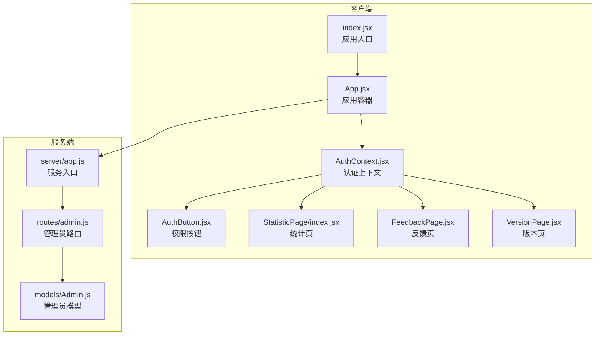
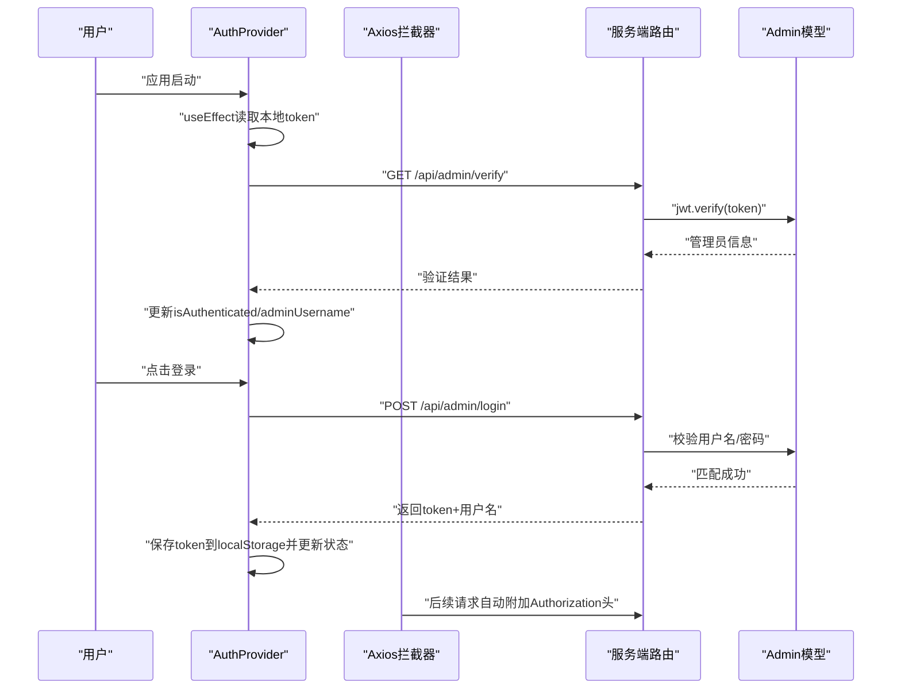
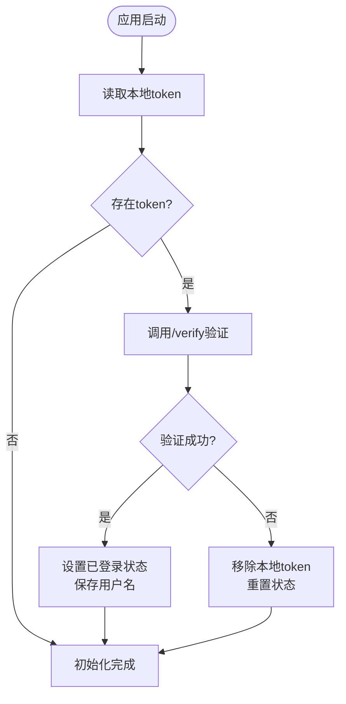
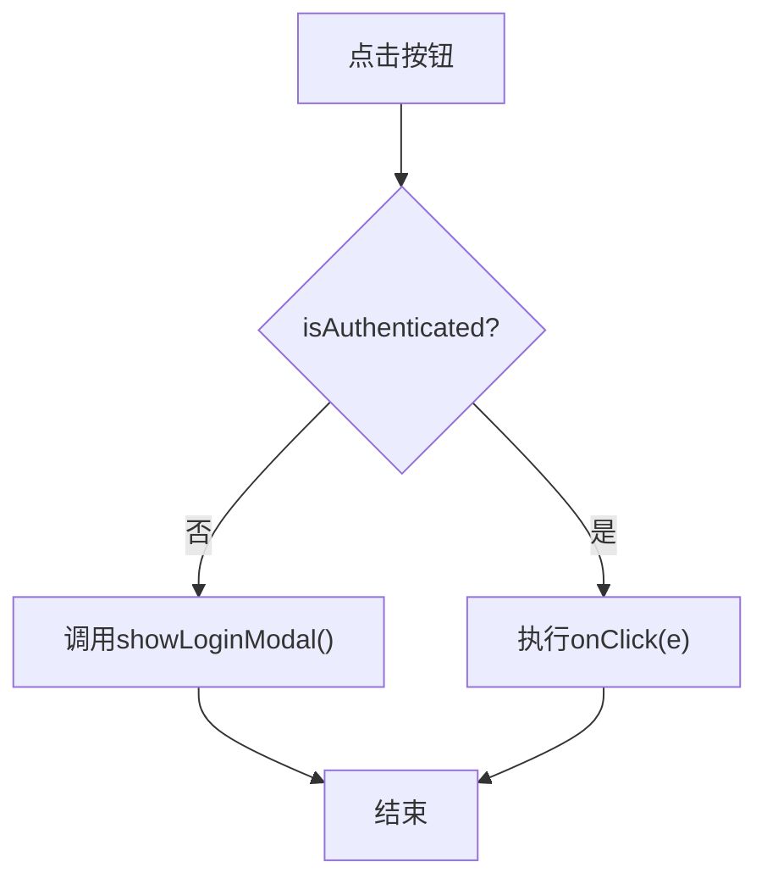
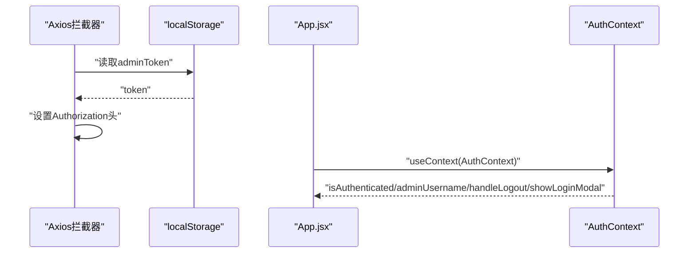
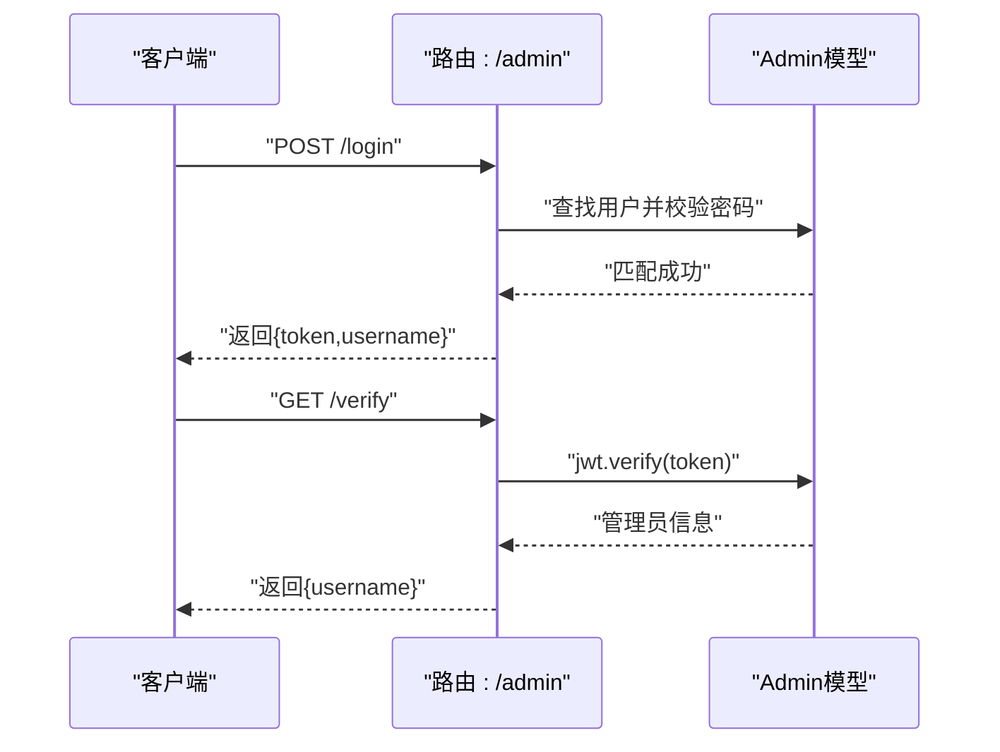
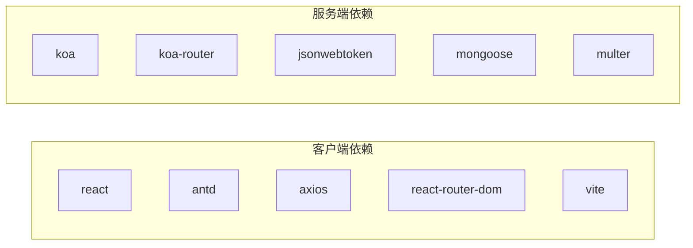
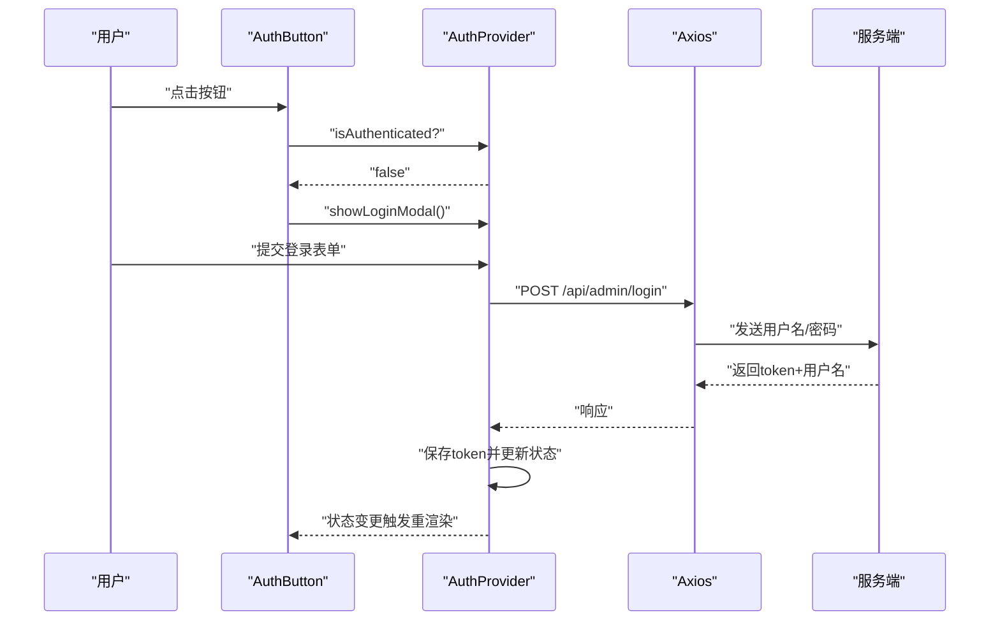

# 认证上下文管理

<cite>
**本文引用的文件**
- [AuthContext.jsx](file://client/src/context/AuthContext.jsx)
- [App.jsx](file://client/src/App.jsx)
- [index.jsx](file://client/src/index.jsx)
- [AuthButton.jsx](file://client/src/components/AuthButton.jsx)
- [StatisticPage/index.jsx](file://client/src/pages/StatisticPage/index.jsx)
- [FeedbackPage.jsx](file://client/src/pages/FeedbackPage.jsx)
- [VersionPage.jsx](file://client/src/pages/VersionPage.jsx)
- [admin.js](file://server/routes/admin.js)
- [Admin.js](file://server/models/Admin.js)
- [package.json](file://client/package.json)
- [server/package.json](file://server/package.json)
</cite>

## 目录
1. [简介](#简介)
2. [项目结构](#项目结构)
3. [核心组件](#核心组件)
4. [架构总览](#架构总览)
5. [详细组件分析](#详细组件分析)
6. [依赖关系分析](#依赖关系分析)
7. [性能考虑](#性能考虑)
8. [故障排查指南](#故障排查指南)
9. [结论](#结论)
10. [附录](#附录)

## 简介
本文件围绕认证上下文（AuthContext）的状态管理进行全面说明，重点解释：
- React Context 在认证系统中的作用与实现方式
- AuthContext 提供的状态管理能力：登录状态跟踪、管理员用户名管理、登录弹窗控制
- useEffect 钩子在应用初始化时自动验证 token 有效性的机制
- AuthProvider 组件的生命周期与状态更新机制
- 完整的组件使用示例与最佳实践
- 性能优化建议与调试技巧

## 项目结构
客户端采用基于文件的组织方式，认证上下文位于 context 目录，应用入口在 src/index.jsx 中挂载 BrowserRouter 并包裹 App；App.jsx 中通过 AuthProvider 提供认证上下文，页面组件通过 AuthContext 使用认证状态与行为。

**图表来源**
- [index.jsx](file://client/src/index.jsx#L1-L15)
- [App.jsx](file://client/src/App.jsx#L1-L253)
- [AuthContext.jsx](file://client/src/context/AuthContext.jsx#L1-L155)
- [AuthButton.jsx](file://client/src/components/AuthButton.jsx#L1-L43)
- [StatisticPage/index.jsx](file://client/src/pages/StatisticPage/index.jsx#L1-L262)
- [FeedbackPage.jsx](file://client/src/pages/FeedbackPage.jsx#L1-L496)
- [VersionPage.jsx](file://client/src/pages/VersionPage.jsx#L1-L800)
- [admin.js](file://server/routes/admin.js#L1-L128)
- [Admin.js](file://server/models/Admin.js#L1-L32)

**章节来源**
- [index.jsx](file://client/src/index.jsx#L1-L15)
- [App.jsx](file://client/src/App.jsx#L1-L253)

## 核心组件
- 认证上下文与提供者
  - AuthContext：导出上下文对象，供组件消费
  - AuthProvider：提供认证状态与行为，包括登录状态、用户名、登录弹窗控制、登录/注销逻辑
- 页面组件与权限按钮
  - AuthButton：封装需要管理员权限的按钮，未登录时显示提示并阻止点击
  - 各页面组件（统计、反馈、版本）通过 AuthContext 控制敏感操作的可用性

关键状态与行为：
- 登录状态跟踪：isAuthenticated
- 管理员用户名：adminUsername
- 登录弹窗控制：isLoginModalVisible、showLoginModal、hideLoginModal
- 登录流程：handleLogin（表单校验、调用登录接口、保存 token、更新状态）
- 注销流程：handleLogout（移除本地 token、清空状态）
- 初始化验证：useEffect 在首次渲染时读取本地 token 并调用验证接口

**章节来源**
- [AuthContext.jsx](file://client/src/context/AuthContext.jsx#L1-L155)
- [AuthButton.jsx](file://client/src/components/AuthButton.jsx#L1-L43)

## 架构总览
认证系统采用“前端上下文 + 服务端 JWT”的模式：
- 前端：AuthProvider 管理认证状态，Axios 请求拦截器自动附加 Authorization 头
- 服务端：提供登录与令牌验证接口，使用 JWT 进行鉴权

**图表来源**
- [AuthContext.jsx](file://client/src/context/AuthContext.jsx#L17-L48)
- [App.jsx](file://client/src/App.jsx#L18-L25)
- [admin.js](file://server/routes/admin.js#L26-L98)
- [Admin.js](file://server/models/Admin.js#L16-L30)

## 详细组件分析

### AuthProvider 生命周期与状态更新
- 初始化阶段
  - 组件挂载后执行一次副作用，读取本地存储的 token
  - 若存在 token，调用 verifyToken 接口验证有效性
  - 验证成功：设置已登录状态与用户名
  - 验证失败：清理本地 token，重置状态
- 登录阶段
  - 表单校验通过后，调用登录接口
  - 成功后保存 token，更新状态并关闭弹窗
- 注销阶段
  - 移除本地 token，清空状态并提示成功
- 弹窗控制
  - showLoginModal/hideLoginModal 控制登录弹窗显隐与表单重置

**图表来源**
- [AuthContext.jsx](file://client/src/context/AuthContext.jsx#L17-L48)

**章节来源**
- [AuthContext.jsx](file://client/src/context/AuthContext.jsx#L9-L155)

### AuthButton 权限控制组件
- 功能要点
  - 未登录时禁用按钮并显示锁图标与提示
  - 已登录时正常渲染按钮
  - 点击时若未登录，触发 showLoginModal；已登录则执行传入的 onClick
- 使用场景
  - 统计页“自主上报”
  - 反馈页“删除反馈”、“提交回复”
  - 版本页“发布新版本”、“设为最新”、“删除版本”

**图表来源**
- [AuthButton.jsx](file://client/src/components/AuthButton.jsx#L12-L27)

**章节来源**
- [AuthButton.jsx](file://client/src/components/AuthButton.jsx#L1-L43)
- [StatisticPage/index.jsx](file://client/src/pages/StatisticPage/index.jsx#L204-L210)
- [FeedbackPage.jsx](file://client/src/pages/FeedbackPage.jsx#L284-L298)
- [VersionPage.jsx](file://client/src/pages/VersionPage.jsx#L553-L570)

### App.jsx 中的认证集成
- Axios 请求拦截器
  - 自动从本地存储读取 token，并附加到 Authorization 头
- 用户信息组件
  - 未登录时显示“管理员登录”按钮（触发 showLoginModal）
  - 已登录时显示下拉菜单，包含“退出登录”选项（触发 handleLogout）

**图表来源**
- [App.jsx](file://client/src/App.jsx#L18-L60)

**章节来源**
- [App.jsx](file://client/src/App.jsx#L1-L253)

### 服务端认证流程
- 登录接口
  - 校验用户名与密码，成功后签发 JWT，返回 token 与用户名
- 令牌验证接口
  - 从 Authorization 头解析 token，验证后返回用户名
- 权限中间件
  - 验证 token 并将管理员信息注入 ctx.state，供受保护路由使用

**图表来源**
- [admin.js](file://server/routes/admin.js#L26-L98)
- [Admin.js](file://server/models/Admin.js#L16-L30)

**章节来源**
- [admin.js](file://server/routes/admin.js#L1-L128)
- [Admin.js](file://server/models/Admin.js#L1-L32)

## 依赖关系分析
- 前端依赖
  - React、Ant Design、Axios、React Router
  - 代理配置指向服务端端口，便于开发联调
- 后端依赖
  - Koa、Koa-Router、jsonwebtoken、mongoose、multer
  - 环境变量 JWT_SECRET 用于签名与验证

**图表来源**
- [package.json](file://client/package.json#L5-L18)
- [server/package.json](file://server/package.json#L10-L19)

**章节来源**
- [package.json](file://client/package.json#L1-L47)
- [server/package.json](file://server/package.json#L1-L24)

## 性能考虑
- 状态粒度
  - 将登录状态、用户名、弹窗状态拆分为独立状态，避免不必要的重渲染
- 本地存储与网络请求
  - 初始化仅在挂载时读取一次 token 并发起一次验证请求，避免重复请求
- 表单与弹窗
  - 登录弹窗关闭时重置表单，减少无效状态占用
- Axios 拦截器
  - 仅在存在 token 时附加 Authorization 头，避免无谓的请求头拼接
- 组件复用
  - AuthButton 统一处理权限控制，降低重复逻辑与渲染成本

[本节为通用性能建议，无需特定文件引用]

## 故障排查指南
- 无法登录
  - 检查服务端 JWT_SECRET 是否正确配置
  - 确认用户名/密码是否匹配
- 登录后仍提示未登录
  - 检查浏览器 localStorage 中是否存在 adminToken
  - 确认 /api/admin/verify 接口返回成功
- 请求被拒绝
  - 检查 Axios 拦截器是否正确附加 Authorization 头
  - 确认服务端中间件 verifyAdmin 是否正确解析 token
- 弹窗无法关闭
  - 确认 hideLoginModal 是否被调用且表单已重置

**章节来源**
- [AuthContext.jsx](file://client/src/context/AuthContext.jsx#L62-L92)
- [App.jsx](file://client/src/App.jsx#L18-L25)
- [admin.js](file://server/routes/admin.js#L100-L125)

## 结论
AuthContext 以最小的侵入实现了认证状态的集中管理，结合 Axios 拦截器与服务端 JWT 验证，构建了清晰的认证流程。通过 AuthButton 组件统一处理权限控制，提升了可维护性与用户体验。建议在生产环境中进一步完善 token 刷新策略、错误边界与日志记录，以增强系统的健壮性与可观测性。

[本节为总结性内容，无需特定文件引用]

## 附录

### 组件使用示例与最佳实践
- 在应用根部包裹 AuthProvider
  - 参考路径：[App.jsx](file://client/src/App.jsx#L245-L251)
- 在页面组件中使用认证状态
  - 示例：统计页“自主上报”按钮
    - 参考路径：[StatisticPage/index.jsx](file://client/src/pages/StatisticPage/index.jsx#L204-L210)
  - 示例：反馈页“删除反馈”按钮
    - 参考路径：[FeedbackPage.jsx](file://client/src/pages/FeedbackPage.jsx#L284-L298)
  - 示例：版本页“发布新版本”按钮
    - 参考路径：[VersionPage.jsx](file://client/src/pages/VersionPage.jsx#L586-L593)
- 使用 AuthButton 包裹敏感操作
  - 参考路径：[AuthButton.jsx](file://client/src/components/AuthButton.jsx#L12-L27)
- 在 App.jsx 中统一处理登录/注销
  - 参考路径：[App.jsx](file://client/src/App.jsx#L28-L60)

### 关键流程图（代码级）
- 登录流程

**图表来源**
- [AuthButton.jsx](file://client/src/components/AuthButton.jsx#L12-L27)
- [AuthContext.jsx](file://client/src/context/AuthContext.jsx#L62-L92)
- [admin.js](file://server/routes/admin.js#L26-L67)