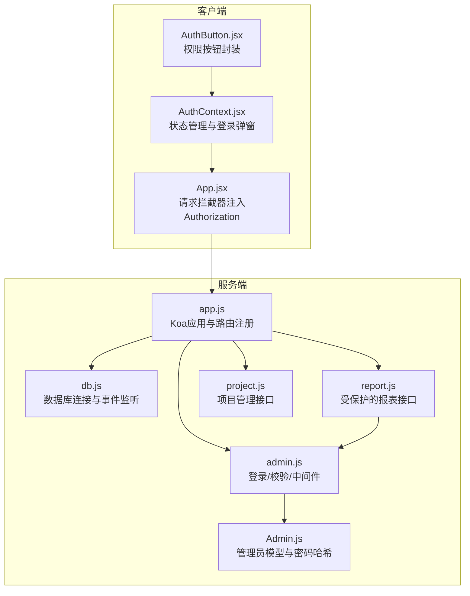
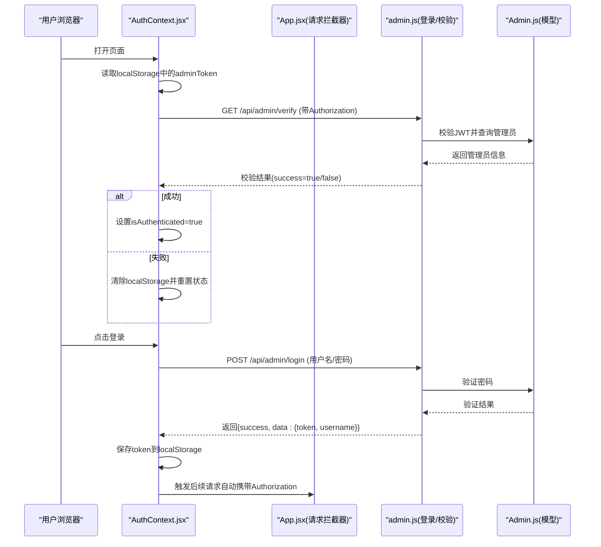
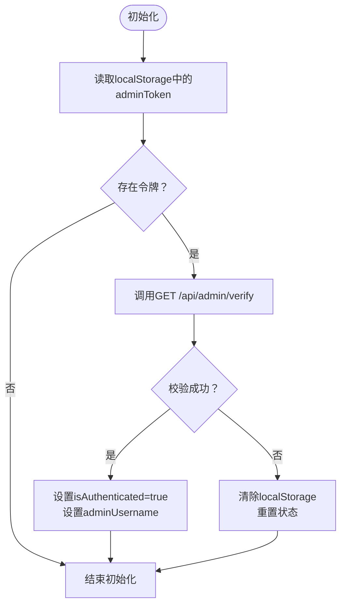
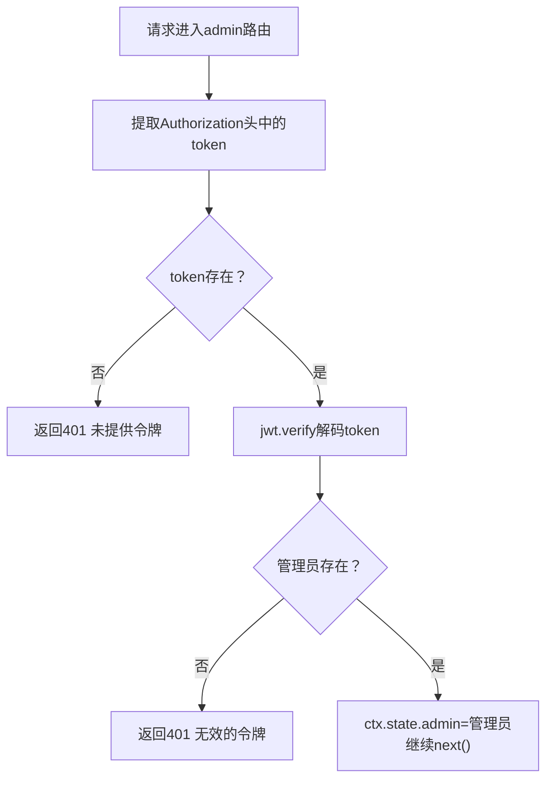
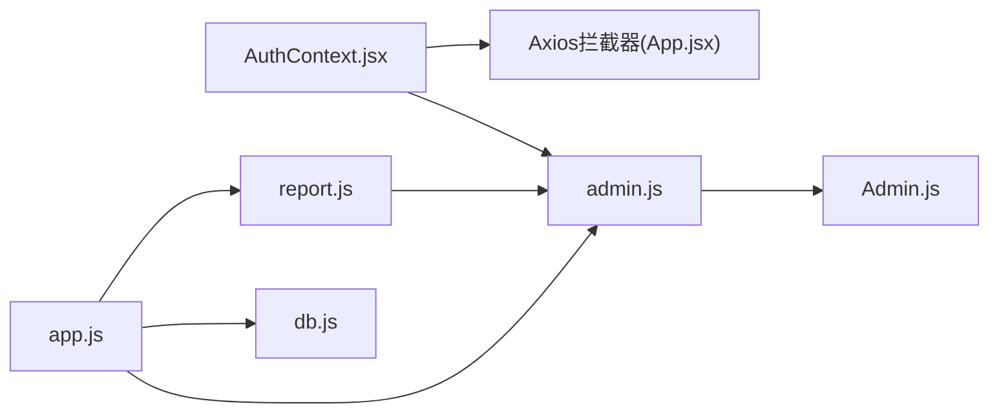
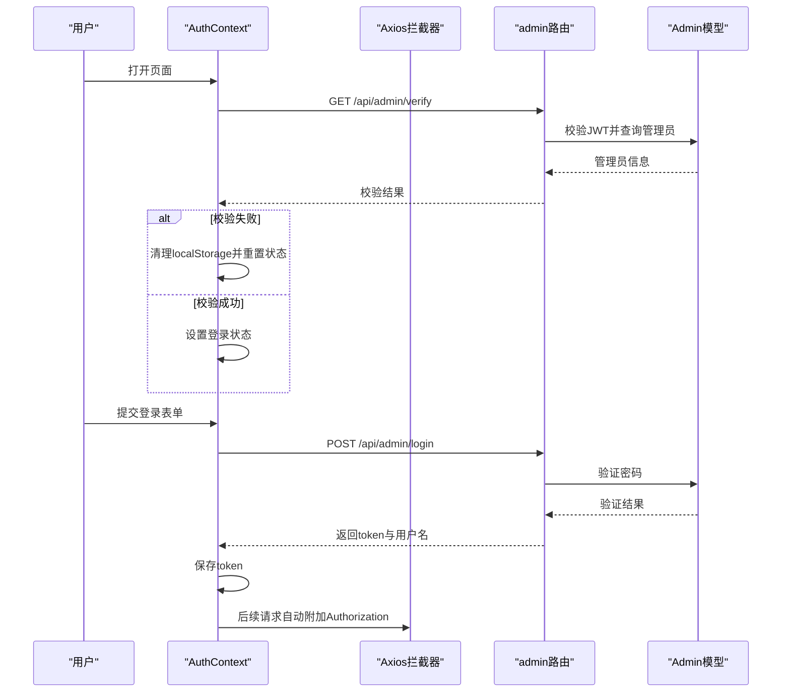

# 认证系统

<cite>
**本文引用的文件**
- [AuthContext.jsx](file://client/src/context/AuthContext.jsx)
- [AuthButton.jsx](file://client/src/components/AuthButton.jsx)
- [App.jsx](file://client/src/App.jsx)
- [Admin.js](file://server/models/Admin.js)
- [admin.js](file://server/routes/admin.js)
- [report.js](file://server/routes/report.js)
- [project.js](file://server/routes/project.js)
- [app.js](file://server/app.js)
- [db.js](file://server/db.js)
- [.env](file://server/.env)
- [woax.admins.json](file://db/woax.admins.json)
</cite>

## 目录
1. [简介](#简介)
2. [项目结构](#项目结构)
3. [核心组件](#核心组件)
4. [架构总览](#架构总览)
5. [详细组件分析](#详细组件分析)
6. [依赖关系分析](#依赖关系分析)
7. [性能考量](#性能考量)
8. [故障排查指南](#故障排查指南)
9. [结论](#结论)
10. [附录](#附录)

## 简介
本文件面向WoaX项目的认证系统，围绕JWT（JSON Web Token）认证机制、AuthContext上下文状态管理、后端认证中间件、管理员账户创建与权限控制进行深入解析，并提供安全最佳实践、token过期处理与会话管理策略，以及完整的认证流程图与代码示例路径。

## 项目结构
WoaX采用前后端分离架构：
- 前端使用React + Ant Design，通过Axios发起HTTP请求，使用localStorage持久化令牌。
- 后端使用Koa + MongoDB，提供REST接口与JWT中间件，统一处理跨域与静态资源。

图表来源
- [AuthContext.jsx](file://client/src/context/AuthContext.jsx#L1-L155)
- [AuthButton.jsx](file://client/src/components/AuthButton.jsx#L1-L43)
- [App.jsx](file://client/src/App.jsx#L1-L253)
- [app.js](file://server/app.js#L1-L61)
- [db.js](file://server/db.js#L1-L45)
- [Admin.js](file://server/models/Admin.js#L1-L32)
- [admin.js](file://server/routes/admin.js#L1-L128)
- [report.js](file://server/routes/report.js#L1-L271)
- [project.js](file://server/routes/project.js#L1-L226)

章节来源
- [app.js](file://server/app.js#L1-L61)
- [db.js](file://server/db.js#L1-L45)
- [AuthContext.jsx](file://client/src/context/AuthContext.jsx#L1-L155)
- [App.jsx](file://client/src/App.jsx#L1-L253)

## 核心组件
- 前端认证上下文：负责登录状态、令牌存储、初始化校验与注销。
- 请求拦截器：自动为每个请求附加Authorization头。
- 管理员模型：提供密码哈希与校验方法。
- 管理员路由：登录、令牌校验、权限中间件。
- 受保护路由：报表删除与自主上报接口使用管理员中间件。

章节来源
- [AuthContext.jsx](file://client/src/context/AuthContext.jsx#L1-L155)
- [App.jsx](file://client/src/App.jsx#L18-L25)
- [Admin.js](file://server/models/Admin.js#L1-L32)
- [admin.js](file://server/routes/admin.js#L1-L128)
- [report.js](file://server/routes/report.js#L205-L229)

## 架构总览
认证系统的关键交互如下：
- 客户端初始化时读取localStorage中的令牌并调用后端校验接口。
- 登录成功后保存令牌并在后续请求中自动附加Authorization头。
- 受保护接口通过中间件校验令牌有效性并注入管理员上下文。

图表来源
- [AuthContext.jsx](file://client/src/context/AuthContext.jsx#L16-L48)
- [App.jsx](file://client/src/App.jsx#L18-L25)
- [admin.js](file://server/routes/admin.js#L27-L98)
- [Admin.js](file://server/models/Admin.js#L17-L30)

## 详细组件分析

### 前端认证上下文（AuthContext）
- 状态管理
  - isLoginModalVisible：控制登录弹窗显示。
  - isAuthenticated：全局登录状态。
  - adminUsername：当前管理员用户名。
  - loading：登录表单加载状态。
- 初始化校验
  - 组件挂载时从localStorage读取令牌并调用后端校验接口。
  - 校验失败自动清理localStorage并重置状态。
- 登录流程
  - 表单校验通过后POST到登录接口，成功后保存token并更新状态。
  - 异常时提示错误消息。
- 注销流程
  - 清除localStorage并重置状态。
- 登录弹窗
  - 使用Ant Design Modal与Form，包含用户名与密码输入。

图表来源
- [AuthContext.jsx](file://client/src/context/AuthContext.jsx#L16-L48)

章节来源
- [AuthContext.jsx](file://client/src/context/AuthContext.jsx#L1-L155)

### 请求拦截器与自动注入
- 在App.jsx中配置Axios请求拦截器，自动将localStorage中的令牌附加到Authorization头。
- 保证后续所有受保护接口无需手动处理令牌。

章节来源
- [App.jsx](file://client/src/App.jsx#L18-L25)

### 管理员模型（Admin.js）
- 字段
  - username：唯一索引，管理员用户名。
  - passwordHash/salt：密码哈希与盐值。
  - email/createdAt/lastLogin：扩展信息。
- 方法
  - setPassword：使用PBKDF2生成盐值与哈希。
  - validatePassword：校验输入密码与哈希是否匹配。

章节来源
- [Admin.js](file://server/models/Admin.js#L1-L32)

### 管理员路由与中间件（admin.js）
- 登录接口
  - 校验用户名与密码，成功后签发JWT（有效期24小时），返回token与用户名。
- 令牌校验接口
  - 从Authorization头提取token，验证后查询管理员并返回用户名。
- 管理员中间件
  - 从Authorization头提取token，验证后将管理员对象注入ctx.state.admin，继续后续处理。
  - 未提供token或无效时返回401。

图表来源
- [admin.js](file://server/routes/admin.js#L70-L125)

章节来源
- [admin.js](file://server/routes/admin.js#L1-L128)

### 受保护接口（report.js）
- 删除报表记录与自主上报接口使用管理员中间件，确保只有有效管理员可操作。
- 通过ctx.state.admin获取当前管理员身份。

章节来源
- [report.js](file://server/routes/report.js#L205-L229)
- [report.js](file://server/routes/report.js#L232-L268)

### 项目路由与默认管理员（project.js、admin.js）
- 项目路由提供项目列表、详情、创建、更新、删除与数据迁移等接口。
- 应用启动时若不存在默认管理员，自动创建用户名为admin、默认密码为admin123的管理员账号。

章节来源
- [project.js](file://server/routes/project.js#L1-L226)
- [admin.js](file://server/routes/admin.js#L8-L24)

### 应用入口与数据库连接（app.js、db.js）
- app.js
  - 注册路由前缀/api/report、/api/feedback、/api/version、/api/projects、/api/admin。
  - 配置CORS与bodyParser，提供静态文件服务（/uploads）。
  - 启动服务器并监听端口。
- db.js
  - 连接MongoDB，监听断开与错误事件，优雅关闭时关闭连接。

章节来源
- [app.js](file://server/app.js#L1-L61)
- [db.js](file://server/db.js#L1-L45)

### 环境变量与默认管理员数据
- .env
  - 包含端口、数据库URI、上传目录与最大文件大小等配置。
- woax.admins.json
  - 展示了默认管理员的用户名、哈希、盐值与最后登录时间等字段。

章节来源
- [.env](file://server/.env#L1-L9)
- [woax.admins.json](file://db/woax.admins.json#L1-L15)

## 依赖关系分析
- 前端
  - AuthContext依赖Axios与Ant Design组件；App.jsx通过拦截器统一注入Authorization。
- 后端
  - admin.js依赖jsonwebtoken进行签发与验证，依赖Admin模型进行密码校验与管理员查询。
  - report.js依赖admin.js导出的verifyAdmin中间件实现权限控制。
  - app.js依赖db.js进行数据库连接与静态资源服务。

图表来源
- [AuthContext.jsx](file://client/src/context/AuthContext.jsx#L1-L155)
- [App.jsx](file://client/src/App.jsx#L18-L25)
- [admin.js](file://server/routes/admin.js#L1-L128)
- [Admin.js](file://server/models/Admin.js#L1-L32)
- [report.js](file://server/routes/report.js#L1-L271)
- [app.js](file://server/app.js#L1-L61)
- [db.js](file://server/db.js#L1-L45)

章节来源
- [admin.js](file://server/routes/admin.js#L1-L128)
- [report.js](file://server/routes/report.js#L1-L271)
- [app.js](file://server/app.js#L1-L61)

## 性能考量
- JWT签发与校验成本低，适合高并发场景。
- 建议：
  - 为不同接口设置差异化token有效期（如登录24小时，部分敏感操作更短）。
  - 对频繁访问的公开接口避免不必要的中间件校验。
  - 使用Redis缓存短期会话或黑名单，配合JWT实现快速吊销。

## 故障排查指南
- 常见问题
  - 未提供令牌：后端返回401“未提供令牌”。
  - 令牌无效或过期：后端返回401“无效的令牌”，前端应清除localStorage并重置状态。
  - 登录失败：用户名或密码错误，后端返回401。
  - 服务器错误：后端捕获异常并返回500。
- 前端处理
  - 初始化时自动校验令牌，失败则清理localStorage并重置状态。
  - 登录异常时提示具体错误消息。
- 后端处理
  - 中间件统一处理401与错误响应格式。
  - 数据库连接失败时抛出异常，便于上层处理。

章节来源
- [admin.js](file://server/routes/admin.js#L70-L98)
- [admin.js](file://server/routes/admin.js#L101-L125)
- [AuthContext.jsx](file://client/src/context/AuthContext.jsx#L24-L48)

## 结论
WoaX认证系统以JWT为核心，结合前端状态管理与后端中间件实现了简洁高效的管理员认证与授权。前端通过拦截器自动注入令牌，后端通过中间件统一校验，形成清晰的职责边界。建议在生产环境中进一步完善令牌吊销、多因子认证与审计日志等安全措施。

## 附录

### 安全最佳实践
- 令牌存储
  - 前端使用localStorage存储token，建议在HTTPS环境下运行，避免XSS攻击。
  - 可考虑使用HttpOnly Cookie存储（需后端改造）以降低XSS风险。
- 令牌有效期
  - 登录默认24小时，建议根据业务场景缩短有效期并实现刷新机制。
- 中间件权限
  - 对敏感接口（删除、修改）严格使用管理员中间件。
- 错误处理
  - 统一返回success/message/data结构，避免泄露内部细节。
- 数据库安全
  - 使用强密码与最小权限原则，定期备份与监控。

### Token过期与会话管理策略
- 过期处理
  - 前端在请求拦截器中检测401，触发重新登录流程。
  - 可引入refresh token机制（需后端支持）实现无感续期。
- 会话清理
  - 注销时清除localStorage并重置全局状态。
  - 后端中间件发现无效令牌时直接拒绝请求。

### 认证流程图（代码级）

图表来源
- [AuthContext.jsx](file://client/src/context/AuthContext.jsx#L16-L92)
- [App.jsx](file://client/src/App.jsx#L18-L25)
- [admin.js](file://server/routes/admin.js#L27-L98)
- [Admin.js](file://server/models/Admin.js#L17-L30)

### 代码示例路径
- 前端登录与校验
  - [AuthContext.jsx](file://client/src/context/AuthContext.jsx#L16-L92)
  - [App.jsx](file://client/src/App.jsx#L18-L25)
- 后端登录与校验
  - [admin.js](file://server/routes/admin.js#L27-L98)
- 管理员中间件
  - [admin.js](file://server/routes/admin.js#L101-L125)
- 受保护接口
  - [report.js](file://server/routes/report.js#L205-L229)
  - [report.js](file://server/routes/report.js#L232-L268)
- 默认管理员创建
  - [admin.js](file://server/routes/admin.js#L8-L24)
- 数据库连接
  - [db.js](file://server/db.js#L10-L24)
- 环境变量
  - [.env](file://server/.env#L1-L9)