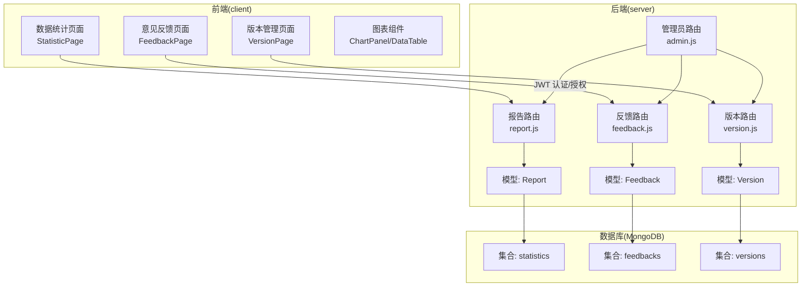
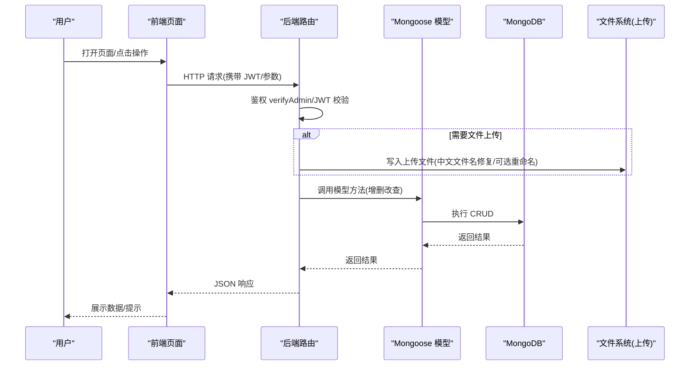
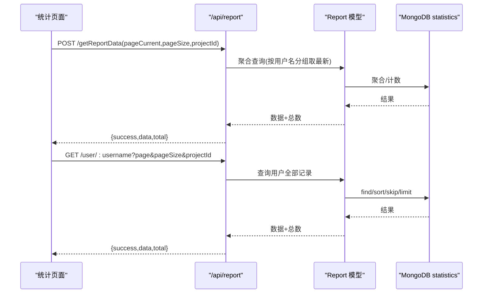
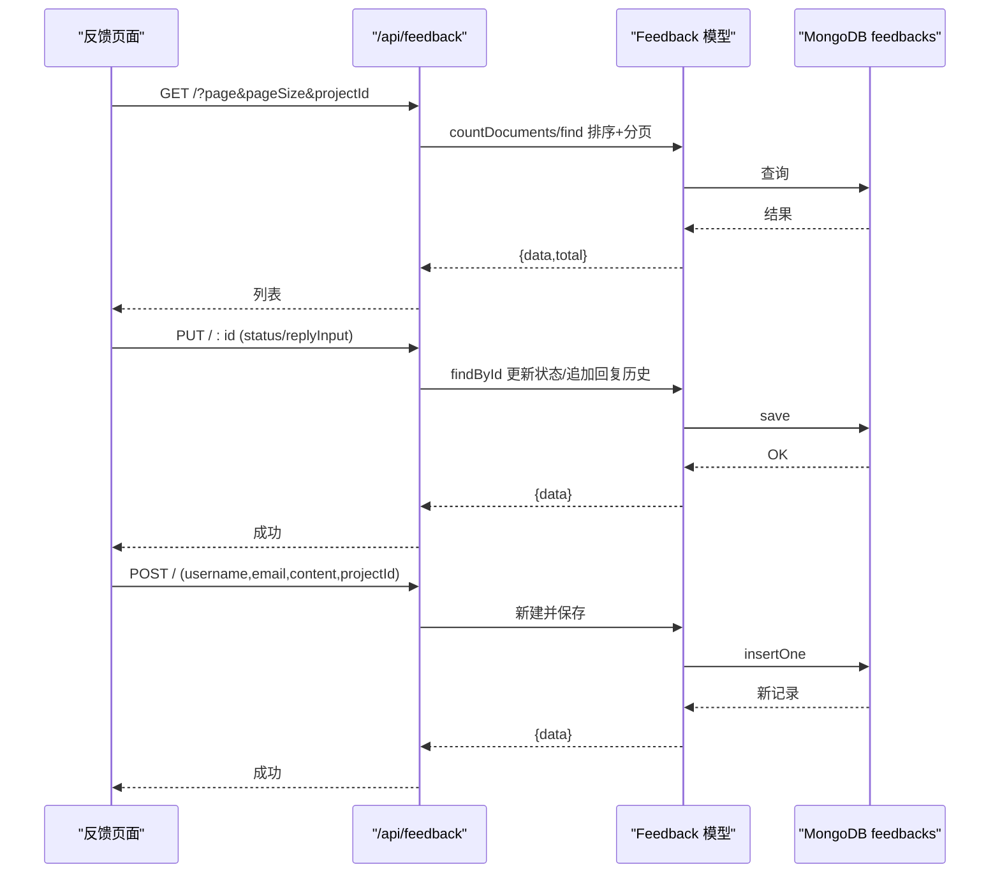
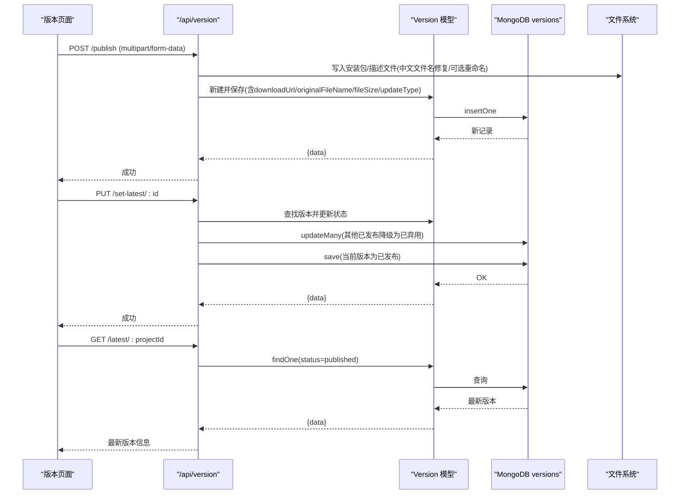
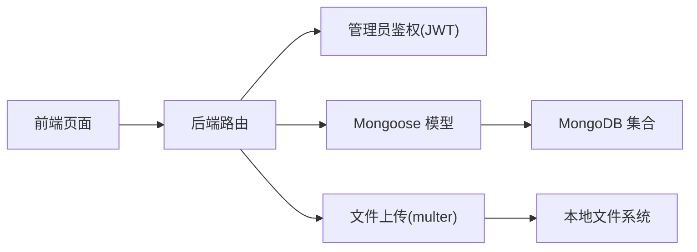

# 功能特性

<cite>
**本文引用的文件**
- [README.md](file://README.md)
- [client/src/pages/StatisticPage/index.jsx](file://client/src/pages/StatisticPage/index.jsx)
- [client/src/pages/StatisticPage/ChartPanel.jsx](file://client/src/pages/StatisticPage/ChartPanel.jsx)
- [client/src/pages/StatisticPage/DataTable.jsx](file://client/src/pages/StatisticPage/DataTable.jsx)
- [client/src/pages/StatisticPage/ReportFormModal.jsx](file://client/src/pages/StatisticPage/ReportFormModal.jsx)
- [client/src/pages/StatisticPage/ReportModal.jsx](file://client/src/pages/StatisticPage/ReportModal.jsx)
- [client/src/pages/FeedbackPage.jsx](file://client/src/pages/FeedbackPage.jsx)
- [client/src/pages/VersionPage.jsx](file://client/src/pages/VersionPage.jsx)
- [server/models/Report.js](file://server/models/Report.js)
- [server/models/Feedback.js](file://server/models/Feedback.js)
- [server/models/Version.js](file://server/models/Version.js)
- [server/routes/report.js](file://server/routes/report.js)
- [server/routes/feedback.js](file://server/routes/feedback.js)
- [server/routes/version.js](file://server/routes/version.js)
- [server/routers/admin.js](file://server/routers/admin.js)
- [db/woax.statistics.json](file://db/woax.statistics.json)
- [db/woax.feedbacks.json](file://db/woax.feedbacks.json)
- [db/woax.versions.json](file://db/woax.versions.json)
</cite>

## 目录
1. [简介](#简介)
2. [项目结构](#项目结构)
3. [核心组件](#核心组件)
4. [架构总览](#架构总览)
5. [详细组件分析](#详细组件分析)
6. [依赖分析](#依赖分析)
7. [性能考虑](#性能考虑)
8. [故障排查指南](#故障排查指南)
9. [结论](#结论)
10. [附录](#附录)

## 简介
WoaX 是一个基于 React 前端、Node.js + Koa 后端与 MongoDB 的全栈应用，围绕三大核心功能模块构建：数据统计、意见反馈与版本管理。其目标是帮助项目管理者收集用户行为数据、收集并管理用户反馈、以及高效地发布与通知版本更新。

- 数据统计：采集用户数据（用户名、IP、时间、版本、设备信息等），提供聚合视图、图表分析与用户明细查询。
- 意见反馈：支持富文本内容、用户信息收集与回复机制，提供状态流转与回复历史。
- 版本管理：支持版本信息管理、更新类型控制、文件上传与下载、最新版本标记与通知。

## 项目结构
项目采用前后端分离架构，前端使用 Ant Design + Recharts 进行可视化与交互，后端使用 Koa + Mongoose 进行接口与数据模型管理；数据存储在 MongoDB 中，配合本地文件上传目录完成版本文件的落地。

**图表来源**
- [client/src/pages/StatisticPage/index.jsx](file://client/src/pages/StatisticPage/index.jsx#L1-L262)
- [client/src/pages/FeedbackPage.jsx](file://client/src/pages/FeedbackPage.jsx#L1-L496)
- [client/src/pages/VersionPage.jsx](file://client/src/pages/VersionPage.jsx#L1-L890)
- [server/routes/report.js](file://server/routes/report.js#L1-L271)
- [server/routes/feedback.js](file://server/routes/feedback.js#L1-L187)
- [server/routes/version.js](file://server/routes/version.js#L1-L432)
- [server/models/Report.js](file://server/models/Report.js#L1-L22)
- [server/models/Feedback.js](file://server/models/Feedback.js#L1-L52)
- [server/models/Version.js](file://server/models/Version.js#L1-L62)

**章节来源**
- [README.md](file://README.md#L1-L44)

## 核心组件
- 数据统计模块
  - 页面入口：聚合每用户最后一次上报，支持分页与图表展示；提供“自主上报”入口（需管理员权限）。
  - 图表组件：版本分布柱状图、时间趋势折线图、设备分布饼图。
  - 用户明细：按用户名查看其全部上报记录，支持分页。
- 意见反馈模块
  - 列表：按项目维度分页展示反馈，支持状态徽章与操作按钮。
  - 详情：查看反馈详情、更新状态、富文本回复、查看回复历史。
  - 提交：管理员可提交新反馈（含用户名、邮箱、内容）。
- 版本管理模块
  - 列表：按项目维度分页展示版本，支持状态与更新方式徽章。
  - 详情：编辑版本号、描述、状态、更新方式；查看下载链接与描述文件。
  - 发布：管理员上传安装包与描述文件，支持中文文件名修复与可选重命名。
  - 最新版本：将某版本设为“已发布”，自动将同项目其他已发布版本降级为“已弃用”。

**章节来源**
- [client/src/pages/StatisticPage/index.jsx](file://client/src/pages/StatisticPage/index.jsx#L1-L262)
- [client/src/pages/StatisticPage/ChartPanel.jsx](file://client/src/pages/StatisticPage/ChartPanel.jsx#L1-L129)
- [client/src/pages/StatisticPage/DataTable.jsx](file://client/src/pages/StatisticPage/DataTable.jsx#L1-L124)
- [client/src/pages/StatisticPage/ReportFormModal.jsx](file://client/src/pages/StatisticPage/ReportFormModal.jsx#L1-L107)
- [client/src/pages/StatisticPage/ReportModal.jsx](file://client/src/pages/StatisticPage/ReportModal.jsx#L1-L51)
- [client/src/pages/FeedbackPage.jsx](file://client/src/pages/FeedbackPage.jsx#L1-L496)
- [client/src/pages/VersionPage.jsx](file://client/src/pages/VersionPage.jsx#L1-L890)

## 架构总览
WoaX 的整体工作流如下：前端页面通过 HTTP 请求调用后端路由，路由层负责鉴权（JWT）、参数校验与业务处理，模型层负责与 MongoDB 的读写，版本模块还涉及本地文件上传与下载。

**图表来源**
- [server/routes/report.js](file://server/routes/report.js#L1-L271)
- [server/routes/feedback.js](file://server/routes/feedback.js#L1-L187)
- [server/routes/version.js](file://server/routes/version.js#L1-L432)
- [server/routers/admin.js](file://server/routers/admin.js#L1-L128)

## 详细组件分析

### 数据统计模块
- 功能要点
  - 聚合每用户最后一次上报，按时间倒序分页展示。
  - 全量数据用于图表渲染，支持版本分布、时间趋势、设备分布三类图表。
  - 支持管理员“自主上报”，直接录入用户数据。
  - 支持删除上报记录（管理员）。
- 数据模型
  - 字段包含用户名、IP、时间戳、版本号、备注、设备信息、项目 ID 等。
- 关键流程
  - 获取聚合数据：后端按项目过滤、按用户名分组取最新一条，再分页返回。
  - 获取用户明细：按用户名与项目 ID 查询该用户的全部上报记录。
  - 自主上报：管理员提交后端保存，自动记录 IP 与时间。

**图表来源**
- [server/routes/report.js](file://server/routes/report.js#L8-L131)
- [server/models/Report.js](file://server/models/Report.js#L1-L22)

**章节来源**
- [client/src/pages/StatisticPage/index.jsx](file://client/src/pages/StatisticPage/index.jsx#L57-L125)
- [client/src/pages/StatisticPage/ChartPanel.jsx](file://client/src/pages/StatisticPage/ChartPanel.jsx#L8-L53)
- [client/src/pages/StatisticPage/DataTable.jsx](file://client/src/pages/StatisticPage/DataTable.jsx#L6-L93)
- [client/src/pages/StatisticPage/ReportFormModal.jsx](file://client/src/pages/StatisticPage/ReportFormModal.jsx#L15-L38)
- [client/src/pages/StatisticPage/ReportModal.jsx](file://client/src/pages/StatisticPage/ReportModal.jsx#L14-L47)
- [server/routes/report.js](file://server/routes/report.js#L8-L131)
- [server/models/Report.js](file://server/models/Report.js#L1-L22)
- [db/woax.statistics.json](file://db/woax.statistics.json#L1-L800)

### 意见反馈模块
- 功能要点
  - 列表：按项目维度分页展示，状态以徽章显示，支持查看详情与删除。
  - 详情：更新状态（待处理/已审阅/已解决），富文本回复，查看回复历史。
  - 提交：管理员提交新反馈，自动记录 IP 与时间。
- 数据模型
  - 字段包含用户名、邮箱、内容、时间戳、IP、状态、回复历史等。
- 关键流程
  - 获取反馈列表：按项目 ID 查询，支持分页与排序。
  - 更新反馈：支持仅更新状态或追加回复，回复历史按时间倒序。
  - 提交反馈：管理员提交后端保存，自动记录 IP 与状态为“待处理”。

**图表来源**
- [server/routes/feedback.js](file://server/routes/feedback.js#L7-L187)
- [server/models/Feedback.js](file://server/models/Feedback.js#L1-L52)

**章节来源**
- [client/src/pages/FeedbackPage.jsx](file://client/src/pages/FeedbackPage.jsx#L66-L191)
- [client/src/pages/FeedbackPage.jsx](file://client/src/pages/FeedbackPage.jsx#L117-L175)
- [client/src/pages/FeedbackPage.jsx](file://client/src/pages/FeedbackPage.jsx#L193-L219)
- [server/routes/feedback.js](file://server/routes/feedback.js#L7-L187)
- [server/models/Feedback.js](file://server/models/Feedback.js#L1-L52)
- [db/woax.feedbacks.json](file://db/woax.feedbacks.json#L1-L185)

### 版本管理模块
- 功能要点
  - 列表：按项目维度分页展示版本，支持状态与更新方式徽章。
  - 详情：编辑版本号、描述、状态、更新方式；查看下载链接与描述文件。
  - 发布：管理员上传安装包与描述文件，支持中文文件名修复与可选重命名。
  - 最新版本：将某版本设为“已发布”，自动将同项目其他已发布版本降级为“已弃用”。
- 数据模型
  - 字段包含版本号、描述、项目 ID、时间戳、状态、下载 URL、原始文件名、文件大小、更新方式、描述文件 URL 等。
- 关键流程
  - 发布新版本：上传文件并生成下载 URL，保存版本信息。
  - 设置最新版本：先将同项目其他已发布版本降级为“已弃用”，再将当前版本置为“已发布”。
  - 下载：根据保存的原始文件名修复中文编码后触发下载。

**图表来源**
- [server/routes/version.js](file://server/routes/version.js#L146-L339)
- [server/models/Version.js](file://server/models/Version.js#L1-L62)

**章节来源**
- [client/src/pages/VersionPage.jsx](file://client/src/pages/VersionPage.jsx#L72-L120)
- [client/src/pages/VersionPage.jsx](file://client/src/pages/VersionPage.jsx#L134-L189)
- [client/src/pages/VersionPage.jsx](file://client/src/pages/VersionPage.jsx#L406-L459)
- [server/routes/version.js](file://server/routes/version.js#L146-L339)
- [server/models/Version.js](file://server/models/Version.js#L1-L62)
- [db/woax.versions.json](file://db/woax.versions.json#L1-L52)

## 依赖分析
- 组件耦合
  - 前端页面与后端路由通过 REST 接口耦合，路由层统一进行管理员权限校验。
  - 后端模型与数据库集合一一对应，版本模块还依赖本地文件系统。
- 外部依赖
  - 前端：Ant Design、Recharts、Axios、ReactQuill。
  - 后端：Koa、Mongoose、JWT、Multer。
- 权限控制
  - 管理员登录与 JWT 验证，所有写操作（新增/更新/删除/设置最新）均需管理员权限。

**图表来源**
- [server/routers/admin.js](file://server/routers/admin.js#L1-L128)
- [server/routes/report.js](file://server/routes/report.js#L1-L271)
- [server/routes/feedback.js](file://server/routes/feedback.js#L1-L187)
- [server/routes/version.js](file://server/routes/version.js#L1-L432)

**章节来源**
- [server/routers/admin.js](file://server/routers/admin.js#L1-L128)

## 性能考虑
- 前端
  - 图表组件使用响应式容器与懒加载策略，避免大数据量下的渲染阻塞。
  - 表格开启虚拟滚动与固定列宽，提升长列表滚动性能。
- 后端
  - 数据统计聚合使用分组与排序，结合分页减少一次性传输的数据量。
  - 版本列表查询使用索引字段（如项目 ID、状态、时间戳）优化分页查询。
- 存储
  - 版本文件采用本地磁盘存储，建议在生产环境迁移至对象存储（如 OSS/COS）以提升可用性与扩展性。
- 安全
  - 所有写操作均进行管理员 JWT 校验，防止未授权访问。

## 故障排查指南
- 登录与权限
  - 若出现“未提供令牌/无效的令牌”，检查前端是否携带正确的 Authorization 头，后端 JWT Secret 是否一致。
- 数据统计
  - 若聚合数据为空，确认项目 ID 参数是否正确，以及是否存在对应集合数据。
- 意见反馈
  - 若更新状态或回复失败，检查请求体字段是否完整（状态、回复内容），以及管理员权限是否生效。
- 版本管理
  - 若上传失败或下载异常，检查文件上传目录权限、中文文件名修复逻辑与下载链接拼接是否正确。
- 日志定位
  - 后端路由层对错误进行统一捕获与返回，前端根据 success 字段与 message 提示进行定位。

**章节来源**
- [server/routers/admin.js](file://server/routers/admin.js#L69-L125)
- [server/routes/report.js](file://server/routes/report.js#L80-L87)
- [server/routes/feedback.js](file://server/routes/feedback.js#L114-L157)
- [server/routes/version.js](file://server/routes/version.js#L148-L255)

## 结论
WoaX 的三大功能模块围绕“数据采集—反馈闭环—版本发布”形成完整的产品运营链路。前端通过直观的可视化与交互提升管理效率，后端通过严格的权限控制与清晰的路由职责保障系统稳定。建议在生产环境中进一步完善文件存储、缓存与监控体系，持续优化用户体验与系统可靠性。

## 附录
- 实际使用场景示例
  - 数据统计：按周导出版本分布与设备分布，识别异常版本与设备占比，指导资源分配。
  - 意见反馈：建立“待处理—已审阅—已解决”的闭环流程，富文本回复提升沟通效率。
  - 版本管理：通过“被动提醒/主动提醒/强制更新”三种方式平衡用户体验与升级需求，确保用户及时获得最新版本。