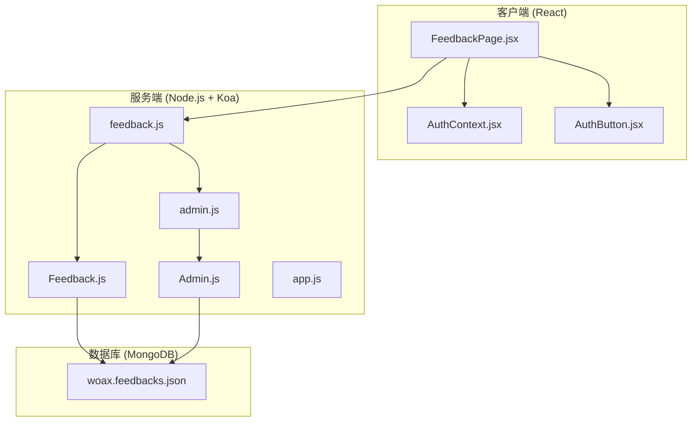
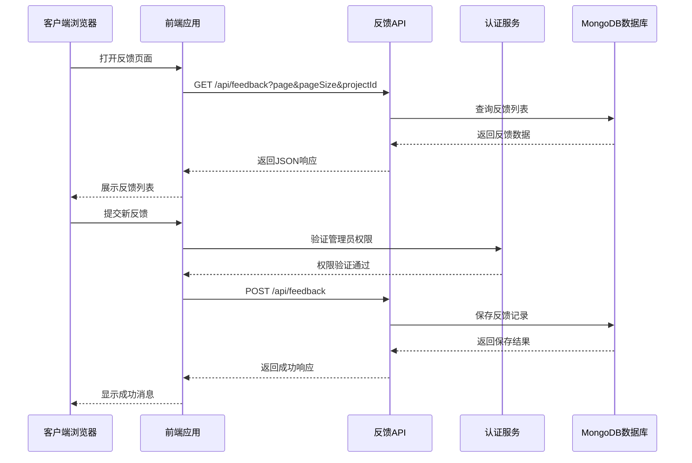
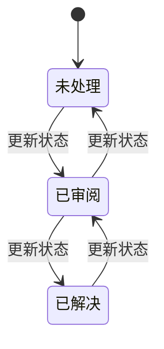
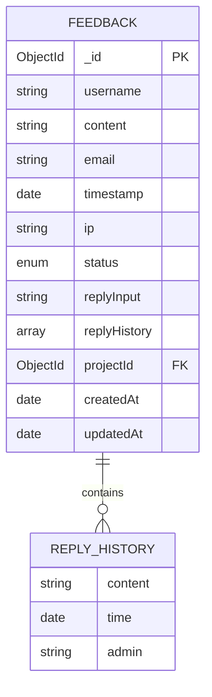
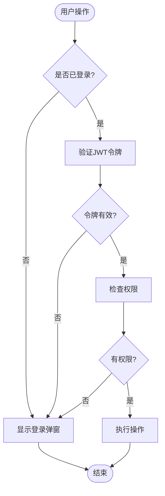
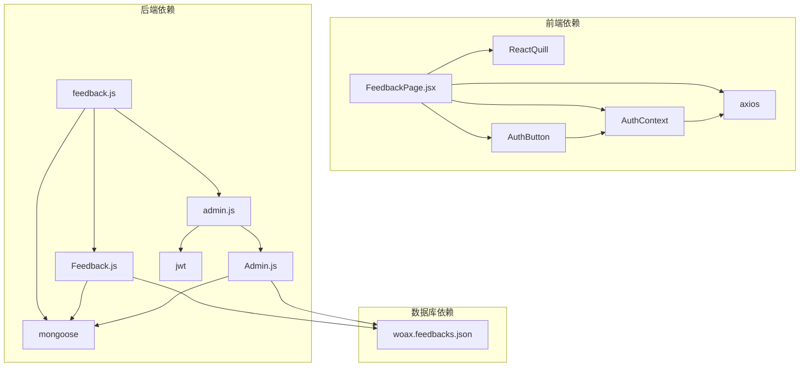
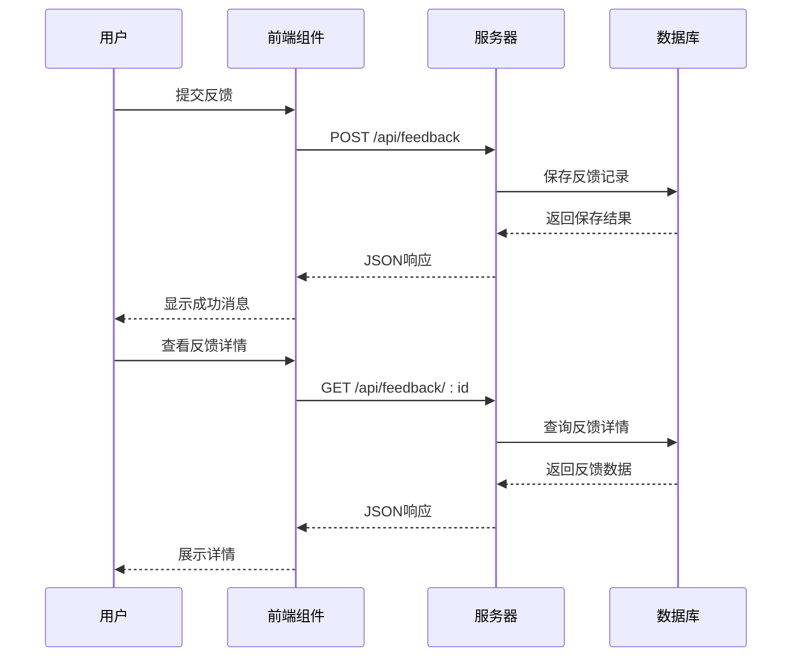

# 意见反馈功能

<cite>
**本文档引用的文件**
- [FeedbackPage.jsx](file://client/src/pages/FeedbackPage.jsx)
- [Feedback.js](file://server/models/Feedback.js)
- [feedback.js](file://server/routes/feedback.js)
- [woax.feedbacks.json](file://db/woax.feedbacks.json)
- [AuthContext.jsx](file://client/src/context/AuthContext.jsx)
- [AuthButton.jsx](file://client/src/components/AuthButton.jsx)
- [admin.js](file://server/routes/admin.js)
- [Admin.js](file://server/models/Admin.js)
- [app.js](file://server/app.js)
- [README.md](file://README.md)
</cite>

## 目录
1. [简介](#简介)
2. [项目结构](#项目结构)
3. [核心组件](#核心组件)
4. [架构概览](#架构概览)
5. [详细组件分析](#详细组件分析)
6. [依赖关系分析](#依赖关系分析)
7. [性能考虑](#性能考虑)
8. [故障排除指南](#故障排除指南)
9. [结论](#结论)
10. [附录](#附录)

## 简介
意见反馈功能是WoaX项目中的重要组成部分，旨在收集和管理用户对项目的反馈意见。该功能提供了完整的反馈收集、分类管理、状态跟踪和回复机制，支持富文本编辑器和用户信息自动收集。

## 项目结构
WoaX采用前后端分离架构，意见反馈功能主要分布在以下模块中：



**图表来源**
- [FeedbackPage.jsx](file://client/src/pages/FeedbackPage.jsx#L1-L496)
- [feedback.js](file://server/routes/feedback.js#L1-L187)
- [Feedback.js](file://server/models/Feedback.js#L1-L52)

**章节来源**
- [README.md](file://README.md#L1-L44)

## 核心组件
意见反馈功能的核心组件包括：

### 前端组件
- **FeedbackPage**: 主要的反馈管理界面，包含反馈列表展示、详情查看、状态更新和回复功能
- **AuthContext**: 管理员认证上下文，处理登录状态管理和权限控制
- **AuthButton**: 权限控制按钮组件，封装了管理员权限验证逻辑

### 后端组件
- **Feedback模型**: 定义反馈数据结构和验证规则
- **反馈路由**: 处理所有反馈相关的HTTP请求
- **Admin模型**: 管理员账户管理和密码加密
- **管理员路由**: 处理管理员登录、验证和权限控制

**章节来源**
- [FeedbackPage.jsx](file://client/src/pages/FeedbackPage.jsx#L23-L496)
- [AuthContext.jsx](file://client/src/context/AuthContext.jsx#L1-L155)
- [AuthButton.jsx](file://client/src/components/AuthButton.jsx#L1-L43)
- [Feedback.js](file://server/models/Feedback.js#L1-L52)
- [admin.js](file://server/routes/admin.js#L1-L128)

## 架构概览
意见反馈功能采用RESTful API设计，实现了完整的CRUD操作和权限控制：



**图表来源**
- [FeedbackPage.jsx](file://client/src/pages/FeedbackPage.jsx#L67-L96)
- [feedback.js](file://server/routes/feedback.js#L7-L43)
- [admin.js](file://server/routes/admin.js#L100-L125)

## 详细组件分析

### 前端反馈页面组件
FeedbackPage组件是意见反馈功能的核心UI组件，提供了完整的用户交互界面：

#### 富文本编辑器集成
系统集成了ReactQuill富文本编辑器，支持：
- 富文本格式化（粗体、斜体、列表等）
- HTML内容渲染和安全处理
- 响应式布局适配

#### 用户信息自动收集
组件自动收集以下用户信息：
- IP地址：通过请求对象自动获取
- 时间戳：记录反馈提交时间
- 用户名：从表单获取
- 邮箱：可选字段

#### 状态管理


**图表来源**
- [FeedbackPage.jsx](file://client/src/pages/FeedbackPage.jsx#L222-L233)

#### 分页和搜索
- 支持分页显示，每页20条记录
- 支持按项目ID过滤反馈
- 实时搜索和筛选功能

**章节来源**
- [FeedbackPage.jsx](file://client/src/pages/FeedbackPage.jsx#L1-L496)

### 后端数据模型设计
Feedback模型定义了完整的反馈数据结构：

#### 数据模型结构


**图表来源**
- [Feedback.js](file://server/models/Feedback.js#L3-L49)

#### 字段说明
- **username**: 用户名，必填，长度限制
- **content**: 反馈内容，必填，支持HTML
- **email**: 用户邮箱，可选
- **timestamp**: 创建时间，默认当前时间
- **ip**: 用户IP地址，可选
- **status**: 反馈状态，枚举类型
- **replyInput**: 当前回复内容
- **replyHistory**: 回复历史记录数组
- **projectId**: 关联的项目ID

**章节来源**
- [Feedback.js](file://server/models/Feedback.js#L1-L52)

### API接口设计
系统提供了完整的RESTful API接口：

#### 反馈管理API
| 方法 | 路径 | 权限 | 功能 |
|------|------|------|------|
| GET | /api/feedback | 公共 | 获取反馈列表 |
| GET | /api/feedback/:id | 公共 | 获取反馈详情 |
| POST | /api/feedback | 管理员 | 创建新反馈 |
| PUT | /api/feedback/:id | 管理员 | 更新反馈状态和回复 |
| DELETE | /api/feedback/:id | 管理员 | 删除反馈 |

#### 管理员认证API
| 方法 | 路径 | 权限 | 功能 |
|------|------|------|------|
| POST | /api/admin/login | 公共 | 管理员登录 |
| GET | /api/admin/verify | 公共 | 验证管理员令牌 |

**章节来源**
- [feedback.js](file://server/routes/feedback.js#L1-L187)
- [admin.js](file://server/routes/admin.js#L1-L128)

### 权限控制系统
系统实现了基于JWT的管理员权限控制：



**图表来源**
- [AuthButton.jsx](file://client/src/components/AuthButton.jsx#L12-L43)
- [admin.js](file://server/routes/admin.js#L100-L125)

**章节来源**
- [AuthContext.jsx](file://client/src/context/AuthContext.jsx#L1-L155)
- [AuthButton.jsx](file://client/src/components/AuthButton.jsx#L1-L43)

## 依赖关系分析

### 组件依赖图


**图表来源**
- [FeedbackPage.jsx](file://client/src/pages/FeedbackPage.jsx#L1-L18)
- [feedback.js](file://server/routes/feedback.js#L1-L5)
- [admin.js](file://server/routes/admin.js#L1-L3)

### 数据流分析


**图表来源**
- [FeedbackPage.jsx](file://client/src/pages/FeedbackPage.jsx#L194-L219)
- [feedback.js](file://server/routes/feedback.js#L46-L69)

**章节来源**
- [FeedbackPage.jsx](file://client/src/pages/FeedbackPage.jsx#L1-L496)
- [feedback.js](file://server/routes/feedback.js#L1-L187)

## 性能考虑
基于现有实现，以下是性能优化建议：

### 前端性能优化
- **虚拟滚动**: 对于大量反馈记录，考虑实现虚拟滚动以提升渲染性能
- **缓存策略**: 实现本地缓存机制，减少重复API调用
- **懒加载**: 对富文本编辑器进行懒加载，提升首屏加载速度

### 后端性能优化
- **索引优化**: 在projectId和timestamp字段上建立索引
- **分页优化**: 实现更高效的分页查询算法
- **连接池**: 优化数据库连接池配置

### 数据库性能
- **查询优化**: 使用投影查询只返回必要字段
- **批量操作**: 对于大量数据操作，考虑使用批量处理

## 故障排除指南

### 常见问题及解决方案

#### 反馈无法提交
**症状**: 提交反馈时出现错误提示
**可能原因**:
- 网络连接问题
- 服务器未启动
- 权限不足

**解决步骤**:
1. 检查网络连接状态
2. 确认服务器端口3001正在运行
3. 验证管理员登录状态
4. 查看浏览器开发者工具的网络面板

#### 反馈列表为空
**症状**: 页面显示空白或只有标题
**可能原因**:
- 项目ID参数缺失
- 数据库连接问题
- 权限不足

**解决步骤**:
1. 确认选择了有效的项目
2. 检查数据库连接状态
3. 验证管理员权限

#### 富文本编辑器异常
**症状**: 富文本编辑器无法正常工作
**可能原因**:
- ReactQuill库加载失败
- CSS样式冲突
- 浏览器兼容性问题

**解决步骤**:
1. 检查网络连接是否正常
2. 确认ReactQuill依赖正确安装
3. 检查CSS样式冲突

**章节来源**
- [FeedbackPage.jsx](file://client/src/pages/FeedbackPage.jsx#L88-L95)
- [AuthContext.jsx](file://client/src/context/AuthContext.jsx#L37-L47)

## 结论
WoaX项目的意见反馈功能实现了完整的用户反馈收集、管理和回复机制。系统采用了现代化的技术栈，包括React前端、Node.js+Koa后端和MongoDB数据库，提供了良好的用户体验和可扩展性。

主要优势包括：
- 完整的权限控制系统
- 支持富文本编辑的内容管理
- 实时的状态跟踪和回复功能
- 响应式的用户界面设计

建议的改进方向：
- 增强富文本编辑器的安全性
- 实现更完善的搜索和筛选功能
- 添加邮件通知机制
- 优化移动端用户体验

## 附录

### API使用示例

#### 获取反馈列表
```javascript
// 请求示例
GET /api/feedback?page=1&pageSize=20&projectId=PROJECT_ID

// 响应示例
{
  "success": true,
  "data": [...],
  "total": 100,
  "page": 1,
  "pageSize": 20
}
```

#### 提交新反馈
```javascript
// 请求示例
POST /api/feedback
Authorization: Bearer YOUR_TOKEN

{
  "username": "user123",
  "email": "user@example.com",
  "content": "<p>反馈内容</p>",
  "projectId": "PROJECT_ID"
}

// 响应示例
{
  "success": true,
  "message": "反馈提交成功",
  "data": {
    "username": "user123",
    "content": "<p>反馈内容</p>",
    "status": "pending",
    "timestamp": "2025-01-01T00:00:00Z"
  }
}
```

#### 更新反馈状态
```javascript
// 请求示例
PUT /api/feedback/FEEDBACK_ID
Authorization: Bearer YOUR_TOKEN

{
  "status": "resolved",
  "replyInput": "<p>回复内容</p>"
}

// 响应示例
{
  "success": true,
  "message": "反馈更新成功",
  "data": {
    "status": "resolved",
    "replyHistory": [...]
  }
}
```

### 最佳实践建议

#### 用户体验设计
- **简洁明了**: 保持界面简洁，避免不必要的复杂操作
- **及时反馈**: 所有用户操作都应有明确的反馈提示
- **错误处理**: 提供友好的错误提示和解决方案
- **响应式设计**: 确保在各种设备上都有良好的使用体验

#### 安全考虑
- **输入验证**: 对所有用户输入进行严格的验证和清理
- **权限控制**: 严格区分普通用户和管理员权限
- **数据保护**: 对敏感信息进行适当的保护和脱敏处理
- **日志记录**: 记录重要的操作日志以便审计

#### 性能优化
- **懒加载**: 对大型组件和资源进行懒加载
- **缓存策略**: 合理使用缓存减少重复请求
- **异步处理**: 对耗时操作使用异步处理避免阻塞UI
- **资源压缩**: 对静态资源进行压缩和优化