# 数据统计功能

<cite>
**本文档引用的文件**
- [StatisticPage/index.jsx](file://client/src/pages/StatisticPage/index.jsx)
- [ChartPanel.jsx](file://client/src/pages/StatisticPage/ChartPanel.jsx)
- [DataTable.jsx](file://client/src/pages/StatisticPage/DataTable.jsx)
- [ReportFormModal.jsx](file://client/src/pages/StatisticPage/ReportFormModal.jsx)
- [ReportModal.jsx](file://client/src/pages/StatisticPage/ReportModal.jsx)
- [AuthButton.jsx](file://client/src/components/AuthButton.jsx)
- [AuthContext.jsx](file://client/src/context/AuthContext.jsx)
- [report.js](file://server/routes/report.js)
- [admin.js](file://server/routes/admin.js)
- [Report.js](file://server/models/Report.js)
- [woax.statistics.json](file://db/woax.statistics.json)
</cite>

## 目录
1. [简介](#简介)
2. [项目结构](#项目结构)
3. [核心组件](#核心组件)
4. [架构概览](#架构概览)
5. [详细组件分析](#详细组件分析)
6. [依赖关系分析](#依赖关系分析)
7. [性能考虑](#性能考虑)
8. [故障排除指南](#故障排除指南)
9. [结论](#结论)
10. [附录](#附录)

## 简介

WoaX项目的数据统计功能是一个完整的用户数据收集和分析系统，旨在收集和展示用户在使用过程中的行为数据。该功能通过自动化的数据收集机制，实时追踪用户的时间轨迹、用户名、IP地址、设备信息等关键指标，并提供直观的数据可视化和交互式报表功能。

系统采用前后端分离架构，前端使用React构建用户界面，后端基于Koa.js提供RESTful API服务，数据存储采用MongoDB数据库。核心功能包括：
- 自动化用户数据收集和时间追踪
- 用户名和IP地址的精确记录
- 多维度数据可视化展示
- 分页数据表格和高级筛选功能
- 管理员权限控制的报表管理
- 实时数据统计和分析

## 项目结构

数据统计功能主要分布在以下目录结构中：

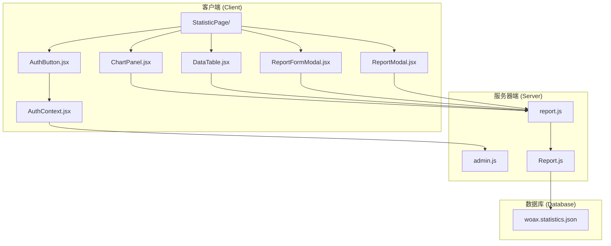

**图表来源**
- [StatisticPage/index.jsx](file://client/src/pages/StatisticPage/index.jsx#L1-L262)
- [report.js](file://server/routes/report.js#L1-L271)
- [Report.js](file://server/models/Report.js#L1-L22)

**章节来源**
- [StatisticPage/index.jsx](file://client/src/pages/StatisticPage/index.jsx#L1-L262)
- [report.js](file://server/routes/report.js#L1-L271)

## 核心组件

数据统计功能由多个相互协作的核心组件构成，每个组件都有明确的职责分工：

### 主要组件职责

| 组件名称 | 职责描述 | 关键功能 |
|---------|----------|----------|
| StatisticPage | 主页面容器 | 数据聚合、分页管理、弹窗控制 |
| ChartPanel | 图表展示 | 版本分布、时间趋势、设备统计 |
| DataTable | 数据表格 | 分页显示、用户操作、数据筛选 |
| ReportFormModal | 自主上报 | 表单验证、数据提交、权限控制 |
| ReportModal | 用户详情 | 用户记录查看、分页查询 |
| AuthButton | 权限控制 | 管理员权限验证、登录提示 |

### 数据流架构

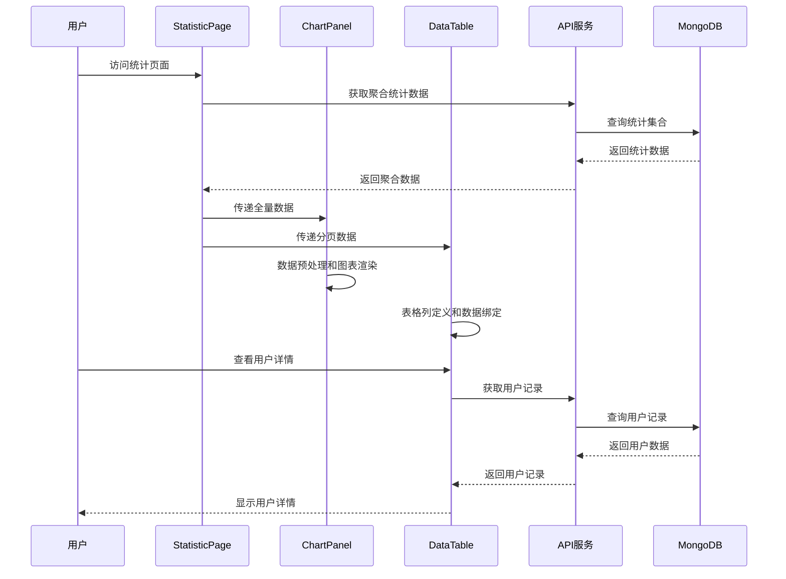

**图表来源**
- [StatisticPage/index.jsx](file://client/src/pages/StatisticPage/index.jsx#L58-L171)
- [report.js](file://server/routes/report.js#L9-L88)

**章节来源**
- [StatisticPage/index.jsx](file://client/src/pages/StatisticPage/index.jsx#L12-L262)
- [ChartPanel.jsx](file://client/src/pages/StatisticPage/ChartPanel.jsx#L8-L129)

## 架构概览

数据统计功能采用现代化的全栈架构设计，实现了前后端的清晰分离和高效的数据流转。

### 整体架构设计

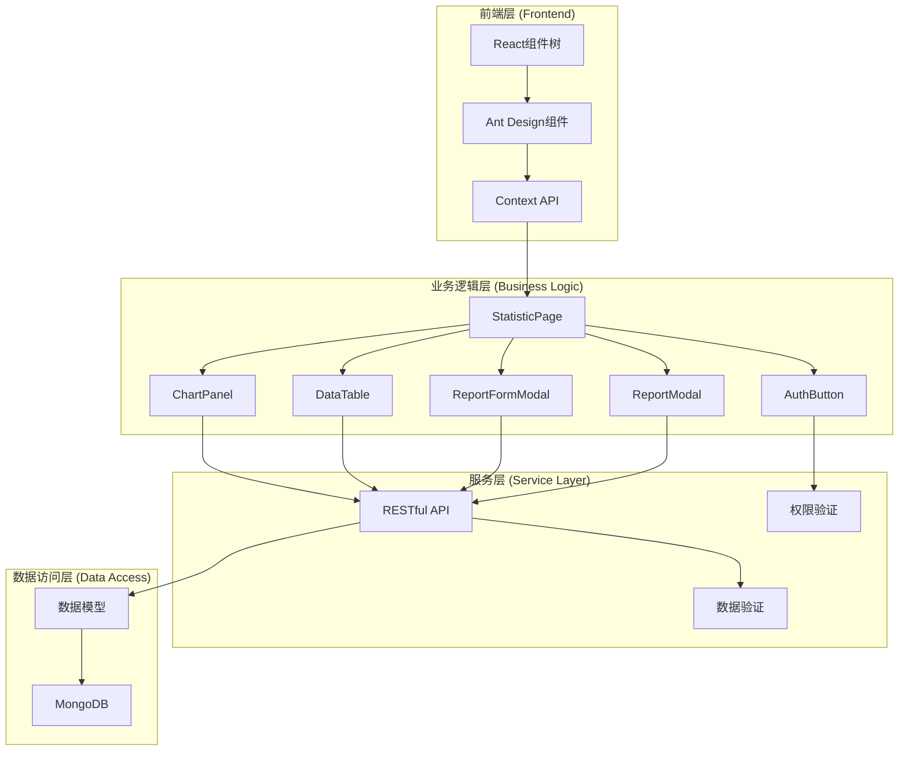

**图表来源**
- [StatisticPage/index.jsx](file://client/src/pages/StatisticPage/index.jsx#L1-L262)
- [report.js](file://server/routes/report.js#L1-L271)

### 数据流向图

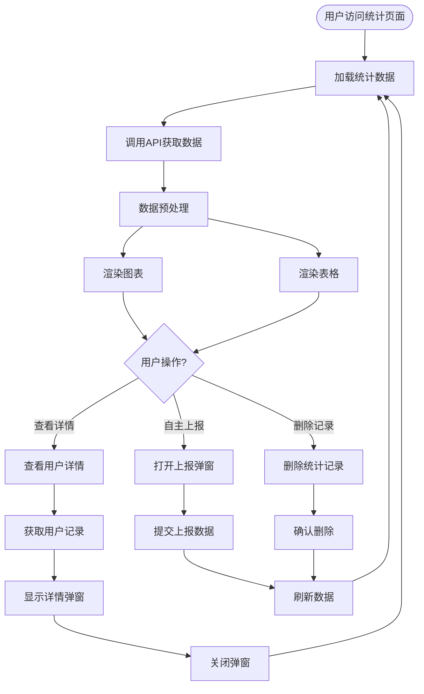

**图表来源**
- [StatisticPage/index.jsx](file://client/src/pages/StatisticPage/index.jsx#L58-L196)
- [report.js](file://server/routes/report.js#L91-L131)

## 详细组件分析

### StatisticPage 主页面组件

StatisticPage是数据统计功能的核心容器组件，负责协调各个子组件的工作和数据流转。

#### 核心状态管理

组件维护了多组状态来管理不同的数据视图：

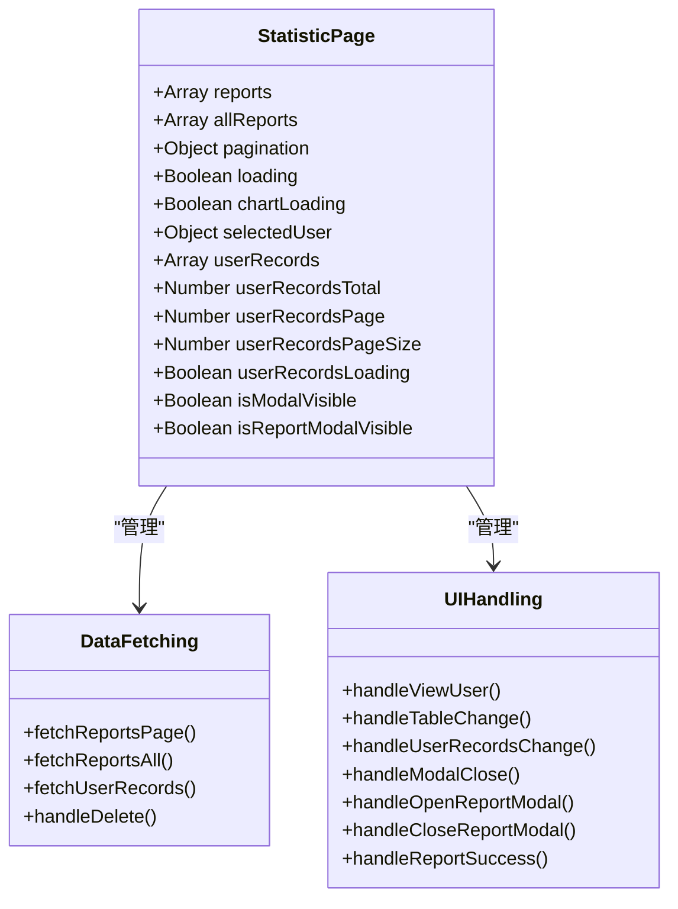

**图表来源**
- [StatisticPage/index.jsx](file://client/src/pages/StatisticPage/index.jsx#L13-L31)

#### 数据获取策略

组件采用了两种不同的数据获取策略来优化用户体验：

1. **分页聚合数据**：用于主表格显示，限制数据量以提高性能
2. **全量数据**：用于图表展示，确保统计分析的完整性

**章节来源**
- [StatisticPage/index.jsx](file://client/src/pages/StatisticPage/index.jsx#L58-L109)

### ChartPanel 图表组件

ChartPanel组件负责将原始统计数据转换为多种可视化图表，提供多维度的数据洞察。

#### 图表类型和数据处理

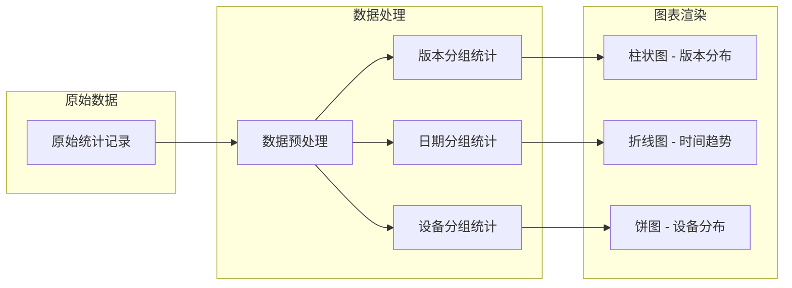

**图表来源**
- [ChartPanel.jsx](file://client/src/pages/StatisticPage/ChartPanel.jsx#L10-L53)

#### 图表配置和样式

组件使用Recharts库提供了丰富的图表配置选项：

| 图表类型 | 配置特性 | 数据源 |
|---------|----------|--------|
| 柱状图 | 响应式容器、工具提示、图例 | 版本分组统计 |
| 折线图 | 时间序列、平滑曲线、活动点 | 日期分组统计 |
| 饼图 | 占比显示、颜色映射、标签 | 设备分组统计 |

**章节来源**
- [ChartPanel.jsx](file://client/src/pages/StatisticPage/ChartPanel.jsx#L55-L126)

### DataTable 数据表格组件

DataTable组件实现了完整的数据表格功能，包括分页、排序、筛选和操作按钮。

#### 表格列定义和数据处理

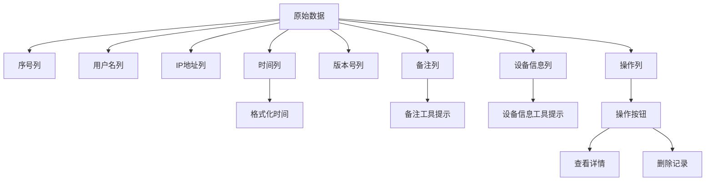

**图表来源**
- [DataTable.jsx](file://client/src/pages/StatisticPage/DataTable.jsx#L8-L93)

#### 表格交互功能

表格组件提供了丰富的用户交互功能：

- **分页导航**：支持自定义每页显示数量
- **数据排序**：基于时间戳的降序排列
- **行内操作**：查看详情和删除记录
- **响应式设计**：适配不同屏幕尺寸

**章节来源**
- [DataTable.jsx](file://client/src/pages/StatisticPage/DataTable.jsx#L95-L121)

### ReportFormModal 自主上报组件

ReportFormModal组件允许管理员手动添加统计数据，提供了完整的表单验证和数据提交流程。

#### 表单字段和验证规则

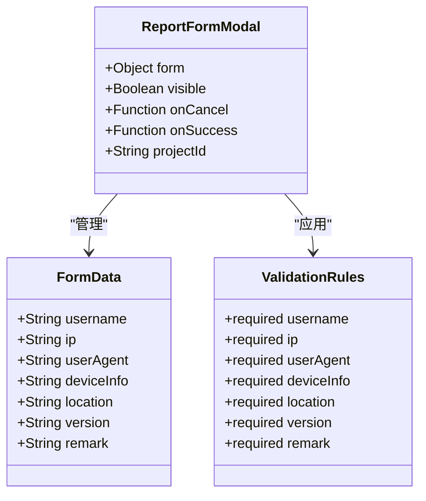

**图表来源**
- [ReportFormModal.jsx](file://client/src/pages/StatisticPage/ReportFormModal.jsx#L5-L13)

#### 权限控制机制

组件通过AuthButton组件实现了细粒度的权限控制：

- **管理员权限验证**：只有认证的管理员才能访问
- **动态权限提示**：根据用户状态显示相应的提示信息
- **自动登录引导**：未登录用户会被引导至登录界面

**章节来源**
- [ReportFormModal.jsx](file://client/src/pages/StatisticPage/ReportFormModal.jsx#L15-L38)
- [AuthButton.jsx](file://client/src/components/AuthButton.jsx#L12-L43)

### ReportModal 用户详情组件

ReportModal组件专门用于展示用户的详细统计记录，提供了完整的分页查询和数据展示功能。

#### 弹窗设计和数据展示

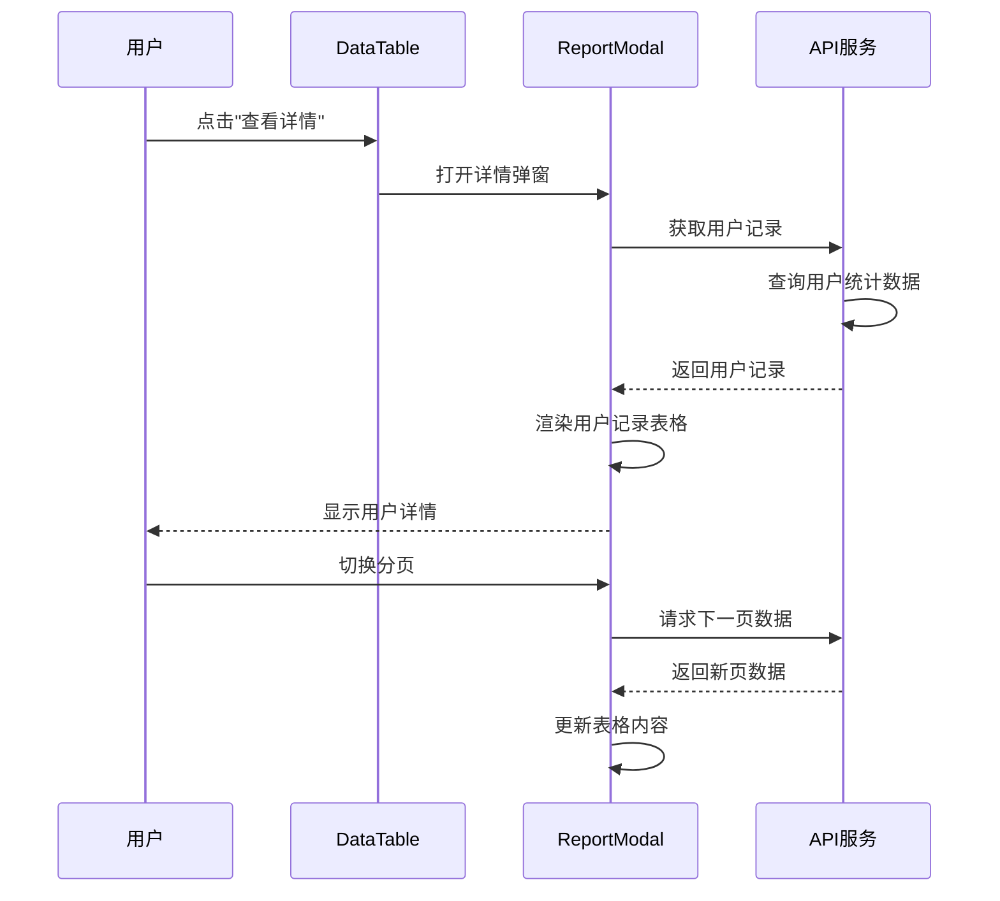

**图表来源**
- [StatisticPage/index.jsx](file://client/src/pages/StatisticPage/index.jsx#L128-L171)
- [ReportModal.jsx](file://client/src/pages/StatisticPage/ReportModal.jsx#L14-L47)

**章节来源**
- [ReportModal.jsx](file://client/src/pages/StatisticPage/ReportModal.jsx#L4-L49)

### 权限控制系统

数据统计功能的权限控制贯穿于整个系统架构中，确保只有授权用户才能执行敏感操作。

#### 权限验证流程

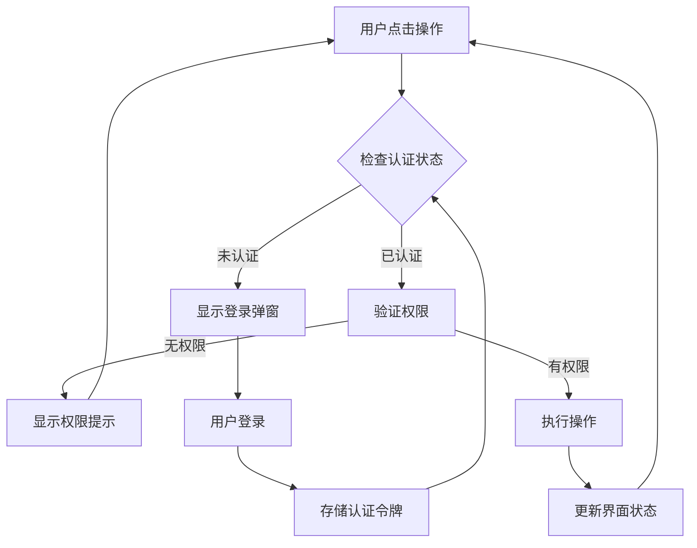

**图表来源**
- [AuthButton.jsx](file://client/src/components/AuthButton.jsx#L15-L27)
- [AuthContext.jsx](file://client/src/context/AuthContext.jsx#L25-L48)

**章节来源**
- [AuthButton.jsx](file://client/src/components/AuthButton.jsx#L12-L43)
- [AuthContext.jsx](file://client/src/context/AuthContext.jsx#L107-L112)

## 依赖关系分析

数据统计功能的依赖关系体现了清晰的分层架构和模块化设计。

### 前端依赖关系

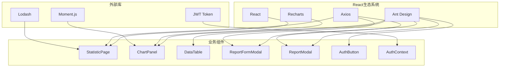

**图表来源**
- [StatisticPage/index.jsx](file://client/src/pages/StatisticPage/index.jsx#L1-L10)
- [ChartPanel.jsx](file://client/src/pages/StatisticPage/ChartPanel.jsx#L1-L4)

### 后端依赖关系

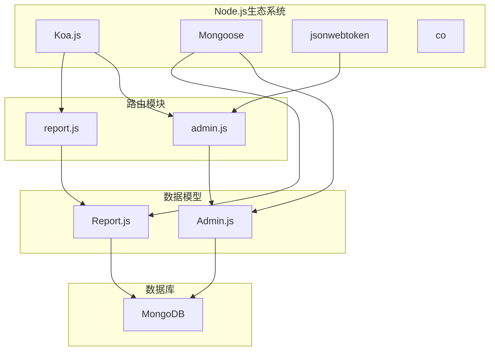

**图表来源**
- [report.js](file://server/routes/report.js#L1-L6)
- [Report.js](file://server/models/Report.js#L1-L3)

### 数据模型关系

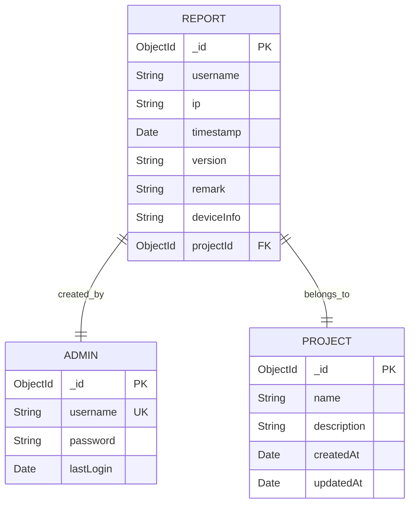

**图表来源**
- [Report.js](file://server/models/Report.js#L3-L19)

**章节来源**
- [report.js](file://server/routes/report.js#L1-L271)
- [Report.js](file://server/models/Report.js#L1-L22)

## 性能考虑

数据统计功能在设计时充分考虑了性能优化，采用了多种策略来确保系统的高效运行。

### 前端性能优化

#### 内存管理策略

- **虚拟滚动**：表格组件使用固定高度和滚动容器，避免大量DOM节点的创建
- **懒加载图表**：图表组件仅在有数据时渲染，空状态显示加载指示器
- **状态最小化**：合理划分组件状态，避免不必要的重渲染

#### 数据缓存机制

- **分页数据缓存**：当前页数据在组件卸载前保持不变
- **全量数据缓存**：图表使用的全量数据在项目切换时才重新获取
- **请求去重**：相同条件的请求会被合并，避免重复网络请求

### 后端性能优化

#### 数据库查询优化

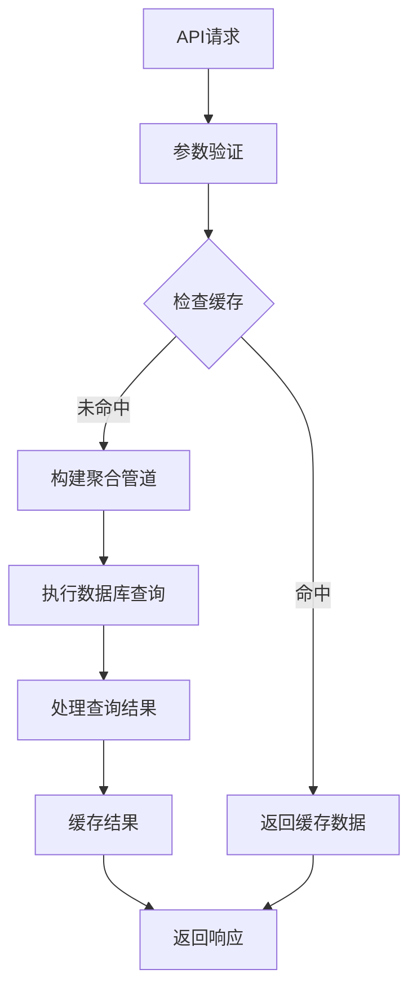

**图表来源**
- [report.js](file://server/routes/report.js#L26-L74)

#### 聚合查询优化

- **索引优化**：在username和timestamp字段上建立复合索引
- **分组优化**：使用$group操作符进行高效的分组统计
- **排序优化**：先排序再分组，确保结果的准确性

**章节来源**
- [report.js](file://server/routes/report.js#L25-L74)

## 故障排除指南

数据统计功能可能遇到的各种问题及其解决方案：

### 常见问题诊断

#### 数据加载失败

**症状**：页面空白或显示加载错误
**原因分析**：
- API服务不可用
- 网络连接问题
- 数据库连接异常

**解决步骤**：
1. 检查API服务状态
2. 验证数据库连接
3. 查看浏览器开发者工具的网络面板
4. 确认项目ID参数正确

#### 图表显示异常

**症状**：图表不显示或显示为空白
**原因分析**：
- 缺少必要的统计数据
- 数据格式不符合预期
- Recharts库版本不兼容

**解决步骤**：
1. 验证统计数据的存在性
2. 检查数据预处理逻辑
3. 确认Recharts版本兼容性

#### 权限相关问题

**症状**：无法执行管理员操作
**原因分析**：
- 未登录或会话过期
- 权限验证失败
- JWT令牌无效

**解决步骤**：
1. 重新登录管理员账户
2. 检查JWT令牌的有效性
3. 验证管理员权限状态

### 调试工具和技巧

#### 前端调试

- **React DevTools**：检查组件状态和属性
- **浏览器控制台**：查看JavaScript错误和警告
- **网络面板**：监控API请求和响应

#### 后端调试

- **日志分析**：查看服务器端错误日志
- **数据库查询**：验证聚合查询的正确性
- **性能监控**：分析查询执行时间和资源使用

**章节来源**
- [StatisticPage/index.jsx](file://client/src/pages/StatisticPage/index.jsx#L79-L84)
- [report.js](file://server/routes/report.js#L80-L87)

## 结论

WoaX项目的数据统计功能展现了现代Web应用开发的最佳实践，通过精心设计的架构和完善的组件体系，实现了用户数据的全面收集、分析和展示。

### 核心优势

1. **完整的数据收集机制**：自动追踪用户时间、用户名、IP地址等关键信息
2. **丰富的可视化展示**：多种图表类型提供多维度的数据洞察
3. **灵活的权限控制**：基于JWT的管理员权限验证系统
4. **高性能的数据处理**：优化的数据库查询和前端渲染策略
5. **良好的用户体验**：响应式设计和流畅的交互体验

### 技术亮点

- **前后端分离架构**：清晰的职责划分和模块化设计
- **实时数据更新**：事件驱动的数据刷新机制
- **可扩展的数据模型**：支持未来功能的扩展和定制
- **完善的错误处理**：健壮的异常处理和用户反馈机制

### 发展建议

1. **增强数据分析能力**：添加更复杂的统计分析功能
2. **优化移动端体验**：改进移动设备上的界面适配
3. **增加数据导出功能**：支持CSV和Excel格式的数据导出
4. **提升性能监控**：添加详细的性能指标和监控功能

## 附录

### API接口规范

#### 数据统计API

| 接口 | 方法 | 路径 | 描述 | 参数 |
|------|------|------|------|------|
| 获取统计数据 | POST | `/api/report/getReportData` | 获取聚合统计数据 | pageCurrent, pageSize, projectId |
| 获取用户记录 | GET | `/api/report/user/:username` | 获取用户详细记录 | page, pageSize, projectId |
| 添加上报数据 | POST | `/api/report/addReport` | 手动添加统计数据 | 所有字段 |
| 获取记录详情 | GET | `/api/report/:id` | 获取单条记录详情 | 无 |
| 删除记录 | DELETE | `/api/report/:id` | 删除统计数据 | 无 |

#### 权限验证API

| 接口 | 方法 | 路径 | 描述 | 参数 |
|------|------|------|------|------|
| 管理员登录 | POST | `/api/admin/login` | 管理员身份验证 | username, password |
| 验证令牌 | GET | `/api/admin/verify` | JWT令牌验证 | Authorization头 |

### 数据模型定义

#### 统计记录模型

| 字段名 | 类型 | 必填 | 描述 |
|--------|------|------|------|
| username | String | 是 | 用户名 |
| ip | String | 否 | IP地址 |
| timestamp | Date | 是 | 时间戳 |
| version | String | 否 | 版本号 |
| remark | String | 否 | 备注信息 |
| deviceInfo | String | 否 | 设备信息 |
| projectId | ObjectId | 是 | 项目ID |

### 使用示例

#### 基本使用场景

1. **查看统计数据**：访问统计页面查看聚合数据
2. **查看详情**：点击用户行查看该用户的详细记录
3. **自主上报**：管理员登录后添加新的统计数据
4. **删除记录**：管理员权限下删除不需要的统计数据

#### 高级功能使用

1. **分页查询**：通过分页控件浏览大量数据
2. **权限控制**：非管理员用户只能查看数据
3. **实时更新**：新增数据会自动反映在统计图表中