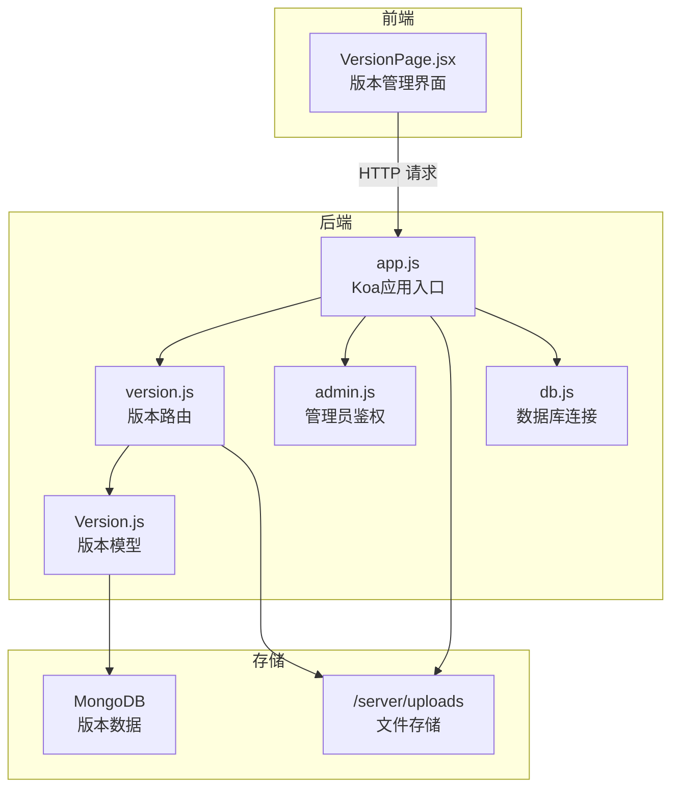
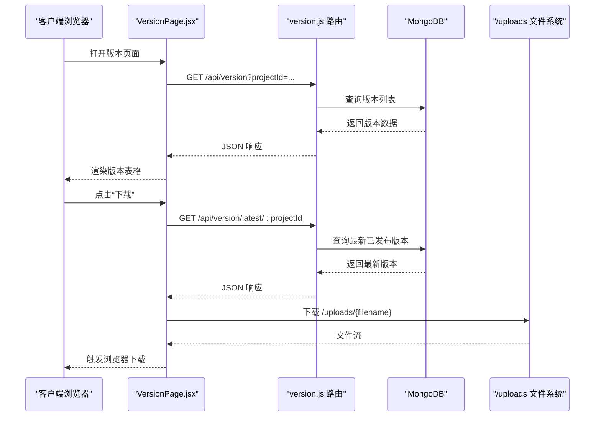
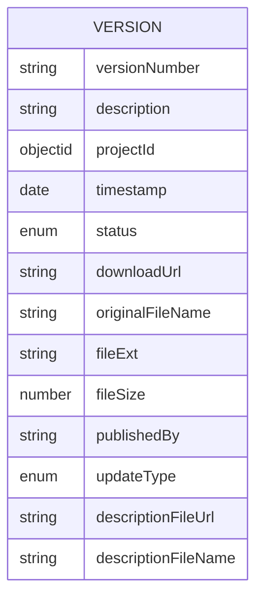
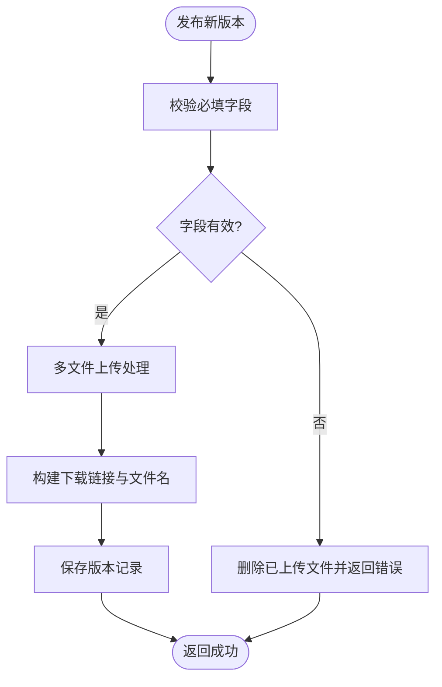
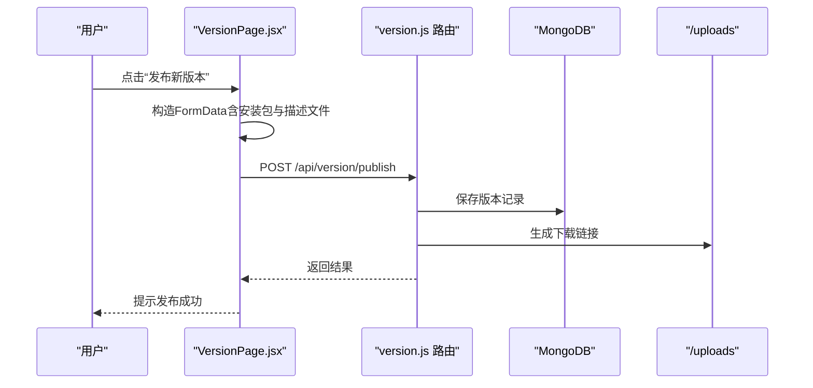
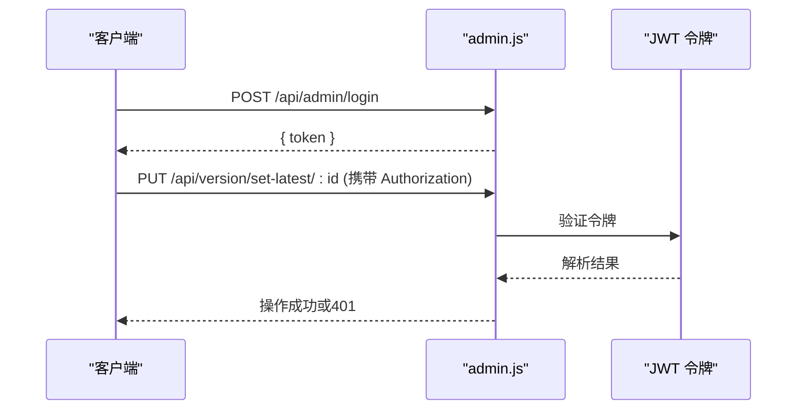
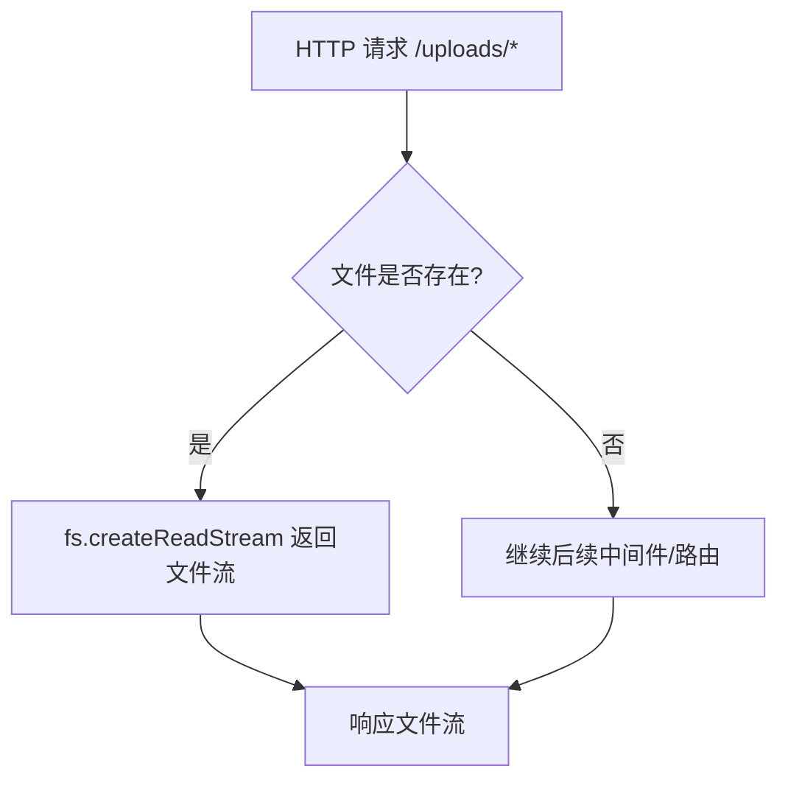
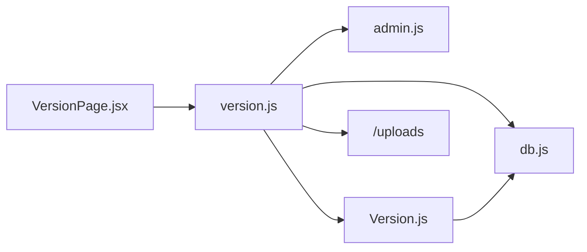

# 版本管理功能

<cite>
**本文引用的文件**
- [server/routers/version.js](file://server/routes/version.js)
- [server/models/Version.js](file://server/models/Version.js)
- [client/pages/VersionPage.jsx](file://client/src/pages/VersionPage.jsx)
- [server/app.js](file://server/app.js)
- [server/db.js](file://server/db.js)
- [server/routes/admin.js](file://server/routes/admin.js)
- [db/woax.versions.json](file://db/woax.versions.json)
- [server/uploads/latest.yml](file://server/uploads/latest.yml)
- [latest-example.yml](file://latest-example.yml)
- [fix-chinese-filename.md](file://fix-chinese-filename.md)
- [test-file-name.md](file://test-file-name.md)
- [update-type-feature.md](file://update-type-feature.md)
- [api-usage-latest-version.md](file://api-usage-latest-version.md)
- [README.md](file://README.md)
</cite>

## 目录
1. [简介](#简介)
2. [项目结构](#项目结构)
3. [核心组件](#核心组件)
4. [架构总览](#架构总览)
5. [详细组件分析](#详细组件分析)
6. [依赖关系分析](#依赖关系分析)
7. [性能考量](#性能考量)
8. [故障排查指南](#故障排查指南)
9. [结论](#结论)
10. [附录](#附录)

## 简介
本文件面向版本管理功能，系统性阐述版本信息管理机制、版本发布通知体系、文件上传处理流程、YAML配置结构与用途，以及版本API接口的完整使用说明。文档同时提供最佳实践与安全注意事项，帮助开发者与运维人员高效、稳定地维护版本发布与更新流程。

## 项目结构
版本管理功能横跨前后端与数据库层，主要涉及以下模块：
- 后端路由与控制器：负责版本查询、发布、状态更新、删除与静态文件服务
- 数据模型：定义版本实体的字段与约束
- 前端页面：提供版本列表、最新版本展示、发布与更新操作的用户界面
- 数据库存储：持久化版本元数据与文件下载链接
- 配置文件：latest.yml 用于自动更新检查与版本兼容性校验

图表来源
- [server/app.js](file://server/app.js#L1-L61)
- [server/routes/version.js](file://server/routes/version.js#L1-L432)
- [server/routes/admin.js](file://server/routes/admin.js#L1-L128)
- [server/models/Version.js](file://server/models/Version.js#L1-L62)
- [server/db.js](file://server/db.js#L1-L45)

章节来源
- [README.md](file://README.md#L1-L44)
- [server/app.js](file://server/app.js#L1-L61)

## 核心组件
- 版本路由与控制器：提供版本列表查询、详情获取、发布新版本、设置最新版本、更新状态、删除版本等接口；集成管理员权限校验与文件上传处理
- 版本数据模型：定义版本号、描述、项目关联、时间戳、状态、下载链接、原始文件名、文件扩展名、文件大小、发布者、更新方式、描述文件链接与名称等字段
- 前端版本页面：展示版本列表、最新版本信息卡片、详情弹窗、发布与更新操作；支持文件上传、下载与中文文件名处理
- 静态文件服务：统一提供 /uploads/* 文件下载能力
- 管理员鉴权：基于 JWT 的管理员登录与权限中间件，保护敏感操作
- YAML 配置：latest.yml 用于描述版本信息、文件校验与发布说明，支持自动更新检查

章节来源
- [server/routes/version.js](file://server/routes/version.js#L82-L432)
- [server/models/Version.js](file://server/models/Version.js#L3-L60)
- [client/src/pages/VersionPage.jsx](file://client/src/pages/VersionPage.jsx#L72-L459)
- [server/app.js](file://server/app.js#L34-L45)
- [server/routes/admin.js](file://server/routes/admin.js#L100-L125)
- [server/uploads/latest.yml](file://server/uploads/latest.yml#L1-L9)

## 架构总览
版本管理采用“前端界面 + 后端API + 数据库 + 文件存储”的分层架构。前端通过 HTTP 与后端交互，后端通过 Mongoose 访问 MongoDB，文件通过磁盘存储并在 /uploads 目录提供下载。

图表来源
- [client/src/pages/VersionPage.jsx](file://client/src/pages/VersionPage.jsx#L72-L120)
- [server/routes/version.js](file://server/routes/version.js#L82-L118)
- [server/app.js](file://server/app.js#L34-L45)

## 详细组件分析

### 版本数据模型（Version）
版本模型定义了版本管理所需的核心字段，包括版本号、描述、项目ID、时间戳、状态、下载链接、原始文件名、文件扩展名、文件大小、发布者、更新方式、描述文件链接与名称等。字段采用枚举约束，保证数据一致性。

图表来源
- [server/models/Version.js](file://server/models/Version.js#L3-L60)

章节来源
- [server/models/Version.js](file://server/models/Version.js#L3-L60)

### 版本路由与控制器（version.js）
版本路由提供以下核心能力：
- 列表查询：支持分页与项目筛选
- 详情查询：按 ID 获取版本信息
- 发布新版本：管理员权限、多文件上传（安装包与描述文件）、中文文件名修复、构建下载链接
- 设置最新版本：将指定版本标记为已发布（最新），并把同项目其他已发布版本降级为已弃用
- 更新状态与信息：支持状态、更新方式、版本号、描述的更新
- 删除版本：删除数据库记录与对应文件

图表来源
- [server/routes/version.js](file://server/routes/version.js#L147-L256)

章节来源
- [server/routes/version.js](file://server/routes/version.js#L82-L432)

### 前端版本页面（VersionPage.jsx）
前端版本页面负责：
- 加载版本列表与最新版本信息
- 展示版本详情、状态徽章、更新方式徽章
- 发布新版本：构造 FormData，上传安装包与可选描述文件，支持重命名开关
- 下载文件：使用 fetch 获取 Blob，动态生成下载链接，修复中文文件名
- 管理员操作：设为最新版本、更新状态与信息、删除版本

图表来源
- [client/src/pages/VersionPage.jsx](file://client/src/pages/VersionPage.jsx#L406-L459)
- [server/routes/version.js](file://server/routes/version.js#L147-L256)

章节来源
- [client/src/pages/VersionPage.jsx](file://client/src/pages/VersionPage.jsx#L72-L459)

### 管理员鉴权（admin.js）
管理员鉴权通过 JWT 实现：
- 登录接口：校验用户名与密码，签发带过期时间的令牌
- 校验接口：验证令牌有效性并返回管理员信息
- 中间件：拦截受保护的版本管理操作，要求携带有效令牌

图表来源
- [server/routes/admin.js](file://server/routes/admin.js#L26-L98)
- [server/routes/version.js](file://server/routes/version.js#L258-L296)

章节来源
- [server/routes/admin.js](file://server/routes/admin.js#L100-L125)

### 文件上传与存储（Multer 与静态服务）
- Multer 配置：磁盘存储目的地为 /server/uploads，文件名支持中文修复与可选重命名
- 多文件上传：支持安装包文件与描述文件（latest.yml）同时上传
- 静态文件服务：/uploads/* 路径直接读取磁盘文件并返回

图表来源
- [server/app.js](file://server/app.js#L34-L45)
- [server/routes/version.js](file://server/routes/version.js#L38-L80)

章节来源
- [server/routes/version.js](file://server/routes/version.js#L38-L80)
- [server/app.js](file://server/app.js#L24-L28)

### YAML 配置文件（latest.yml）
- 结构要点：版本号、文件列表（url、sha512、size、blockMapSize）、更新信息（path、sha512、releaseDate）、发布说明（releaseNotes）、更新策略（updateType）
- 用途：作为描述文件供客户端解析，实现自动更新检查与版本兼容性校验
- 示例参考：latest-example.yml 与实际上传的 descriptionFile-*.yml

章节来源
- [server/uploads/latest.yml](file://server/uploads/latest.yml#L1-L9)
- [latest-example.yml](file://latest-example.yml#L1-L38)

### 版本 API 接口文档
- 获取版本列表
  - 方法：GET /api/version
  - 参数：page、pageSize、projectId（必填）
  - 返回：版本数组、总数、分页信息
- 获取版本详情
  - 方法：GET /api/version/:id
  - 返回：版本对象
- 发布新版本（管理员）
  - 方法：POST /api/version/publish
  - 参数：versionNumber、description、projectId、publishedBy、originalFileName、updateType、enableRename、文件字段 file 与 descriptionFile
  - 返回：新建版本对象
- 设置为最新版本（管理员）
  - 方法：PUT /api/version/set-latest/:id
  - 返回：更新后的版本对象
- 更新版本（管理员）
  - 方法：PUT /api/version/:id
  - 参数：status、updateType、versionNumber、description
  - 返回：更新后的版本对象
- 删除版本（管理员）
  - 方法：DELETE /api/version/:id
  - 返回：删除结果
- 获取最新版本（公开）
  - 方法：GET /api/version/latest/:projectId
  - 返回：最新已发布版本对象（若无则404）

章节来源
- [server/routes/version.js](file://server/routes/version.js#L82-L432)
- [api-usage-latest-version.md](file://api-usage-latest-version.md#L1-L227)

## 依赖关系分析
- 版本路由依赖管理员中间件以保护敏感操作
- 版本路由依赖 Mongoose 模型进行数据持久化
- 前端页面依赖后端 API 提供数据与操作能力
- 静态文件服务依赖 /uploads 目录与文件系统
- 数据库连接通过 db.js 统一管理

图表来源
- [client/src/pages/VersionPage.jsx](file://client/src/pages/VersionPage.jsx#L72-L120)
- [server/routes/version.js](file://server/routes/version.js#L1-L10)
- [server/routes/admin.js](file://server/routes/admin.js#L100-L125)
- [server/models/Version.js](file://server/models/Version.js#L1-L62)
- [server/db.js](file://server/db.js#L1-L45)

章节来源
- [server/routes/version.js](file://server/routes/version.js#L1-L10)
- [server/db.js](file://server/db.js#L1-L45)

## 性能考量
- 分页查询：列表接口支持分页参数，避免一次性加载过多数据
- 单次查询：最新版本接口按状态与时间排序，仅返回一个结果
- 文件下载：静态文件服务直接读取磁盘，减少不必要的处理开销
- 存储策略：上传文件统一存放于 /uploads，便于缓存与CDN部署

章节来源
- [server/routes/version.js](file://server/routes/version.js#L82-L118)
- [server/app.js](file://server/app.js#L34-L45)

## 故障排查指南
- 中文文件名乱码
  - 后端与前端均提供文件名编码修复函数，确保上传、存储、显示与下载过程中的文件名正确
  - 参考：fix-chinese-filename.md
- 下载失败
  - 检查 /uploads 目录是否存在目标文件
  - 确认 downloadUrl 与 originalFileName 字段是否正确
  - 参考：test-file-name.md
- 权限不足
  - 发布、设置最新版本、更新状态、删除版本等操作需管理员权限
  - 确认登录与令牌有效性
  - 参考：server/routes/admin.js
- 最新版本接口返回404
  - 项目暂无已发布版本属于正常情况，前端应妥善处理
  - 参考：api-usage-latest-version.md

章节来源
- [fix-chinese-filename.md](file://fix-chinese-filename.md#L1-L126)
- [test-file-name.md](file://test-file-name.md#L1-L61)
- [server/routes/admin.js](file://server/routes/admin.js#L100-L125)
- [api-usage-latest-version.md](file://api-usage-latest-version.md#L220-L227)

## 结论
版本管理功能通过清晰的前后端分工、严谨的数据模型与完善的权限控制，实现了版本信息的全生命周期管理。配合中文文件名修复、多文件上传与静态文件服务，系统在易用性与稳定性方面表现良好。建议在生产环境中进一步完善安全策略与监控告警，持续优化用户体验。

## 附录

### 版本状态与更新方式说明
- 状态：draft（草稿）、published（已发布）、deprecated（已弃用）
- 更新方式：passive（被动提醒）、active（主动提醒）、force（强制更新）

章节来源
- [server/models/Version.js](file://server/models/Version.js#L22-L51)
- [update-type-feature.md](file://update-type-feature.md#L69-L131)

### 数据库样例
- 版本集合样例：woax.versions.json

章节来源
- [db/woax.versions.json](file://db/woax.versions.json#L1-L52)