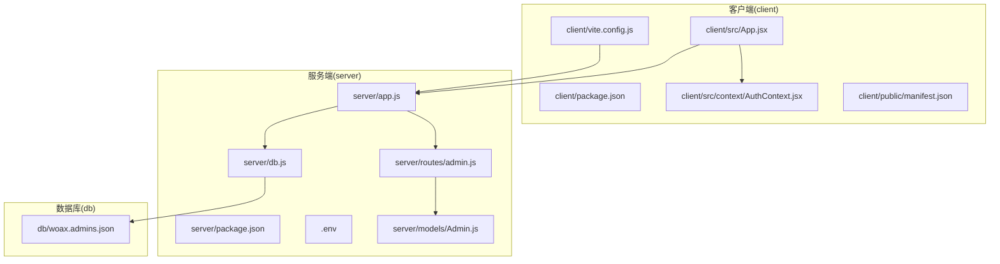
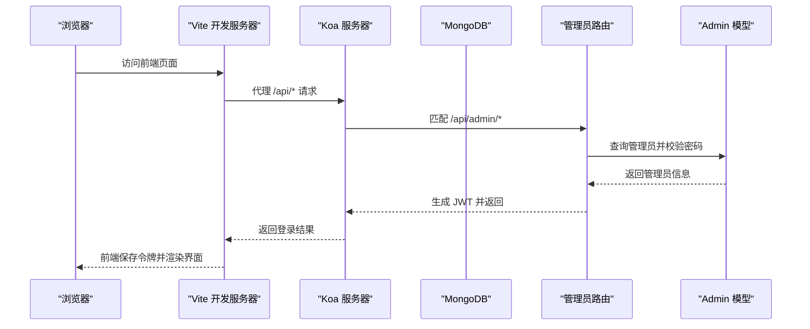
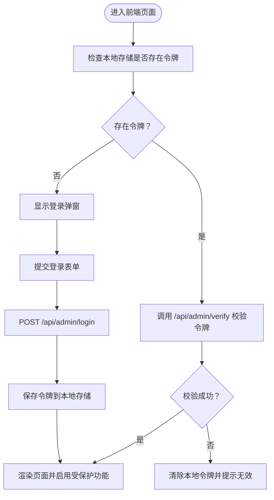
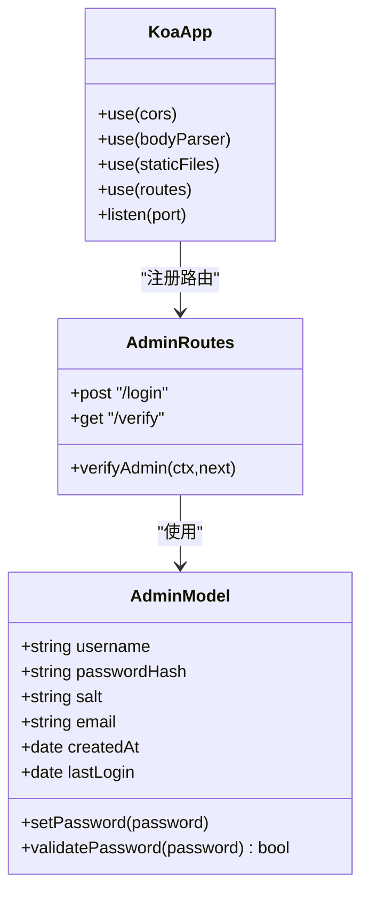
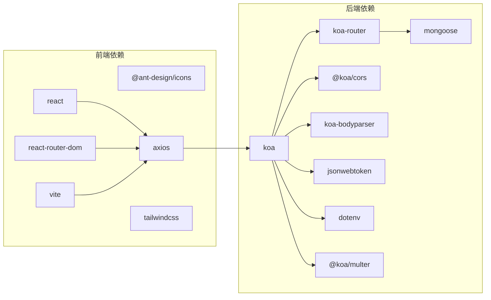

# 快速开始

<cite>
**本文引用的文件**
- [README.md](file://README.md)
- [client/package.json](file://client/package.json)
- [client/vite.config.js](file://client/vite.config.js)
- [client/src/App.jsx](file://client/src/App.jsx)
- [client/src/context/AuthContext.jsx](file://client/src/context/AuthContext.jsx)
- [client/public/manifest.json](file://client/public/manifest.json)
- [server/package.json](file://server/package.json)
- [server/.env](file://server/.env)
- [server/app.js](file://server/app.js)
- [server/db.js](file://server/db.js)
- [server/routes/admin.js](file://server/routes/admin.js)
- [server/models/Admin.js](file://server/models/Admin.js)
- [db/woax.admins.json](file://db/woax.admins.json)
</cite>

## 目录
1. [简介](#简介)
2. [项目结构](#项目结构)
3. [核心组件](#核心组件)
4. [架构总览](#架构总览)
5. [详细组件分析](#详细组件分析)
6. [依赖关系分析](#依赖关系分析)
7. [性能考虑](#性能考虑)
8. [故障排除指南](#故障排除指南)
9. [结论](#结论)
10. [附录](#附录)

## 简介
本指南面向首次接触 WoaX 的开发者，帮助你在最短时间内完成环境准备、依赖安装、数据库配置与项目启动，并掌握前后端独立运行方式（开发与生产）。同时提供默认管理员账号信息、初始配置说明以及常见问题的解决方案与调试技巧，确保你能快速上手并顺利开展后续开发工作。

## 项目结构
WoaX 是一个前后端分离的全栈应用：
- 前端采用 Vite + React 构建，提供数据统计、意见反馈、版本更新等功能页面。
- 后端基于 Koa.js，提供 RESTful API，使用 MongoDB 存储数据。
- 数据库存放在 db 目录下的 JSON 文件中，便于初始化与演示。

图表来源
- [client/src/App.jsx](file://client/src/App.jsx#L1-L253)
- [client/src/context/AuthContext.jsx](file://client/src/context/AuthContext.jsx#L1-L155)
- [client/vite.config.js](file://client/vite.config.js#L1-L50)
- [server/app.js](file://server/app.js#L1-L61)
- [server/db.js](file://server/db.js#L1-L45)
- [server/routes/admin.js](file://server/routes/admin.js#L1-L128)
- [server/models/Admin.js](file://server/models/Admin.js#L1-L32)
- [db/woax.admins.json](file://db/woax.admins.json#L1-L15)

章节来源
- [README.md](file://README.md#L1-L44)
- [client/package.json](file://client/package.json#L1-L47)
- [server/package.json](file://server/package.json#L1-L24)

## 核心组件
- 前端应用入口与路由：负责页面导航、项目切换、登录弹窗与认证上下文管理。
- 认证上下文：封装登录、登出、令牌校验逻辑，统一处理管理员登录态。
- 后端应用：Koa 服务器，注册路由、中间件，提供静态资源服务与 API 接口。
- 数据库连接：通过 Mongoose 连接 MongoDB，监听连接事件并在进程退出时关闭连接。
- 管理员路由与模型：提供登录、令牌校验、权限中间件，以及密码加盐哈希存储。

章节来源
- [client/src/App.jsx](file://client/src/App.jsx#L1-L253)
- [client/src/context/AuthContext.jsx](file://client/src/context/AuthContext.jsx#L1-L155)
- [server/app.js](file://server/app.js#L1-L61)
- [server/db.js](file://server/db.js#L1-L45)
- [server/routes/admin.js](file://server/routes/admin.js#L1-L128)
- [server/models/Admin.js](file://server/models/Admin.js#L1-L32)

## 架构总览
WoaX 的整体交互流程如下：
- 前端通过 Vite 开发服务器启动，代理 /api 请求到后端 Koa 服务。
- 后端通过 dotenv 读取环境变量，连接 MongoDB 并注册路由。
- 管理员登录后生成 JWT，前端在请求头携带令牌访问受保护接口。
- 上传文件通过后端静态文件服务暴露到 /uploads 路径。

图表来源
- [client/vite.config.js](file://client/vite.config.js#L14-L22)
- [server/app.js](file://server/app.js#L48-L55)
- [server/routes/admin.js](file://server/routes/admin.js#L26-L67)
- [server/models/Admin.js](file://server/models/Admin.js#L16-L30)

## 详细组件分析

### 前端组件分析
- 应用入口与路由
  - 负责顶部导航、项目下拉切换、页面路由与登录弹窗。
  - 自动注入请求拦截器，向后端携带 Bearer 令牌。
- 认证上下文
  - 维护登录态、用户名、登录弹窗显示与隐藏。
  - 登录成功后写入本地存储令牌；令牌校验失败时自动清理。
- 开发服务器与代理
  - Vite 开发服务器默认端口为 3600，代理 /api 到后端 3001 端口。
  - 生产构建输出至 build 目录，可通过预览命令查看效果。

图表来源
- [client/src/context/AuthContext.jsx](file://client/src/context/AuthContext.jsx#L16-L48)
- [client/src/context/AuthContext.jsx](file://client/src/context/AuthContext.jsx#L62-L92)
- [client/src/App.jsx](file://client/src/App.jsx#L18-L25)

章节来源
- [client/src/App.jsx](file://client/src/App.jsx#L1-L253)
- [client/src/context/AuthContext.jsx](file://client/src/context/AuthContext.jsx#L1-L155)
- [client/vite.config.js](file://client/vite.config.js#L1-L50)
- [client/package.json](file://client/package.json#L20-L24)

### 后端组件分析
- 应用入口
  - 加载 dotenv，连接数据库，注册 CORS、bodyParser 中间件。
  - 静态文件服务：当请求以 /uploads 开头时，直接读取后端 uploads 目录并返回。
  - 注册各模块路由前缀，如 /api/report、/api/feedback、/api/version、/api/projects、/api/admin。
- 数据库连接
  - 通过 Mongoose 连接 MongoDB，监听断开与错误事件。
  - 进程收到 SIGINT 时关闭数据库连接并退出。
- 管理员路由与模型
  - 登录：校验用户名与密码，更新最后登录时间，签发 JWT。
  - 校验：从 Authorization 头解析令牌并验证有效性。
  - 权限中间件：校验令牌并注入管理员信息到 ctx.state。
  - 模型：提供密码加盐与哈希比较方法，字段包含用户名、密码哈希、盐、邮箱、创建时间与最后登录时间。

图表来源
- [server/models/Admin.js](file://server/models/Admin.js#L1-L32)
- [server/routes/admin.js](file://server/routes/admin.js#L1-L128)
- [server/app.js](file://server/app.js#L1-L61)

章节来源
- [server/app.js](file://server/app.js#L1-L61)
- [server/db.js](file://server/db.js#L1-L45)
- [server/routes/admin.js](file://server/routes/admin.js#L1-L128)
- [server/models/Admin.js](file://server/models/Admin.js#L1-L32)

## 依赖关系分析
- 前端依赖
  - React、Ant Design、Axios、React Router、Vite、TailwindCSS 等。
  - 开发脚本 dev/build/preview，代理指向后端 3001 端口。
- 后端依赖
  - Koa、Koa Router、CORS、Body Parser、Mongoose、Multer、JWT、dotenv 等。
  - 开发脚本 dev 使用 nodemon 监听文件变化重启服务。

图表来源
- [client/package.json](file://client/package.json#L5-L19)
- [client/package.json](file://client/package.json#L20-L24)
- [server/package.json](file://server/package.json#L10-L20)
- [server/package.json](file://server/package.json#L6-L9)

章节来源
- [client/package.json](file://client/package.json#L1-L47)
- [server/package.json](file://server/package.json#L1-L24)

## 性能考虑
- 前端
  - Vite 开发模式下热更新与按需编译，适合快速迭代。
  - 生产构建建议开启压缩与分包策略，减少首屏加载时间。
- 后端
  - 合理设置数据库连接池大小与超时时间，避免并发过高导致阻塞。
  - 对大文件上传建议限制大小与类型，并在上传完成后及时清理临时文件。
  - 使用中间件顺序优化请求处理链路，避免不必要的重复解析。

## 故障排除指南
- 数据库连接失败
  - 确认 MongoDB 已安装并正在运行，且 MONGODB_URI 指向正确的地址与端口。
  - 查看后端控制台日志，确认连接错误信息与堆栈。
- 端口冲突
  - 前端默认端口 3600，后端默认端口 3001。若被占用，请修改对应配置文件中的端口。
- 代理不生效
  - 确认 Vite 配置中的代理目标与后端端口一致，且后端已启动。
- 登录失败
  - 确认管理员账号存在且密码正确。默认管理员账号信息见“默认管理员账号”。
  - 检查前端是否正确携带 Authorization 头，后端是否正确解析并验证令牌。
- 上传文件无法访问
  - 确认 uploads 目录存在且可读，后端静态文件服务已启用。
- 令牌过期或无效
  - 前端本地存储的令牌可能已过期或被篡改，尝试重新登录获取新令牌。

章节来源
- [server/.env](file://server/.env#L1-L9)
- [client/vite.config.js](file://client/vite.config.js#L14-L22)
- [server/app.js](file://server/app.js#L34-L45)
- [server/routes/admin.js](file://server/routes/admin.js#L69-L98)
- [client/src/context/AuthContext.jsx](file://client/src/context/AuthContext.jsx#L24-L48)

## 结论
通过本快速开始指南，你已经完成了环境准备、依赖安装、数据库配置与项目启动，并掌握了前后端独立运行方式与默认管理员账号信息。遇到问题时，可参考故障排除指南进行定位与修复。建议在开发过程中逐步熟悉前端路由与认证上下文、后端路由与数据库连接机制，以便更高效地扩展功能。

## 附录

### 安装与运行步骤
- 环境准备
  - 安装 Node.js 与包管理工具（推荐 pnpm 或 npm）。
  - 安装并启动 MongoDB，确保服务可用。
- 克隆与安装
  - 在根目录执行安装命令，分别安装前后端依赖。
- 启动后端
  - 进入 server 目录，启动后端服务。
  - 确认控制台输出服务器运行信息与数据库连接成功日志。
- 启动前端
  - 进入 client 目录，启动前端开发服务器。
  - 浏览器访问前端地址，确认代理已将 /api 请求转发到后端。
- 生产部署
  - 前端：执行构建命令生成静态资源，部署到任意静态服务器或 CDN。
  - 后端：打包 Node.js 应用，配置环境变量与数据库连接，使用进程管理器（如 PM2）启动。

章节来源
- [README.md](file://README.md#L19-L36)
- [client/package.json](file://client/package.json#L20-L24)
- [server/package.json](file://server/package.json#L6-L9)
- [server/.env](file://server/.env#L1-L9)

### 默认管理员账号
- 用户名：admin
- 密码：admin123
- 说明：系统会在启动时自动创建默认管理员账号（若不存在），也可通过数据库文件查看初始数据。

章节来源
- [README.md](file://README.md#L44-L44)
- [server/routes/admin.js](file://server/routes/admin.js#L8-L21)
- [db/woax.admins.json](file://db/woax.admins.json#L1-L15)

### 初始配置说明
- 环境变量
  - 端口：PORT，默认 3001。
  - 数据库：MONGODB_URI，默认 mongodb://localhost:27017/woax。
  - 上传目录：UPLOAD_DIR，默认 uploads。
  - 最大文件大小：MAX_FILE_SIZE，默认 10MB。
- 前端代理
  - Vite 开发服务器代理 /api 到后端 3001 端口，确保跨域请求正常。
- 清单与图标
  - PWA 清单文件定义了应用名称、图标与启动行为，便于移动端展示。

章节来源
- [server/.env](file://server/.env#L1-L9)
- [client/vite.config.js](file://client/vite.config.js#L14-L22)
- [client/public/manifest.json](file://client/public/manifest.json#L1-L25)