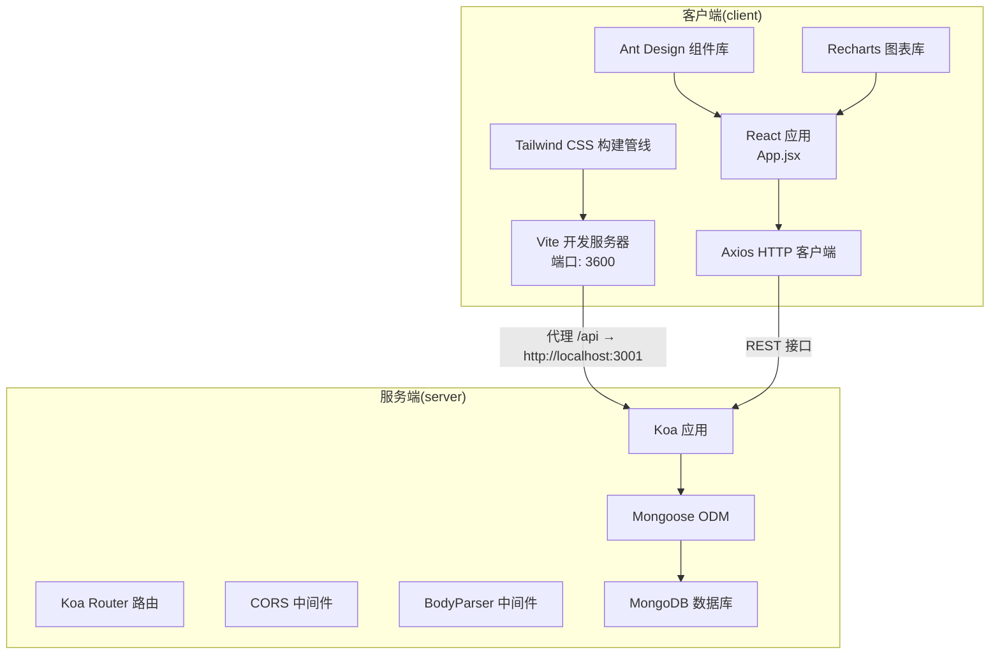
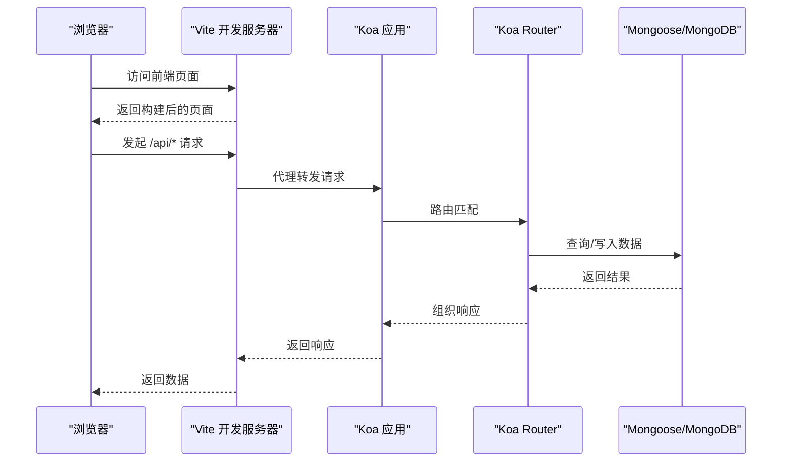
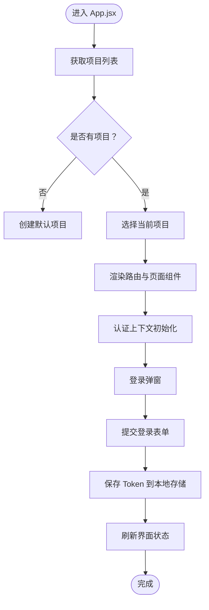
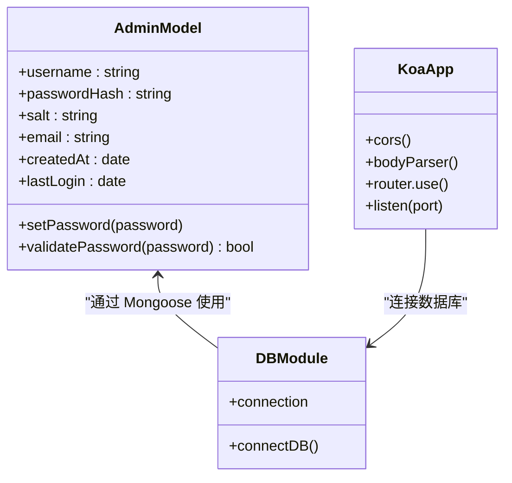
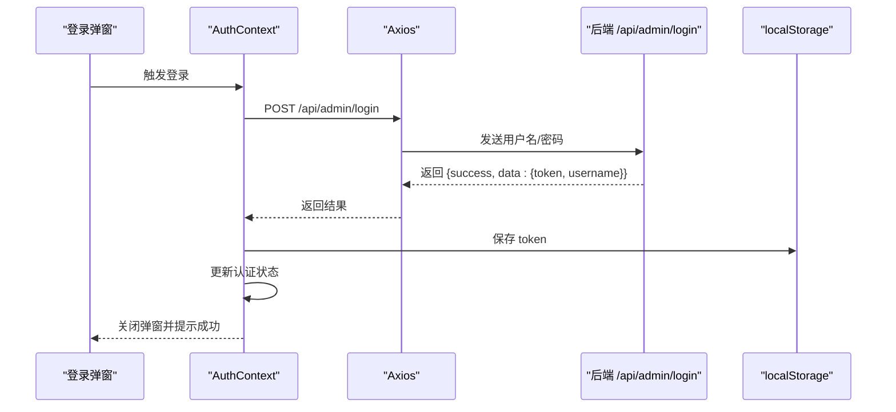
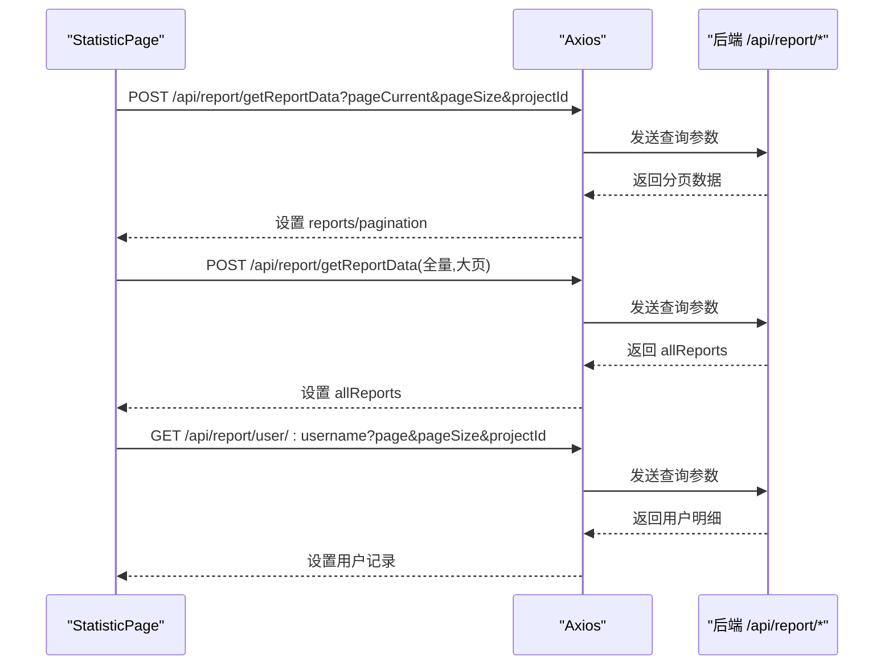
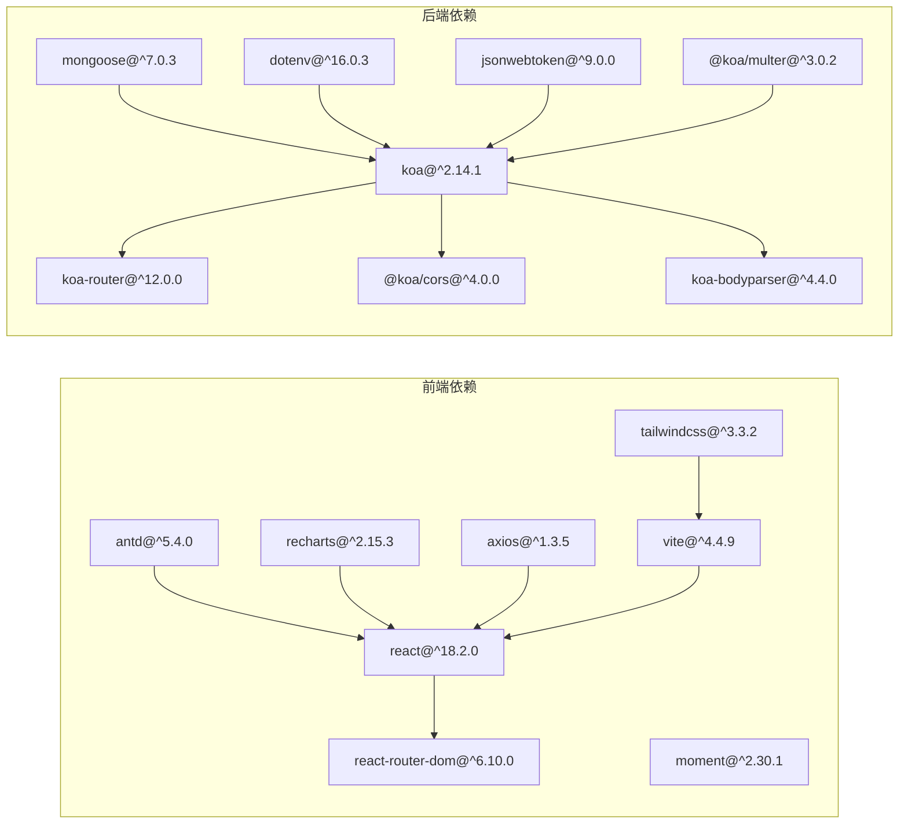

# 技术栈

<cite>
**本文引用的文件**
- [client/package.json](file://client/package.json)
- [server/package.json](file://server/package.json)
- [client/vite.config.js](file://client/vite.config.js)
- [client/tailwind.config.js](file://client/tailwind.config.js)
- [client/postcss.config.js](file://client/postcss.config.js)
- [client/src/styles/index.scss](file://client/src/styles/index.scss)
- [client/src/App.jsx](file://client/src/App.jsx)
- [client/src/context/AuthContext.jsx](file://client/src/context/AuthContext.jsx)
- [client/src/pages/StatisticPage/index.jsx](file://client/src/pages/StatisticPage/index.jsx)
- [server/app.js](file://server/app.js)
- [server/db.js](file://server/db.js)
- [server/models/Admin.js](file://server/models/Admin.js)
- [server/.env](file://server/.env)
- [README.md](file://README.md)
</cite>

## 目录
1. [简介](#简介)
2. [项目结构](#项目结构)
3. [核心组件](#核心组件)
4. [架构总览](#架构总览)
5. [详细组件分析](#详细组件分析)
6. [依赖关系分析](#依赖关系分析)
7. [性能考量](#性能考量)
8. [故障排查指南](#故障排查指南)
9. [结论](#结论)
10. [附录](#附录)

## 简介
本项目采用前后端分离架构，前端基于现代构建工具与组件生态，后端基于轻量级 Web 框架与 MongoDB 数据库。技术栈覆盖：
- 前端：React 18.2.0、React Router、Ant Design 5.4.0、Recharts 2.15.3、Tailwind CSS、Vite、Axios、Moment 等
- 后端：Node.js、Koa 2.14.1、MongoDB、Mongoose、dotenv、jsonwebtoken 等

本文档系统阐述技术选型原因、协同机制、版本与兼容性、最佳实践与扩展建议，并通过图示帮助读者快速理解整体架构与数据流。

## 项目结构
项目采用“client + server”双仓库结构，分别承载前端与后端代码，通过 Vite 的代理与后端 CORS 实现跨域联调。

图表来源
- [client/vite.config.js](file://client/vite.config.js#L14-L22)
- [client/src/App.jsx](file://client/src/App.jsx#L1-L253)
- [server/app.js](file://server/app.js#L1-L61)
- [server/db.js](file://server/db.js#L1-L45)

章节来源
- [client/package.json](file://client/package.json#L1-L47)
- [server/package.json](file://server/package.json#L1-L24)
- [client/vite.config.js](file://client/vite.config.js#L1-L50)
- [server/app.js](file://server/app.js#L1-L61)

## 核心组件
- 前端核心
  - React 18.2.0：提供声明式 UI 与并发特性，配合 Vite 快速开发体验
  - Ant Design 5.4.0：企业级 UI 设计语言，提供丰富的业务组件与主题定制
  - Recharts 2.15.3：基于 React 的图表库，适合数据可视化场景
  - Tailwind CSS：原子化 CSS 框架，结合 PostCSS/Tailwind 插件实现按需构建
  - Vite：现代化构建工具，提供快速热更新与打包能力
  - Axios：HTTP 客户端，统一请求拦截与错误处理
  - Moment：日期处理库，便于时间格式化与计算
- 后端核心
  - Koa 2.14.1：极简而强大的 Web 框架，中间件生态完善
  - Mongoose 7.x：ODM 层，提供 Schema 定义与模型操作
  - MongoDB：文档型数据库，适合灵活的数据模型与高并发读写
  - dotenv：环境变量管理
  - jsonwebtoken：JWT 认证令牌生成与校验

章节来源
- [client/package.json](file://client/package.json#L5-L18)
- [server/package.json](file://server/package.json#L10-L19)
- [client/vite.config.js](file://client/vite.config.js#L1-L50)
- [client/postcss.config.js](file://client/postcss.config.js#L1-L7)
- [client/tailwind.config.js](file://client/tailwind.config.js#L1-L10)
- [client/src/styles/index.scss](file://client/src/styles/index.scss#L1-L36)
- [server/app.js](file://server/app.js#L1-L61)
- [server/db.js](file://server/db.js#L1-L45)
- [server/models/Admin.js](file://server/models/Admin.js#L1-L32)

## 架构总览
前端通过 Vite 开发服务器启动，使用代理将 /api 请求转发至后端 Koa 服务；后端启用 CORS 并解析 JSON 请求体，静态资源访问 /uploads 目录；数据库通过 Mongoose 连接 MongoDB。

图表来源
- [client/vite.config.js](file://client/vite.config.js#L14-L22)
- [server/app.js](file://server/app.js#L30-L55)
- [server/db.js](file://server/db.js#L9-L24)

## 详细组件分析

### 前端技术栈与协同机制
- React 18.2.0
  - 使用并发渲染与自动批处理提升性能
  - 在入口文件中通过 Provider 包裹应用，集中管理认证上下文
- Ant Design 5.4.0
  - 提供布局、菜单、下拉、模态框、按钮、输入等基础组件
  - 与 React Router 结合实现导航与页面切换
- Recharts 2.15.3
  - 在统计页中用于展示聚合数据的图表
  - 通过传入全量数据进行渲染，避免频繁请求
- Tailwind CSS
  - 通过 PostCSS 插件链与 Tailwind 配置文件启用按需扫描
  - 在 SCSS 中引入 Tailwind 指令，统一全局样式
- Vite
  - 开发服务器端口 3600，代理 /api 到后端 3001
  - 优化依赖与 JSX 加载策略，提升开发体验
- Axios
  - 在请求拦截器中自动附加 Bearer Token
  - 统一错误提示与异常处理
- Moment
  - 用于日期格式化与时间处理

图表来源
- [client/src/App.jsx](file://client/src/App.jsx#L78-L118)
- [client/src/context/AuthContext.jsx](file://client/src/context/AuthContext.jsx#L24-L48)

章节来源
- [client/src/App.jsx](file://client/src/App.jsx#L1-L253)
- [client/src/context/AuthContext.jsx](file://client/src/context/AuthContext.jsx#L1-L155)
- [client/src/pages/StatisticPage/index.jsx](file://client/src/pages/StatisticPage/index.jsx#L1-L262)
- [client/vite.config.js](file://client/vite.config.js#L14-L22)
- [client/src/styles/index.scss](file://client/src/styles/index.scss#L1-L36)
- [client/postcss.config.js](file://client/postcss.config.js#L1-L7)
- [client/tailwind.config.js](file://client/tailwind.config.js#L1-L10)

### 后端技术栈与协同机制
- Koa 2.14.1
  - 中间件顺序：CORS → BodyParser → 静态文件服务 → 路由注册
  - 通过 dotenv 读取环境变量，统一端口与数据库地址
- 路由与控制器
  - 分模块导出路由，分别挂载到 /api/report、/api/feedback、/api/version、/api/projects、/api/admin
- 数据库与模型
  - Mongoose 连接 MongoDB，监听断开与错误事件
  - Admin 模型定义字段与密码加盐哈希方法
- 环境变量
  - PORT、MONGODB_URI、UPLOAD_DIR、MAX_FILE_SIZE 等

图表来源
- [server/models/Admin.js](file://server/models/Admin.js#L1-L32)
- [server/db.js](file://server/db.js#L9-L24)
- [server/app.js](file://server/app.js#L1-L61)

章节来源
- [server/app.js](file://server/app.js#L1-L61)
- [server/db.js](file://server/db.js#L1-L45)
- [server/models/Admin.js](file://server/models/Admin.js#L1-L32)
- [server/.env](file://server/.env#L1-L9)

### 认证流程（前端）
- 登录弹窗收集用户名与密码
- 提交后调用后端 /api/admin/login，接收 JWT Token
- 将 Token 存入本地存储并在请求拦截器中附加 Authorization 头
- 首次进入应用会验证 Token 有效性，否则清空本地存储并重置状态

图表来源
- [client/src/context/AuthContext.jsx](file://client/src/context/AuthContext.jsx#L62-L92)
- [client/src/App.jsx](file://client/src/App.jsx#L18-L25)

章节来源
- [client/src/context/AuthContext.jsx](file://client/src/context/AuthContext.jsx#L1-L155)

### 数据统计页（前端）
- 页面组件负责分页、删除、查看用户详情、图表数据加载与弹窗交互
- 通过 POST /api/report/getReportData 获取聚合分页数据
- 通过 GET /api/report/user/:username 获取用户明细分页数据
- 通过 DELETE /api/report/:id 删除记录

图表来源
- [client/src/pages/StatisticPage/index.jsx](file://client/src/pages/StatisticPage/index.jsx#L57-L154)

章节来源
- [client/src/pages/StatisticPage/index.jsx](file://client/src/pages/StatisticPage/index.jsx#L1-L262)

## 依赖关系分析
- 前端依赖
  - React 生态：react、react-dom、react-router-dom
  - UI 组件：antd、@ant-design/icons
  - 可视化：recharts
  - 工具：axios、moment
  - 构建：vite、@vitejs/plugin-react、tailwindcss、sass
- 后端依赖
  - Web 框架：koa、koa-router、@koa/cors、koa-bodyparser
  - 数据库：mongoose
  - 工具：dotenv、jsonwebtoken、multer/@koa/multer

图表来源
- [client/package.json](file://client/package.json#L5-L18)
- [server/package.json](file://server/package.json#L10-L19)

章节来源
- [client/package.json](file://client/package.json#L1-L47)
- [server/package.json](file://server/package.json#L1-L24)

## 性能考量
- 前端
  - Vite 的按需编译与热更新显著缩短开发等待时间
  - Tailwind 按需扫描与 PostCSS 优化减少 CSS 体积
  - Axios 请求拦截器统一处理 Token 与错误，降低重复逻辑
- 后端
  - Koa 中间件链简洁高效，避免不必要的中间件
  - Mongoose 连接池与错误监听有助于稳定运行
  - 静态文件直接读取磁盘，减少额外处理开销

[本节为通用性能建议，不直接分析具体文件]

## 故障排查指南
- 前端
  - 代理未生效：确认 Vite 代理配置与后端端口一致
  - Token 失效：检查本地存储中的 token 是否存在且有效
  - 样式异常：确认 Tailwind 指令与 PostCSS 插件链正确
- 后端
  - 数据库连接失败：检查 .env 中 MONGODB_URI 与 MongoDB 服务状态
  - CORS 错误：确认 @koa/cors 已启用且放行前端域名
  - 静态文件 404：确认 uploads 目录存在且路径正确

章节来源
- [client/vite.config.js](file://client/vite.config.js#L14-L22)
- [client/src/context/AuthContext.jsx](file://client/src/context/AuthContext.jsx#L16-L22)
- [client/src/styles/index.scss](file://client/src/styles/index.scss#L3-L5)
- [server/.env](file://server/.env#L1-L9)
- [server/app.js](file://server/app.js#L24-L45)
- [server/db.js](file://server/db.js#L9-L24)

## 结论
本项目以 React 与 Ant Design 构建现代化前端界面，借助 Vite 提升开发效率；后端以 Koa 与 Mongoose 提供简洁稳定的 API 与数据层。整体技术栈成熟、生态完善、易于维护与扩展。建议在后续迭代中关注安全加固（如 HTTPS、CSRF）、可观测性（日志与监控）与自动化测试体系的建设。

[本节为总结性内容，不直接分析具体文件]

## 附录

### 版本与兼容性
- 前端
  - React 18.2.0、Ant Design 5.4.0、Recharts 2.15.3、Tailwind CSS 3.x、Vite 4.x
  - 浏览器支持：根据 browserslist 配置，覆盖主流现代浏览器
- 后端
  - Node.js（与 Koa 2.14.1 兼容），MongoDB 与 Mongoose 7.x
  - 环境变量：PORT、MONGODB_URI、UPLOAD_DIR、MAX_FILE_SIZE

章节来源
- [client/package.json](file://client/package.json#L31-L42)
- [server/package.json](file://server/package.json#L1-L24)
- [server/.env](file://server/.env#L1-L9)

### 最佳实践与扩展建议
- 前端
  - 使用 TypeScript（可选）增强类型安全
  - 引入 ESLint/Prettier 统一代码风格
  - 对敏感 API 使用 HTTPS 与安全头
  - 对图表与大数据量场景增加虚拟滚动或分页优化
- 后端
  - 引入统一错误处理中间件与日志记录
  - 对上传文件增加大小与类型校验
  - 使用环境区分（dev/test/prod）与配置管理
  - 对数据库连接增加重试与超时控制
  - 引入单元测试与集成测试

[本节为通用建议，不直接分析具体文件]