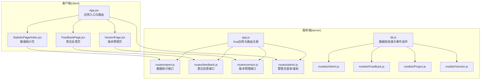
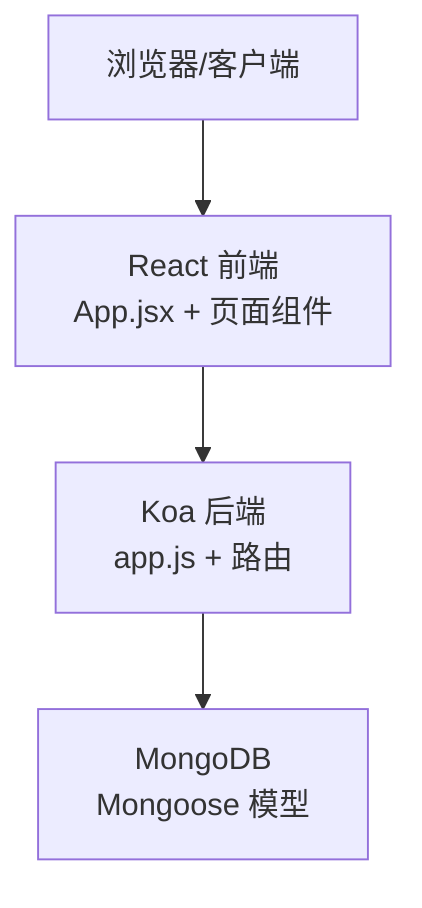
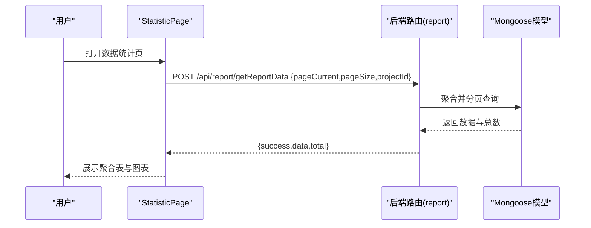
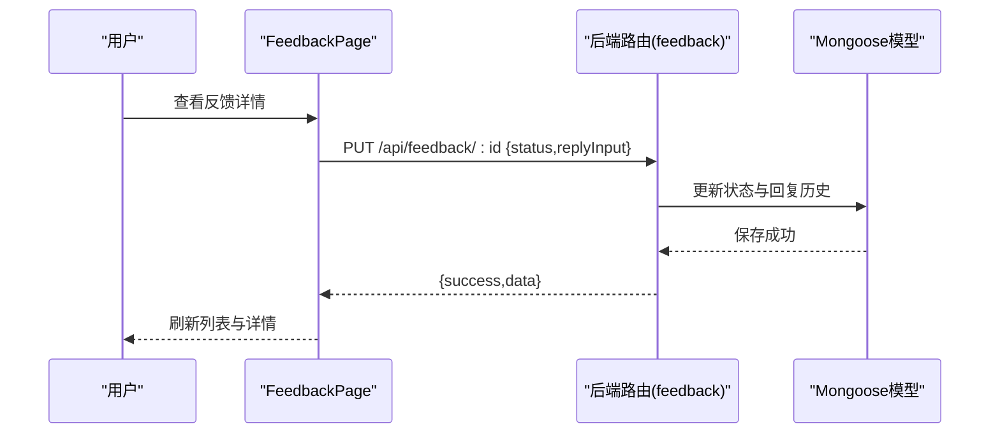
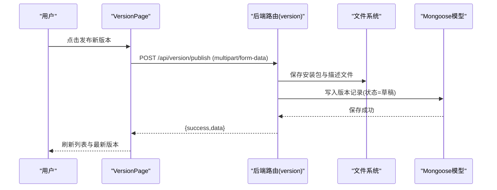
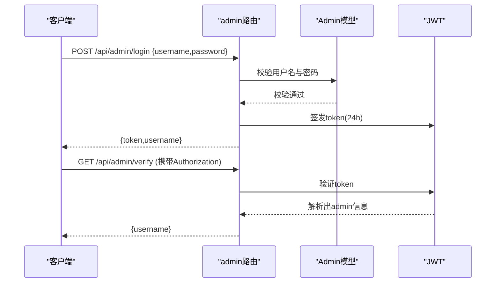
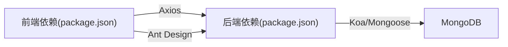

# 项目介绍

<cite>
**本文引用的文件**
- [README.md](file://README.md)
- [client/package.json](file://client/package.json)
- [server/package.json](file://server/package.json)
- [client/src/App.jsx](file://client/src/App.jsx)
- [client/src/pages/StatisticPage/index.jsx](file://client/src/pages/StatisticPage/index.jsx)
- [client/src/pages/FeedbackPage.jsx](file://client/src/pages/FeedbackPage.jsx)
- [client/src/pages/VersionPage.jsx](file://client/src/pages/VersionPage.jsx)
- [server/app.js](file://server/app.js)
- [server/db.js](file://server/db.js)
- [server/models/Admin.js](file://server/models/Admin.js)
- [server/models/Feedback.js](file://server/models/Feedback.js)
- [server/models/Project.js](file://server/models/Project.js)
- [server/models/Version.js](file://server/models/Version.js)
- [server/routes/admin.js](file://server/routes/admin.js)
- [server/routes/report.js](file://server/routes/report.js)
- [server/routes/feedback.js](file://server/routes/feedback.js)
- [server/routes/version.js](file://server/routes/version.js)
</cite>

## 目录
1. [引言](#引言)
2. [项目结构](#项目结构)
3. [核心组件](#核心组件)
4. [架构总览](#架构总览)
5. [详细组件分析](#详细组件分析)
6. [依赖关系分析](#依赖关系分析)
7. [性能考量](#性能考量)
8. [故障排查指南](#故障排查指南)
9. [结论](#结论)

## 引言
WoaX 是一个基于 React + Koa + MongoDB 的全栈数据统计与版本管理平台，面向需要统一管理“用户行为数据统计”“用户意见反馈”“版本更新通知”的团队与产品线。项目通过清晰的功能边界与一致的前后端交互协议，帮助管理员高效地收集、分析与运营数据，同时为用户提供便捷的反馈渠道与版本更新体验。

- 核心价值
  - 统一入口：在一个系统内完成数据统计、意见反馈与版本管理，降低跨系统协作成本。
  - 权限驱动：通过管理员体系与细粒度权限控制，保障敏感操作的安全性。
  - 开放扩展：模块化的数据模型与路由设计，便于按需扩展更多业务场景。

- 目标用户
  - 产品/运营团队：查看数据趋势、分析用户反馈、推动版本迭代。
  - 开发/测试团队：通过统计数据定位问题、评估版本影响范围。
  - 管理者：监控版本发布状态、跟踪用户反馈闭环。

- 应用场景
  - 移动端/桌面端应用的用户行为采集与可视化。
  - 产品版本发布通知与下载管理。
  - 用户反馈收集、分类与回复闭环。

- 技术栈选择理由
  - React：组件化与生态完善，适合构建交互丰富的管理界面。
  - Koa：轻量、灵活、中间件友好，适配 RESTful 接口与权限校验。
  - MongoDB：文档型数据库，天然契合 JSON 结构的数据模型，便于快速演进。

- 独特价值
  - 数据统计：按用户聚合展示最近一次上报，支持分页与用户明细查询。
  - 意见反馈：支持富文本回复、状态流转与回复历史记录。
  - 版本管理：支持多文件上传、中文文件名修复、更新类型策略（被动/主动/强制），并可一键设为“最新版本”。

**章节来源**
- file://README.md#L1-L44

## 项目结构
项目采用前后端分离架构，客户端负责界面与交互，服务端提供 REST API 与数据库访问。

**图示来源**
- [client/src/App.jsx](file://client/src/App.jsx#L62-L243)
- [client/src/pages/StatisticPage/index.jsx](file://client/src/pages/StatisticPage/index.jsx#L12-L262)
- [client/src/pages/FeedbackPage.jsx](file://client/src/pages/FeedbackPage.jsx#L23-L496)
- [client/src/pages/VersionPage.jsx](file://client/src/pages/VersionPage.jsx#L30-L800)
- [server/app.js](file://server/app.js#L1-L61)
- [server/db.js](file://server/db.js#L1-L45)
- [server/routes/report.js](file://server/routes/report.js#L1-L271)
- [server/routes/feedback.js](file://server/routes/feedback.js#L1-L187)
- [server/routes/version.js](file://server/routes/version.js#L1-L432)
- [server/routes/admin.js](file://server/routes/admin.js#L1-L128)
- [server/models/Admin.js](file://server/models/Admin.js#L1-L32)
- [server/models/Feedback.js](file://server/models/Feedback.js#L1-L52)
- [server/models/Project.js](file://server/models/Project.js#L1-L21)
- [server/models/Version.js](file://server/models/Version.js#L1-L62)

**章节来源**
- file://README.md#L11-L17
- file://client/package.json#L1-L47
- file://server/package.json#L1-L24

## 核心组件
- 客户端应用
  - 应用入口与全局布局：负责菜单导航、项目切换、登录态与权限按钮渲染。
  - 页面组件：数据统计、意见反馈、版本管理三大功能页。
  - 请求拦截器：自动注入管理员 Token，简化接口调用。
- 服务端应用
  - Koa 应用：注册 CORS、BodyParser、静态资源与路由。
  - 数据库连接：集中管理连接、断开与错误事件。
  - 路由层：按功能划分 report/feedback/version/admin，统一返回结构。
  - 模型层：Admin/Feedback/Project/Version，定义数据结构与约束。

**章节来源**
- file://client/src/App.jsx#L1-L253
- file://server/app.js#L1-L61
- file://server/db.js#L1-L45
- file://server/models/Admin.js#L1-L32
- file://server/models/Feedback.js#L1-L52
- file://server/models/Project.js#L1-L21
- file://server/models/Version.js#L1-L62

## 架构总览
WoaX 采用“前端组件 + 后端路由 + MongoDB 模型”的三层架构。前端通过 Axios 访问后端 API；后端通过 Mongoose 访问 MongoDB；静态资源通过 Koa 提供下载。

**图示来源**
- [client/src/App.jsx](file://client/src/App.jsx#L1-L253)
- [server/app.js](file://server/app.js#L1-L61)
- [server/db.js](file://server/db.js#L1-L45)
- [server/models/Admin.js](file://server/models/Admin.js#L1-L32)
- [server/models/Feedback.js](file://server/models/Feedback.js#L1-L52)
- [server/models/Version.js](file://server/models/Version.js#L1-L62)

## 详细组件分析

### 数据统计组件（StatisticPage）
- 功能要点
  - 聚合展示：按用户维度聚合最近一次上报，支持分页与图表数据全量加载。
  - 用户明细：点击“查看”打开弹窗，分页展示该用户的全部上报记录。
  - 自主上报：管理员可直接提交上报数据，用于补充或测试。
  - 删除记录：管理员可删除指定记录。
- 关键流程（聚合与分页）

**图示来源**
- [client/src/pages/StatisticPage/index.jsx](file://client/src/pages/StatisticPage/index.jsx#L58-L109)
- [server/routes/report.js](file://server/routes/report.js#L8-L88)

**章节来源**
- file://client/src/pages/StatisticPage/index.jsx#L12-L262
- file://server/routes/report.js#L1-L271

### 意见反馈组件（FeedbackPage）
- 功能要点
  - 列表展示：分页展示反馈，支持状态徽章与查看详情。
  - 详情编辑：管理员可更新状态、添加回复并查看历史。
  - 提交反馈：管理员可提交新反馈（含富文本）。
  - 删除反馈：管理员可删除反馈。
- 关键流程（回复与状态更新）

**图示来源**
- [client/src/pages/FeedbackPage.jsx](file://client/src/pages/FeedbackPage.jsx#L118-L175)
- [server/routes/feedback.js](file://server/routes/feedback.js#L114-L158)
- [server/models/Feedback.js](file://server/models/Feedback.js#L1-L52)

**章节来源**
- file://client/src/pages/FeedbackPage.jsx#L23-L496
- file://server/routes/feedback.js#L1-L187
- file://server/models/Feedback.js#L1-L52

### 版本管理组件（VersionPage）
- 功能要点
  - 版本列表：分页展示版本，支持状态与更新方式筛选。
  - 最新版本：展示当前已发布的最新版本，支持下载。
  - 发布新版本：支持安装包与描述文件（latest.yml）上传，自动修复中文文件名。
  - 设为最新：一键将某版本设为“已发布”，并清理其他版本状态。
  - 删除版本：删除版本记录与对应文件。
- 关键流程（发布新版本）

**图示来源**
- [client/src/pages/VersionPage.jsx](file://client/src/pages/VersionPage.jsx#L407-L459)
- [server/routes/version.js](file://server/routes/version.js#L147-L256)
- [server/models/Version.js](file://server/models/Version.js#L1-L62)

**章节来源**
- file://client/src/pages/VersionPage.jsx#L30-L800
- file://server/routes/version.js#L1-L432
- file://server/models/Version.js#L1-L62

### 管理员鉴权与安全
- 登录与令牌
  - 登录成功生成 JWT，有效期 24 小时。
  - 验证接口支持前端轮询校验登录状态。
- 权限控制
  - 通过中间件对敏感接口进行管理员权限校验。
  - 自主上报、删除记录、发布版本、更新状态等均需管理员权限。
- 密码安全
  - 使用 PBKDF2 加盐存储密码，避免明文泄露风险。

**图示来源**
- [server/routes/admin.js](file://server/routes/admin.js#L27-L98)
- [server/models/Admin.js](file://server/models/Admin.js#L16-L30)

**章节来源**
- file://server/routes/admin.js#L1-L128
- file://server/models/Admin.js#L1-L32

## 依赖关系分析
- 前端依赖
  - React 生态：React、React Router、Ant Design、Axios。
  - 可视化与富文本：Recharts、ReactQuill。
  - 构建工具：Vite、TailwindCSS。
- 后端依赖
  - Web 框架：Koa、Koa Router。
  - 中间件：CORS、BodyParser、Multer。
  - 数据库：Mongoose、MongoDB。
  - 安全：jsonwebtoken、dotenv。
- 项目耦合
  - 前端通过统一的 API 前缀与后端交互，路由清晰、职责明确。
  - 模型与路由一一对应，便于维护与扩展。

**图示来源**
- [client/package.json](file://client/package.json#L1-L47)
- [server/package.json](file://server/package.json#L1-L24)

**章节来源**
- file://client/package.json#L1-L47
- file://server/package.json#L1-L24

## 性能考量
- 前端
  - 图表数据全量加载：建议在大数据量场景下增加分页或采样策略，避免一次性渲染过多数据。
  - 本地缓存：项目切换与登录态可利用 localStorage 减少重复请求。
- 后端
  - 聚合查询：数据统计使用聚合管道，注意索引优化与分页 skip/limit 的性能平衡。
  - 文件上传：上传目录与文件名修复逻辑已内置，建议结合 CDN 或对象存储优化大文件下载。
- 数据库
  - 建议为常用查询字段建立索引（如 projectId、timestamp），提升分页与聚合性能。

## 故障排查指南
- 数据库连接失败
  - 检查环境变量与连接字符串，确认 MongoDB 服务可用。
  - 关注连接断开与错误事件日志，必要时重启服务。
- 接口 401 未授权
  - 确认请求头 Authorization 是否携带有效 JWT。
  - 若令牌过期，重新登录获取新令牌。
- 文件下载异常
  - 检查上传目录是否存在与权限是否正确。
  - 对于中文文件名，确认已触发文件名修复逻辑。
- 版本删除失败
  - 确认版本记录存在且关联文件已删除。
- 反馈回复历史为空
  - 确认回复内容非空且已写入 replyHistory。

**章节来源**
- file://server/db.js#L26-L40
- file://server/routes/admin.js#L100-L125
- file://server/routes/version.js#L394-L430
- file://server/routes/feedback.js#L114-L158

## 结论
WoaX 以“数据统计 + 意见反馈 + 版本管理”为核心能力，结合 React + Koa + MongoDB 的技术栈，提供了开箱即用的管理平台。其模块化设计、完善的权限体系与对中文文件名等细节的关注，使其在中小型团队与产品线中具备良好的落地价值。建议在生产环境中进一步完善监控、日志与缓存策略，持续优化查询与文件处理性能。