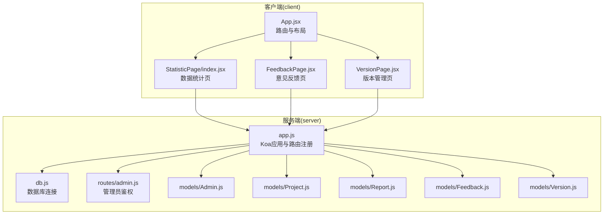
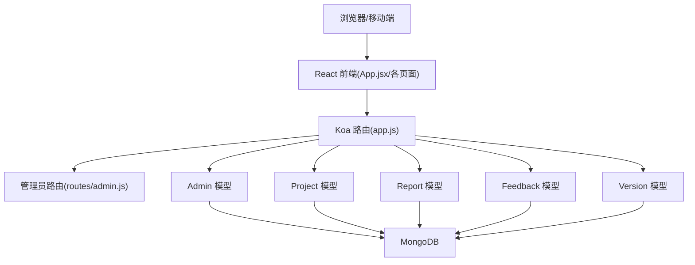
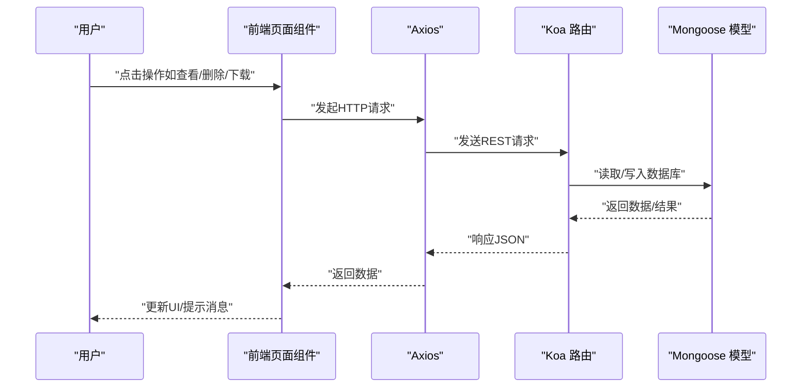
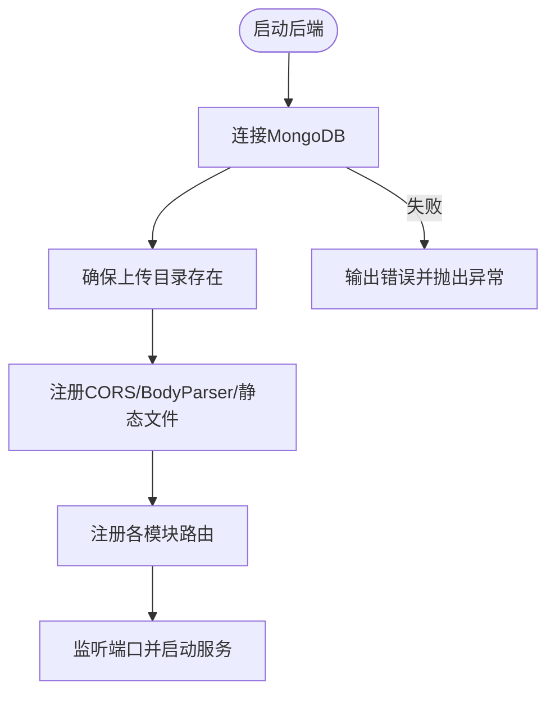
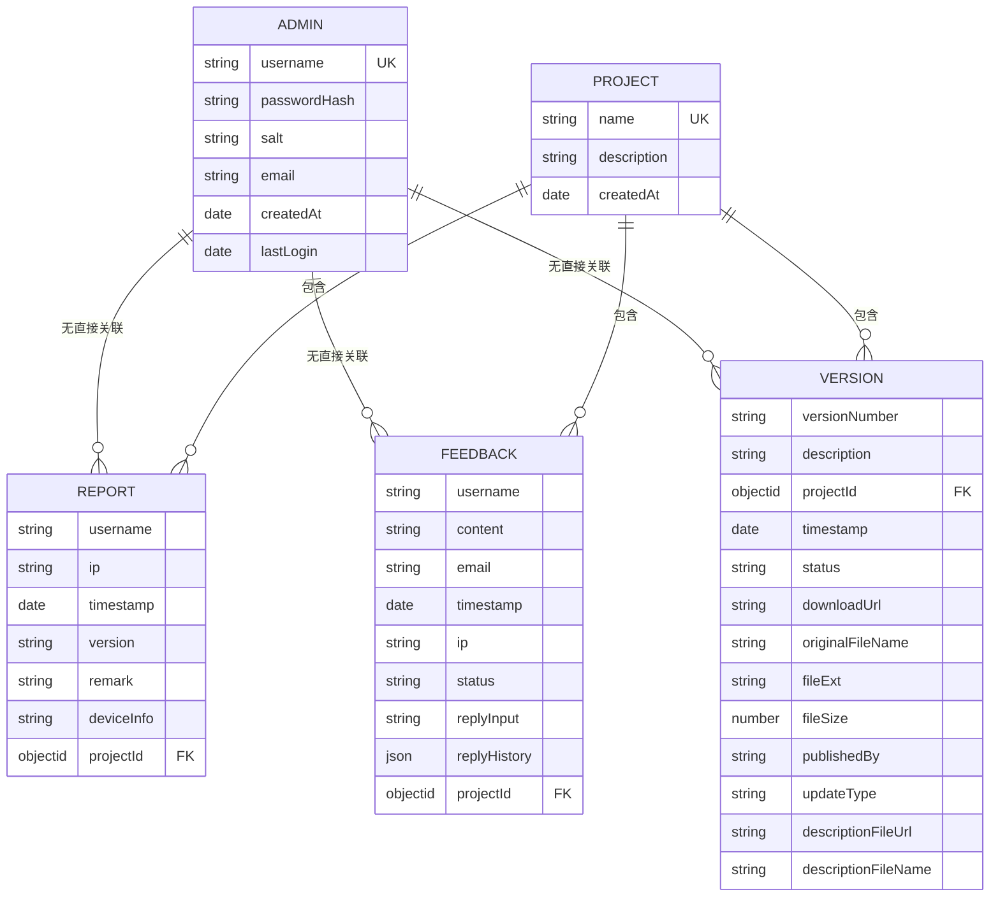
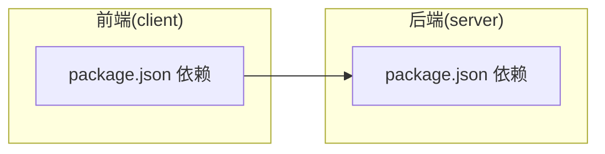

# 项目概述

<cite>
**本文引用的文件**
- [README.md](file://README.md)
- [client/package.json](file://client/package.json)
- [server/package.json](file://server/package.json)
- [client/src/App.jsx](file://client/src/App.jsx)
- [client/src/pages/StatisticPage/index.jsx](file://client/src/pages/StatisticPage/index.jsx)
- [client/src/pages/FeedbackPage.jsx](file://client/src/pages/FeedbackPage.jsx)
- [client/src/pages/VersionPage.jsx](file://client/src/pages/VersionPage.jsx)
- [server/app.js](file://server/app.js)
- [server/db.js](file://server/db.js)
- [server/models/Admin.js](file://server/models/Admin.js)
- [server/models/Feedback.js](file://server/models/Feedback.js)
- [server/models/Project.js](file://server/models/Project.js)
- [server/models/Report.js](file://server/models/Report.js)
- [server/models/Version.js](file://server/models/Version.js)
- [server/routes/admin.js](file://server/routes/admin.js)
</cite>

## 目录
1. [引言](#引言)
2. [项目结构](#项目结构)
3. [核心组件](#核心组件)
4. [架构总览](#架构总览)
5. [详细组件分析](#详细组件分析)
6. [依赖关系分析](#依赖关系分析)
7. [性能考虑](#性能考虑)
8. [故障排查指南](#故障排查指南)
9. [结论](#结论)
10. [附录](#附录)

## 引言
WoaX 是一个基于 React 前端、Koa 后端与 MongoDB 数据库的全栈应用，聚焦于三类核心能力：
- 数据统计：采集并聚合用户行为数据（如时间、用户名、IP、设备信息等），支持按项目维度查看与导出。
- 意见反馈：收集用户反馈，支持状态流转与管理员回复，具备富文本编辑能力。
- 版本管理：管理软件版本信息与安装包，支持草稿/发布/弃用状态、不同更新策略（被动/主动/强制），并提供文件上传与下载。

项目采用前后端分离架构，前端通过 Axios 访问后端 API；后端使用 Koa + 路由模块化组织业务接口；数据持久化使用 Mongoose 连接 MongoDB，模型清晰划分 Admin、Project、Report、Feedback、Version 等实体。

## 项目结构
项目采用“client + server + db”三层组织方式：
- client：React + Vite 前端工程，负责页面渲染、交互与 API 调用。
- server：Node.js + Koa 后端工程，负责路由、中间件、业务逻辑与数据库访问。
- db：本地 JSON 初始化数据（示例），实际运行使用 MongoDB。

**图示来源**
- [client/src/App.jsx](file://client/src/App.jsx#L1-L253)
- [client/src/pages/StatisticPage/index.jsx](file://client/src/pages/StatisticPage/index.jsx#L1-L262)
- [client/src/pages/FeedbackPage.jsx](file://client/src/pages/FeedbackPage.jsx#L1-L496)
- [client/src/pages/VersionPage.jsx](file://client/src/pages/VersionPage.jsx#L1-L800)
- [server/app.js](file://server/app.js#L1-L61)
- [server/db.js](file://server/db.js#L1-L45)
- [server/routes/admin.js](file://server/routes/admin.js#L1-L128)
- [server/models/Admin.js](file://server/models/Admin.js#L1-L32)
- [server/models/Project.js](file://server/models/Project.js#L1-L21)
- [server/models/Report.js](file://server/models/Report.js#L1-L22)
- [server/models/Feedback.js](file://server/models/Feedback.js#L1-L52)
- [server/models/Version.js](file://server/models/Version.js#L1-L62)

**章节来源**
- [README.md](file://README.md#L1-L44)
- [client/package.json](file://client/package.json#L1-L47)
- [server/package.json](file://server/package.json#L1-L24)

## 核心组件
- 前端应用入口与导航
  - App.jsx 负责全局布局、菜单导航、项目切换、登录态管理与路由分发。
  - 通过 axios 请求拦截器统一注入 Bearer Token，实现鉴权。
- 页面组件
  - 数据统计页：聚合展示每用户最后一次记录与全量数据，支持分页、查看详情、删除与自主上报。
  - 意见反馈页：列表展示、状态管理、富文本回复、删除反馈。
  - 版本管理页：版本列表、最新版本展示、发布/更新/删除、文件上传下载与中文文件名修复。
- 后端应用
  - app.js 统一注册 CORS、BodyParser、静态文件服务与各模块路由。
  - db.js 负责连接 MongoDB 并监听连接事件。
  - routes/admin.js 提供登录、令牌校验与管理员中间件。
- 数据模型
  - Admin：用户名、密码哈希与盐值、最后登录时间等。
  - Project：项目名称唯一、描述、时间戳。
  - Report：用户、IP、时间、版本、备注、设备信息与项目关联。
  - Feedback：用户名、内容、邮箱、IP、状态、回复历史与项目关联。
  - Version：版本号、描述、状态、下载链接、文件元信息、更新类型与项目关联。

**章节来源**
- [client/src/App.jsx](file://client/src/App.jsx#L1-L253)
- [client/src/pages/StatisticPage/index.jsx](file://client/src/pages/StatisticPage/index.jsx#L1-L262)
- [client/src/pages/FeedbackPage.jsx](file://client/src/pages/FeedbackPage.jsx#L1-L496)
- [client/src/pages/VersionPage.jsx](file://client/src/pages/VersionPage.jsx#L1-L800)
- [server/app.js](file://server/app.js#L1-L61)
- [server/db.js](file://server/db.js#L1-L45)
- [server/routes/admin.js](file://server/routes/admin.js#L1-L128)
- [server/models/Admin.js](file://server/models/Admin.js#L1-L32)
- [server/models/Project.js](file://server/models/Project.js#L1-L21)
- [server/models/Report.js](file://server/models/Report.js#L1-L22)
- [server/models/Feedback.js](file://server/models/Feedback.js#L1-L52)
- [server/models/Version.js](file://server/models/Version.js#L1-L62)

## 架构总览
整体采用前后端分离架构，前端通过 HTTP 接口与后端交互，后端通过 Mongoose 访问 MongoDB。系统通过 JWT 实现管理员鉴权，路由层统一处理跨域与请求体解析。

**图示来源**
- [client/src/App.jsx](file://client/src/App.jsx#L1-L253)
- [server/app.js](file://server/app.js#L1-L61)
- [server/routes/admin.js](file://server/routes/admin.js#L1-L128)
- [server/db.js](file://server/db.js#L1-L45)
- [server/models/Admin.js](file://server/models/Admin.js#L1-L32)
- [server/models/Project.js](file://server/models/Project.js#L1-L21)
- [server/models/Report.js](file://server/models/Report.js#L1-L22)
- [server/models/Feedback.js](file://server/models/Feedback.js#L1-L52)
- [server/models/Version.js](file://server/models/Version.js#L1-L62)

## 详细组件分析

### 前端应用与页面组件
- 应用入口与导航
  - 负责菜单选择、项目下拉切换、登录态展示与路由分发。
  - 项目切换通过 localStorage 持久化当前项目 ID，并向子组件广播变更事件。
- 数据统计页
  - 聚合分页列表与全量数据用于图表渲染。
  - 支持删除单条记录、查看用户全部记录与分页。
  - 提供“自主上报”弹窗，仅管理员可见。
- 意见反馈页
  - 列表展示反馈内容、状态与时间，支持状态切换与删除。
  - 详情弹窗支持富文本回复与回复历史展示。
  - 提交反馈弹窗用于匿名用户提交。
- 版本管理页
  - 展示最新版本卡片与完整版本列表。
  - 支持设置最新版本、删除版本、文件下载与中文文件名修复。
  - 发布新版本支持上传安装包与描述文件，设置版本号、描述、更新类型与状态。

**图示来源**
- [client/src/pages/StatisticPage/index.jsx](file://client/src/pages/StatisticPage/index.jsx#L58-L109)
- [client/src/pages/FeedbackPage.jsx](file://client/src/pages/FeedbackPage.jsx#L67-L96)
- [client/src/pages/VersionPage.jsx](file://client/src/pages/VersionPage.jsx#L73-L94)
- [server/app.js](file://server/app.js#L48-L55)

**章节来源**
- [client/src/App.jsx](file://client/src/App.jsx#L62-L243)
- [client/src/pages/StatisticPage/index.jsx](file://client/src/pages/StatisticPage/index.jsx#L1-L262)
- [client/src/pages/FeedbackPage.jsx](file://client/src/pages/FeedbackPage.jsx#L1-L496)
- [client/src/pages/VersionPage.jsx](file://client/src/pages/VersionPage.jsx#L1-L800)

### 后端应用与数据库连接
- 应用启动
  - 连接 MongoDB，确保 uploads 目录存在，注册 CORS、BodyParser 与静态文件中间件。
  - 注册各模块路由（report/feedback/version/projects/admin）。
- 数据库连接
  - 统一连接字符串与错误处理，监听断开与错误事件，优雅关闭时关闭连接。
- 管理员鉴权
  - 登录：校验用户名与密码，签发 JWT。
  - 校验：从 Authorization 头解析 JWT，验证有效性。
  - 中间件：校验管理员权限，注入 admin 对象到 ctx.state。

**图示来源**
- [server/app.js](file://server/app.js#L10-L61)
- [server/db.js](file://server/db.js#L9-L45)
- [server/routes/admin.js](file://server/routes/admin.js#L26-L98)

**章节来源**
- [server/app.js](file://server/app.js#L1-L61)
- [server/db.js](file://server/db.js#L1-L45)
- [server/routes/admin.js](file://server/routes/admin.js#L1-L128)

### 数据模型与关系
- 实体关系
  - Admin：独立实体，无外键依赖。
  - Project：项目实体，被 Report/Feedback/Version 关联。
  - Report/Feedback/Version：均包含 projectId 引用 Project。
- 关键字段与约束
  - Admin：用户名唯一、密码哈希与盐值、最后登录时间。
  - Project：名称唯一、描述、时间戳。
  - Report：用户名必填、可选 IP、时间戳、版本、备注、设备信息与项目关联。
  - Feedback：用户名、内容必填，邮箱可选，状态枚举，回复历史数组，项目关联。
  - Version：版本号必填、状态枚举、下载链接、文件元信息、更新类型、描述文件信息与项目关联。

**图示来源**
- [server/models/Admin.js](file://server/models/Admin.js#L4-L14)
- [server/models/Project.js](file://server/models/Project.js#L3-L19)
- [server/models/Report.js](file://server/models/Report.js#L3-L19)
- [server/models/Feedback.js](file://server/models/Feedback.js#L3-L49)
- [server/models/Version.js](file://server/models/Version.js#L3-L60)

**章节来源**
- [server/models/Admin.js](file://server/models/Admin.js#L1-L32)
- [server/models/Project.js](file://server/models/Project.js#L1-L21)
- [server/models/Report.js](file://server/models/Report.js#L1-L22)
- [server/models/Feedback.js](file://server/models/Feedback.js#L1-L52)
- [server/models/Version.js](file://server/models/Version.js#L1-L62)

## 依赖关系分析
- 前端依赖
  - React 生态与 UI 组件库（Ant Design）、路由（react-router-dom）、HTTP 客户端（axios）、图表（recharts）、富文本（react-quill）、构建工具（Vite）。
  - 代理配置指向后端 3001 端口，便于开发调试。
- 后端依赖
  - Koa 核心、路由（koa-router）、CORS（@koa/cors）、BodyParser（koa-bodyparser）、JWT（jsonwebtoken）、MongoDB 驱动（mongoose）、文件上传（multer/@koa/multer）。
- 项目内耦合
  - 前端通过统一的 API 前缀调用后端路由，后端路由与模型一一对应。
  - 管理员鉴权中间件贯穿需要权限的路由。

**图示来源**
- [client/package.json](file://client/package.json#L5-L18)
- [server/package.json](file://server/package.json#L10-L19)

**章节来源**
- [client/package.json](file://client/package.json#L1-L47)
- [server/package.json](file://server/package.json#L1-L24)

## 性能考虑
- 前端
  - 图表渲染建议控制一次性查询的数据量，避免全量数据过大导致卡顿。
  - 分页与懒加载结合，减少 DOM 节点数量。
  - 本地存储项目选择与令牌，降低重复请求。
- 后端
  - 路由层中间件顺序合理，避免重复解析请求体。
  - 静态文件服务仅处理 /uploads/*，减少不必要的 IO。
  - 数据库查询建议在高频字段上建立索引（如 Report 的 username、Feedback 的 status、Version 的 status/updateType）。
- 存储与网络
  - 上传目录与文件命名规范化，避免中文乱码影响下载体验。
  - 大文件下载建议使用流式传输与断点续传策略（当前实现为一次性下载）。

## 故障排查指南
- 启动失败
  - 数据库连接失败：检查 MongoDB URI 是否正确，服务是否运行。
  - 端口占用：修改后端监听端口或释放端口。
- 鉴权失败
  - 登录返回 401：确认用户名与密码是否匹配。
  - 令牌无效：确认 Authorization 头格式与签名密钥一致。
- 文件下载异常
  - 中文文件名乱码：使用内置的文件名修复逻辑，确保后端保存原始文件名。
  - 下载链接为空：确认版本状态为已发布且下载链接已生成。
- 权限不足
  - 操作被拒绝：确认当前登录管理员身份与操作所需权限。

**章节来源**
- [server/db.js](file://server/db.js#L9-L45)
- [server/routes/admin.js](file://server/routes/admin.js#L26-L98)
- [client/src/pages/VersionPage.jsx](file://client/src/pages/VersionPage.jsx#L319-L404)

## 结论
WoaX 以清晰的前后端分层、模块化的路由与规范的数据模型，实现了数据统计、意见反馈与版本管理三大核心功能。项目采用成熟的 React + Koa + MongoDB 技术栈，具备良好的扩展性与维护性。建议后续在数据库索引、文件上传优化与权限细化方面持续改进，以提升性能与用户体验。

## 附录
- 快速开始
  - 安装与运行
    - 前端：进入 client 目录，安装依赖并启动开发服务器。
    - 后端：进入 server 目录，安装依赖并启动服务。
  - 环境变量
    - 后端需配置数据库连接字符串与 JWT 密钥（可通过 .env 文件）。
  - 默认管理员
    - 用户名：admin；密码：admin123（首次启动自动创建）。
- 基本使用说明
  - 项目管理：在顶部菜单选择项目，或通过“项目管理”按钮新增项目。
  - 数据统计：查看聚合列表与图表，支持删除与查看详情。
  - 意见反馈：查看列表、更新状态、回复用户或删除反馈。
  - 版本管理：发布新版本、设置最新版本、下载安装包与描述文件。

**章节来源**
- [README.md](file://README.md#L19-L44)
- [server/.env](file://server/.env)
- [server/routes/admin.js](file://server/routes/admin.js#L8-L21)