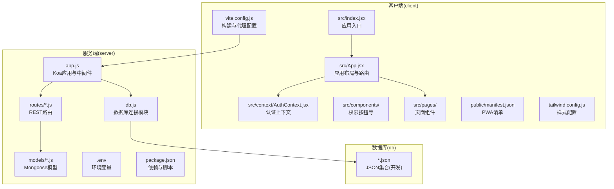
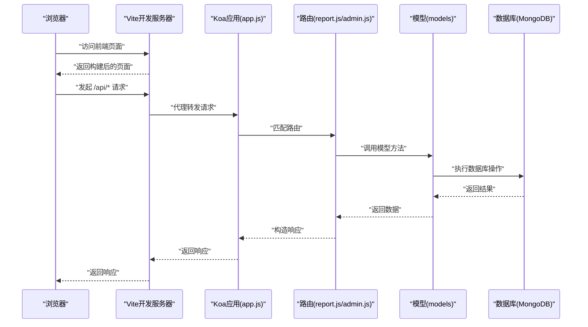
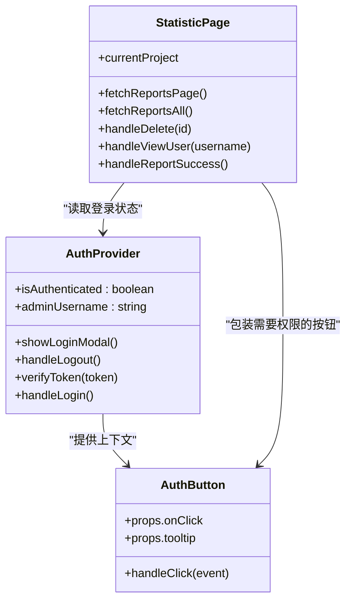
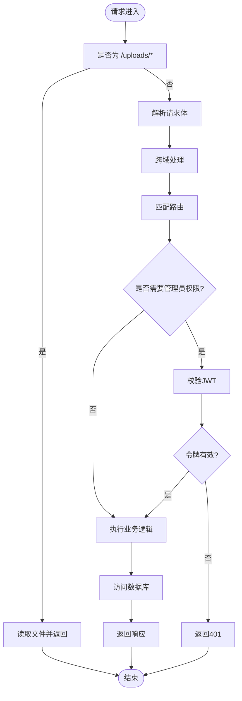
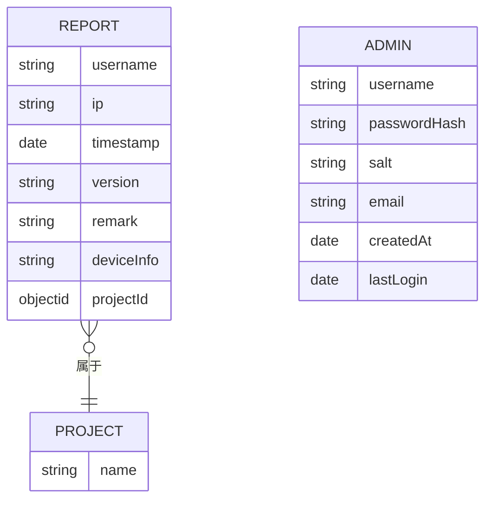
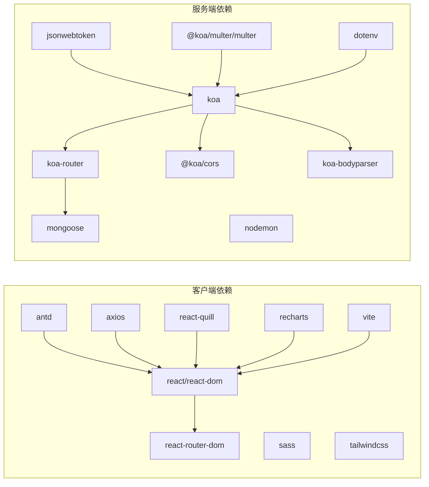

# 项目结构

<cite>
**本文引用的文件**
- [README.md](file://README.md)
- [client/package.json](file://client/package.json)
- [client/vite.config.js](file://client/vite.config.js)
- [client/src/index.jsx](file://client/src/index.jsx)
- [client/src/App.jsx](file://client/src/App.jsx)
- [client/src/context/AuthContext.jsx](file://client/src/context/AuthContext.jsx)
- [client/src/components/AuthButton.jsx](file://client/src/components/AuthButton.jsx)
- [client/src/pages/StatisticPage/index.jsx](file://client/src/pages/StatisticPage/index.jsx)
- [client/public/manifest.json](file://client/public/manifest.json)
- [client/tailwind.config.js](file://client/tailwind.config.js)
- [server/package.json](file://server/package.json)
- [server/app.js](file://server/app.js)
- [server/db.js](file://server/db.js)
- [server/.env](file://server/.env)
- [server/routes/report.js](file://server/routes/report.js)
- [server/routes/admin.js](file://server/routes/admin.js)
- [server/models/Report.js](file://server/models/Report.js)
- [server/models/Admin.js](file://server/models/Admin.js)
</cite>

## 目录
1. [简介](#简介)
2. [项目结构](#项目结构)
3. [核心组件](#核心组件)
4. [架构总览](#架构总览)
5. [详细组件分析](#详细组件分析)
6. [依赖分析](#依赖分析)
7. [性能考虑](#性能考虑)
8. [故障排除指南](#故障排除指南)
9. [结论](#结论)
10. [附录](#附录)

## 简介
本项目是一个基于 React 前端、Node.js + Koa 后端与 MongoDB 数据库的全栈应用，主要功能包括数据统计、意见反馈与版本更新通知。项目采用前后端分离架构，通过 RESTful 接口进行通信，并使用 JWT 实现管理员认证。

## 项目结构
项目采用“根目录 + 子目录”的组织方式，分为前端 client、后端 server 与数据存储 db 三部分：
- client：React + Vite 前端应用，负责用户界面与交互，通过代理访问后端接口。
- server：Node.js + Koa 后端服务，提供 REST API、数据库连接与静态资源服务。
- db：本地 JSON 文件模拟数据库（开发阶段），包含管理员、反馈、项目、统计数据与版本信息等集合。

**图示来源**
- [client/src/index.jsx](file://client/src/index.jsx#L1-L15)
- [client/src/App.jsx](file://client/src/App.jsx#L1-L253)
- [client/vite.config.js](file://client/vite.config.js#L1-L50)
- [server/app.js](file://server/app.js#L1-L61)
- [server/db.js](file://server/db.js#L1-L45)
- [server/.env](file://server/.env#L1-L9)

**章节来源**
- [README.md](file://README.md#L1-L44)
- [client/package.json](file://client/package.json#L1-L47)
- [server/package.json](file://server/package.json#L1-L24)

## 核心组件
- 客户端入口与路由
  - 入口文件负责挂载 React 应用与路由容器，开启浏览器路由模式。
  - 应用主组件负责顶部导航、项目切换、页面路由与登录弹窗。
- 认证系统
  - 认证上下文提供登录状态、令牌校验与登录弹窗控制；权限按钮组件封装需要管理员权限的交互。
- 服务端入口与中间件
  - Koa 应用注册 CORS、BodyParser、静态文件服务与路由；统一暴露 /api/* 接口。
- 数据库连接
  - Mongoose 连接 MongoDB，监听连接事件并在进程退出时关闭连接。
- 路由与模型
  - 报表路由提供数据统计、用户记录查询、上报与删除；管理员路由提供登录与令牌验证；模型定义集合结构。

**章节来源**
- [client/src/index.jsx](file://client/src/index.jsx#L1-L15)
- [client/src/App.jsx](file://client/src/App.jsx#L1-L253)
- [client/src/context/AuthContext.jsx](file://client/src/context/AuthContext.jsx#L1-L155)
- [client/src/components/AuthButton.jsx](file://client/src/components/AuthButton.jsx#L1-L43)
- [server/app.js](file://server/app.js#L1-L61)
- [server/db.js](file://server/db.js#L1-L45)
- [server/routes/report.js](file://server/routes/report.js#L1-L271)
- [server/routes/admin.js](file://server/routes/admin.js#L1-L128)
- [server/models/Report.js](file://server/models/Report.js#L1-L22)
- [server/models/Admin.js](file://server/models/Admin.js#L1-L32)

## 架构总览
前端通过 Vite 开发服务器启动，使用代理将 /api 请求转发至后端 Koa 服务；后端通过 Mongoose 连接 MongoDB，提供 REST 接口并提供静态文件服务（上传目录）。管理员认证采用 JWT，权限按钮组件在未登录时拦截操作并引导登录。

**图示来源**
- [client/vite.config.js](file://client/vite.config.js#L14-L22)
- [server/app.js](file://server/app.js#L34-L55)
- [server/routes/report.js](file://server/routes/report.js#L8-L88)
- [server/routes/admin.js](file://server/routes/admin.js#L26-L98)
- [server/models/Report.js](file://server/models/Report.js#L1-L22)
- [server/models/Admin.js](file://server/models/Admin.js#L1-L32)

## 详细组件分析

### 客户端组件分析
- 应用入口与路由
  - 入口文件设置路由容器与全局样式，渲染根组件。
  - 主应用组件负责顶部导航栏、项目下拉选择、页面路由与登录弹窗。
- 页面组件
  - 统计页面负责聚合每用户最后一次上报数据、分页展示、图表数据与用户详情弹窗。
- 认证上下文与权限按钮
  - 认证上下文提供登录状态、令牌校验、登录弹窗控制与注销；权限按钮在未登录时禁用并提示需要管理员权限。

**图示来源**
- [client/src/context/AuthContext.jsx](file://client/src/context/AuthContext.jsx#L8-L112)
- [client/src/components/AuthButton.jsx](file://client/src/components/AuthButton.jsx#L12-L39)
- [client/src/pages/StatisticPage/index.jsx](file://client/src/pages/StatisticPage/index.jsx#L12-L262)

**章节来源**
- [client/src/index.jsx](file://client/src/index.jsx#L1-L15)
- [client/src/App.jsx](file://client/src/App.jsx#L62-L243)
- [client/src/context/AuthContext.jsx](file://client/src/context/AuthContext.jsx#L1-L155)
- [client/src/components/AuthButton.jsx](file://client/src/components/AuthButton.jsx#L1-L43)
- [client/src/pages/StatisticPage/index.jsx](file://client/src/pages/StatisticPage/index.jsx#L1-L262)

### 服务端组件分析
- 应用入口与中间件
  - 注册 CORS、BodyParser；确保上传目录存在；提供 /uploads/* 静态文件服务；注册各模块路由。
- 路由与权限
  - 报表路由提供数据统计、用户记录查询、上报与删除；管理员路由提供登录与令牌验证；报表路由中使用管理员权限中间件保护敏感操作。
- 数据库连接
  - 连接 MongoDB，监听断开与错误事件；进程退出时关闭连接。

**图示来源**
- [server/app.js](file://server/app.js#L34-L55)
- [server/routes/admin.js](file://server/routes/admin.js#L100-L125)
- [server/routes/report.js](file://server/routes/report.js#L204-L229)

**章节来源**
- [server/app.js](file://server/app.js#L1-L61)
- [server/routes/report.js](file://server/routes/report.js#L1-L271)
- [server/routes/admin.js](file://server/routes/admin.js#L1-L128)
- [server/db.js](file://server/db.js#L1-L45)

### 数据模型分析
- 报表模型
  - 定义字段包括用户名、IP、时间戳、版本、备注、设备信息与项目关联；集合名为 statistics。
- 管理员模型
  - 定义用户名、密码哈希、盐、邮箱、创建时间与最后登录时间；集合名为 admins；提供密码加密与验证方法。

**图示来源**
- [server/models/Report.js](file://server/models/Report.js#L3-L18)
- [server/models/Admin.js](file://server/models/Admin.js#L4-L14)

**章节来源**
- [server/models/Report.js](file://server/models/Report.js#L1-L22)
- [server/models/Admin.js](file://server/models/Admin.js#L1-L32)

## 依赖分析
- 客户端依赖
  - React 生态与 UI 组件库（Ant Design）、路由（React Router）、HTTP 客户端（Axios）、可视化（Recharts）、样式工具（TailwindCSS/Sass/Vite）。
- 服务端依赖
  - Web 框架（Koa）、路由（Koa Router）、CORS、请求体解析、MongoDB 驱动（Mongoose）、JWT、文件上传（Multer）与开发工具（Nodemon）。
- 配置与脚本
  - 前端使用 Vite 作为开发服务器与打包工具，配置代理指向后端端口；后端使用 NPM 脚本启动与开发。

**图示来源**
- [client/package.json](file://client/package.json#L5-L18)
- [server/package.json](file://server/package.json#L10-L19)

**章节来源**
- [client/package.json](file://client/package.json#L1-L47)
- [server/package.json](file://server/package.json#L1-L24)

## 性能考虑
- 前端
  - 使用 Vite 的快速冷启动与热更新提升开发体验；合理拆分组件与懒加载减少首屏体积；在统计页面使用分页与聚合查询避免一次性加载大量数据。
- 后端
  - 对于大数据量查询，优先使用聚合管道与分页；确保数据库索引（如用户名、时间戳、项目 ID）以提升查询性能；限制上传文件大小与数量，避免资源滥用。
- 数据库
  - 在开发阶段可使用 JSON 文件模拟集合，便于快速迭代；生产环境应迁移到 MongoDB 并启用副本集与备份策略。

## 故障排除指南
- 无法连接数据库
  - 检查环境变量中的数据库 URI 是否正确；确认 MongoDB 服务已启动；查看连接模块的日志输出。
- 代理请求失败
  - 确认前端 Vite 代理配置指向正确的后端地址与端口；检查后端是否正常启动。
- 登录失败或权限不足
  - 确认管理员账户是否存在且密码正确；检查 JWT 秘钥是否一致；确认请求头中携带有效的 Bearer 令牌。
- 静态文件无法访问
  - 确认上传目录存在且具有读取权限；检查路径前缀是否为 /uploads。

**章节来源**
- [server/db.js](file://server/db.js#L10-L24)
- [client/vite.config.js](file://client/vite.config.js#L14-L22)
- [server/app.js](file://server/app.js#L24-L28)
- [server/routes/admin.js](file://server/routes/admin.js#L26-L98)

## 结论
本项目采用清晰的前后端分离架构，前端使用现代化工具链提升开发效率，后端通过 Koa 与 Mongoose 提供稳定的 API 与数据持久化能力。通过 JWT 实现管理员认证，配合权限按钮组件实现细粒度的权限控制。建议在生产环境中完善数据库迁移、安全加固与监控告警机制。

## 附录
- 项目最佳实践与命名规范
  - 目录命名：小写 + 复数形式（如 pages、components、models、routes）。
  - 文件命名：页面组件使用 PascalCase（如 StatisticPage/index.jsx），通用组件使用 PascalCase（如 AuthButton.jsx），样式文件使用语义化命名（如 index.scss、reset.css）。
  - 路由与模型：路由文件按功能划分（如 report.js、admin.js），模型文件与集合一一对应（如 Report.js 对应 statistics 集合）。
  - 配置文件：前端使用 vite.config.js 与 tailwind.config.js，后端使用 .env 与 package.json。
  - 扩展与维护：新增功能时遵循“页面组件 -> 路由 -> 模型”的顺序；为每个路由添加必要的权限校验；在开发阶段使用默认管理员账号快速验证流程。