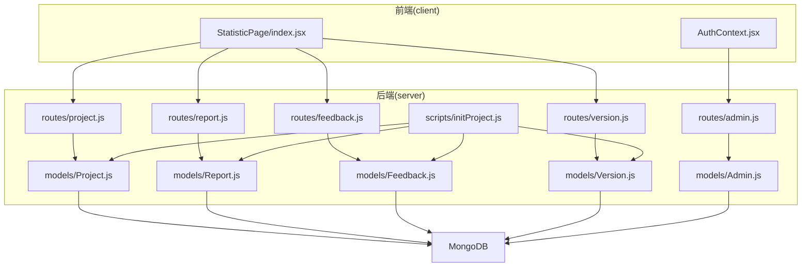
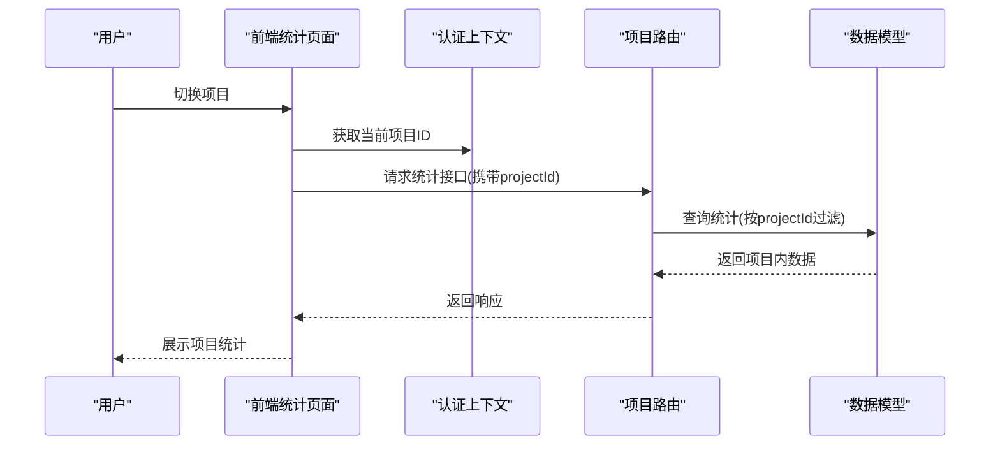
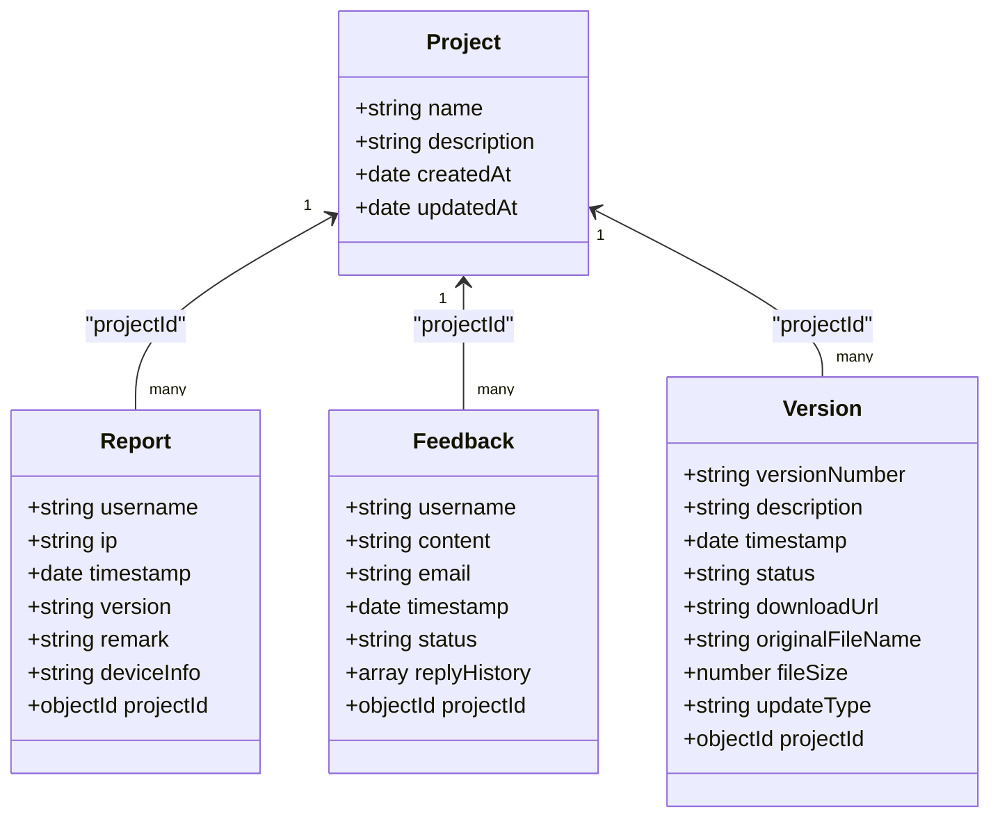
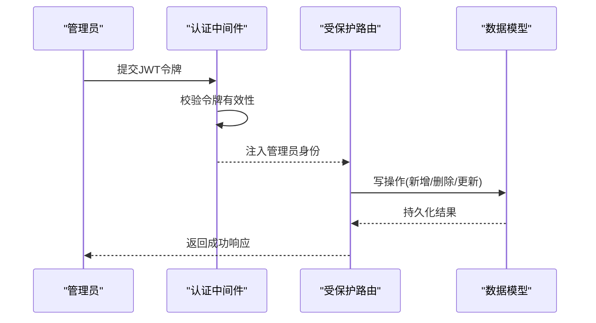
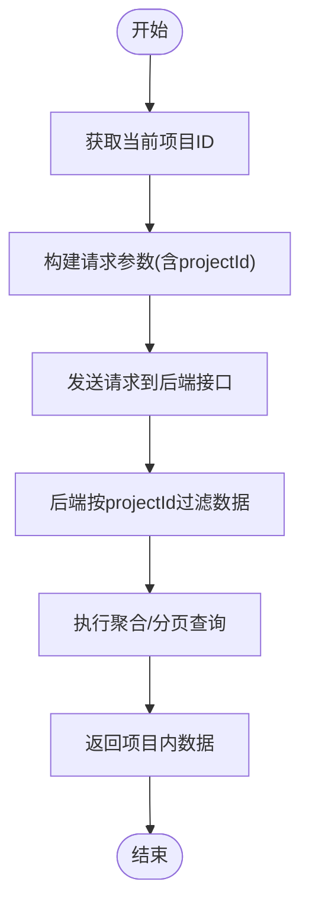
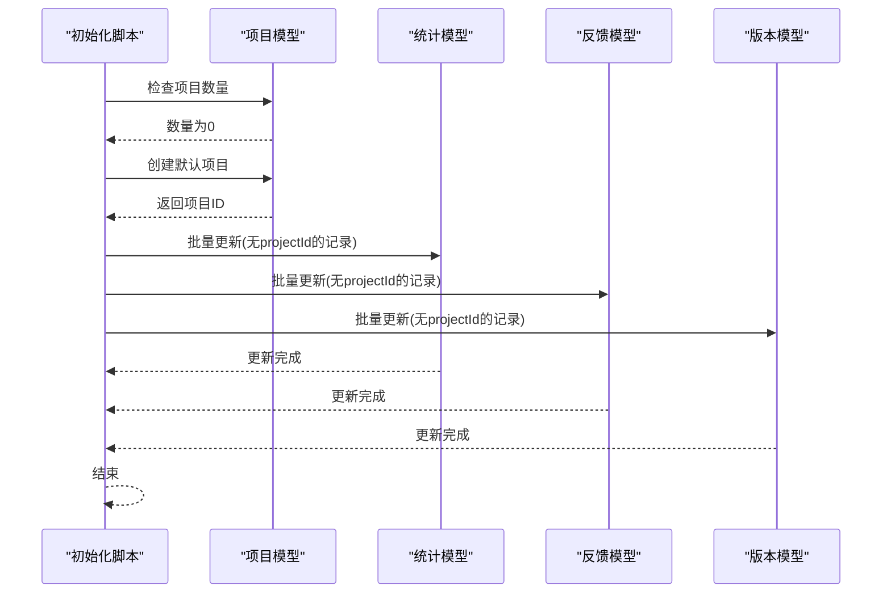
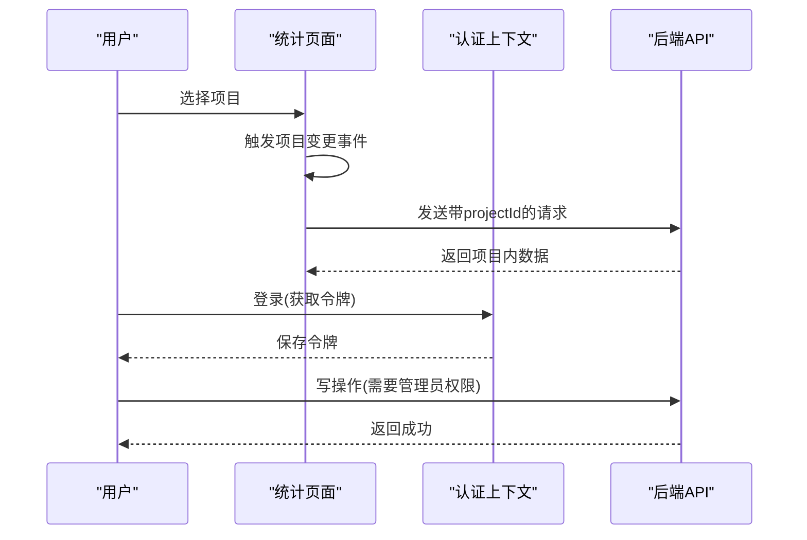
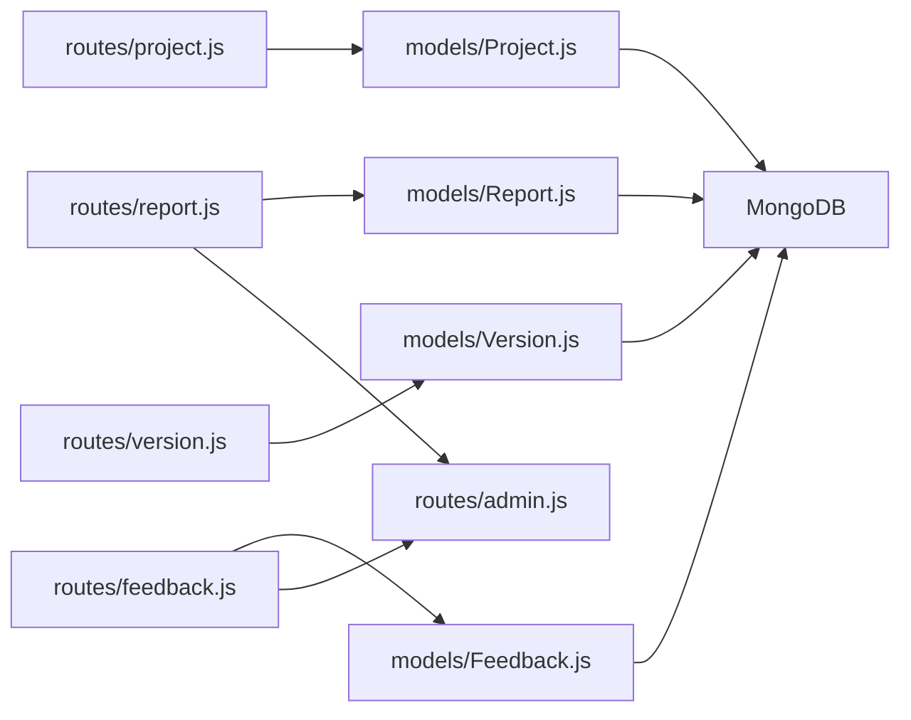

# 项目管理功能

<cite>
**本文档引用的文件**
- [README.md](file://README.md)
- [Project.js](file://server/models/Project.js)
- [project.js](file://server/routes/project.js)
- [Report.js](file://server/models/Report.js)
- [report.js](file://server/routes/report.js)
- [Feedback.js](file://server/models/Feedback.js)
- [feedback.js](file://server/routes/feedback.js)
- [Version.js](file://server/models/Version.js)
- [version.js](file://server/routes/version.js)
- [Admin.js](file://server/models/Admin.js)
- [admin.js](file://server/routes/admin.js)
- [AuthContext.jsx](file://client/src/context/AuthContext.jsx)
- [StatisticPage/index.jsx](file://client/src/pages/StatisticPage/index.jsx)
- [woax.projects.json](file://db/woax.projects.json)
- [initProject.js](file://server/scripts/initProject.js)
</cite>

## 目录
1. [简介](#简介)
2. [项目结构](#项目结构)
3. [核心组件](#核心组件)
4. [架构总览](#架构总览)
5. [详细组件分析](#详细组件分析)
6. [依赖关系分析](#依赖关系分析)
7. [性能考虑](#性能考虑)
8. [故障排除指南](#故障排除指南)
9. [结论](#结论)
10. [附录](#附录)

## 简介
本项目是一个基于 React + Koa + MongoDB 的全栈应用，提供多项目支持下的数据统计、意见反馈与版本更新通知功能。本文档聚焦于“项目管理功能”，涵盖以下主题：
- 多项目支持的实现机制：项目创建、删除、切换与数据迁移
- ProjectModel 数据模型设计：属性、关联关系与业务规则
- 项目数据隔离与权限控制策略
- 项目配置管理、统计范围控制与资源分配
- 项目生命周期管理、数据迁移与备份恢复建议
- 最佳实践与使用指南

## 项目结构
项目采用前后端分离架构，前端使用 React，后端使用 Koa，数据存储在 MongoDB。项目管理功能主要涉及后端的 Project 模型与路由，以及前端的统计页面与认证上下文。

**图示来源**
- [StatisticPage/index.jsx](file://client/src/pages/StatisticPage/index.jsx#L1-L262)
- [AuthContext.jsx](file://client/src/context/AuthContext.jsx#L1-L155)
- [project.js](file://server/routes/project.js#L1-L226)
- [report.js](file://server/routes/report.js#L1-L271)
- [feedback.js](file://server/routes/feedback.js#L1-L187)
- [version.js](file://server/routes/version.js#L1-L200)
- [admin.js](file://server/routes/admin.js#L1-L128)
- [Project.js](file://server/models/Project.js#L1-L21)
- [Report.js](file://server/models/Report.js#L1-L22)
- [Feedback.js](file://server/models/Feedback.js#L1-L52)
- [Version.js](file://server/models/Version.js#L1-L62)
- [Admin.js](file://server/models/Admin.js#L1-L32)
- [initProject.js](file://server/scripts/initProject.js#L1-L61)

**章节来源**
- [README.md](file://README.md#L1-L44)
- [project.js](file://server/routes/project.js#L1-L226)
- [Project.js](file://server/models/Project.js#L1-L21)

## 核心组件
- 项目模型与路由：负责项目的增删改查、数据迁移与项目级数据隔离
- 统计页面与数据访问：通过项目 ID 控制统计范围，实现跨模块的项目切换
- 认证与权限：管理员登录、令牌校验与受保护的写操作
- 初始化脚本：自动创建默认项目并迁移历史数据

**章节来源**
- [project.js](file://server/routes/project.js#L1-L226)
- [Project.js](file://server/models/Project.js#L1-L21)
- [StatisticPage/index.jsx](file://client/src/pages/StatisticPage/index.jsx#L1-L262)
- [AuthContext.jsx](file://client/src/context/AuthContext.jsx#L1-L155)
- [admin.js](file://server/routes/admin.js#L1-L128)
- [initProject.js](file://server/scripts/initProject.js#L1-L61)

## 架构总览
项目管理功能围绕“项目”这一核心实体展开，所有统计数据、反馈与版本信息均通过 projectId 字段与项目建立关联。前端通过当前选中的项目 ID 控制数据查询范围；后端在路由层强制要求提供项目 ID 并进行项目级过滤，确保数据隔离。

**图示来源**
- [StatisticPage/index.jsx](file://client/src/pages/StatisticPage/index.jsx#L33-L55)
- [report.js](file://server/routes/report.js#L9-L88)
- [project.js](file://server/routes/project.js#L10-L25)

## 详细组件分析

### 项目模型与路由（ProjectModel）
- 数据模型设计
  - 名称唯一性约束：防止重复项目名
  - 时间戳字段：自动维护创建与更新时间
  - 与统计、反馈、版本模型的外键关联：通过 ObjectId 引用 Project
- 路由能力
  - 列表查询：按创建时间倒序返回项目列表
  - 详情查询：按 ID 获取项目信息
  - 创建项目：校验名称唯一性后保存
  - 更新项目：可更新名称与描述，名称更新前进行冲突检查
  - 删除项目：限制系统至少保留一个项目，避免空配置
  - 数据迁移：将未归属任何项目的统计数据、反馈与版本迁移到目标项目

**图示来源**
- [Project.js](file://server/models/Project.js#L1-L21)
- [Report.js](file://server/models/Report.js#L1-L22)
- [Feedback.js](file://server/models/Feedback.js#L1-L52)
- [Version.js](file://server/models/Version.js#L1-L62)

**章节来源**
- [Project.js](file://server/models/Project.js#L1-L21)
- [project.js](file://server/routes/project.js#L1-L226)

### 项目数据隔离与权限控制
- 数据隔离
  - 所有读取接口均要求提供 projectId 参数，并在查询阶段按项目过滤
  - 统计聚合与分页查询均以项目维度进行
- 权限控制
  - 管理员登录与令牌校验：JWT 令牌有效期 24 小时
  - 受保护的写操作：新增统计、删除统计、新增反馈、更新反馈状态、删除反馈、版本发布等均需管理员权限
  - 删除项目前的项目数量校验：确保系统至少保留一个项目

**图示来源**
- [admin.js](file://server/routes/admin.js#L100-L125)
- [report.js](file://server/routes/report.js#L204-L268)
- [feedback.js](file://server/routes/feedback.js#L113-L184)
- [project.js](file://server/routes/project.js#L151-L187)

**章节来源**
- [report.js](file://server/routes/report.js#L9-L88)
- [feedback.js](file://server/routes/feedback.js#L8-L187)
- [admin.js](file://server/routes/admin.js#L100-L125)
- [project.js](file://server/routes/project.js#L151-L187)

### 项目配置管理与统计范围控制
- 项目配置
  - 项目名称唯一且不可为空，描述可选
  - 项目创建与更新自动记录时间戳
- 统计范围控制
  - 前端通过 currentProject._id 控制请求参数
  - 后端在聚合与分页查询中强制过滤 projectId
  - 用户详情页按用户名与项目 ID 双重条件查询

**图示来源**
- [StatisticPage/index.jsx](file://client/src/pages/StatisticPage/index.jsx#L57-L109)
- [report.js](file://server/routes/report.js#L9-L88)

**章节来源**
- [StatisticPage/index.jsx](file://client/src/pages/StatisticPage/index.jsx#L33-L109)
- [report.js](file://server/routes/report.js#L9-L88)

### 项目生命周期管理与数据迁移
- 生命周期
  - 初始化：若无项目则创建默认项目并迁移历史数据
  - 运行期：支持创建、更新、删除项目
  - 迁移：支持将未归属项目的统计数据、反馈与版本迁移到目标项目
- 数据迁移流程
  - 校验目标项目存在性
  - 对统计、反馈、版本三类集合执行批量更新，补全 projectId

**图示来源**
- [initProject.js](file://server/scripts/initProject.js#L8-L61)
- [project.js](file://server/routes/project.js#L189-L224)

**章节来源**
- [initProject.js](file://server/scripts/initProject.js#L1-L61)
- [project.js](file://server/routes/project.js#L189-L224)
- [woax.projects.json](file://db/woax.projects.json#L1-L28)

### 前端项目切换与认证集成
- 项目切换
  - 统计页面监听项目变更事件，动态刷新数据
  - 通过 currentProject._id 控制请求参数
- 认证集成
  - 登录成功后保存 JWT 令牌，后续请求携带 Authorization 头
  - 管理员权限用于受保护的写操作

**图示来源**
- [StatisticPage/index.jsx](file://client/src/pages/StatisticPage/index.jsx#L33-L55)
- [AuthContext.jsx](file://client/src/context/AuthContext.jsx#L62-L92)
- [admin.js](file://server/routes/admin.js#L26-L98)

**章节来源**
- [StatisticPage/index.jsx](file://client/src/pages/StatisticPage/index.jsx#L1-L262)
- [AuthContext.jsx](file://client/src/context/AuthContext.jsx#L1-L155)
- [admin.js](file://server/routes/admin.js#L1-L128)

## 依赖关系分析
- 模块耦合
  - 项目路由依赖项目模型与统计、反馈、版本模型
  - 统计与反馈路由依赖管理员中间件进行权限控制
  - 前端统计页面依赖项目路由与认证上下文
- 外部依赖
  - MongoDB 存储与 Mongoose ORM
  - JWT 实现管理员令牌校验
  - Koa 路由与中间件体系

**图示来源**
- [project.js](file://server/routes/project.js#L1-L226)
- [report.js](file://server/routes/report.js#L1-L271)
- [feedback.js](file://server/routes/feedback.js#L1-L187)
- [version.js](file://server/routes/version.js#L1-L200)
- [Project.js](file://server/models/Project.js#L1-L21)
- [Report.js](file://server/models/Report.js#L1-L22)
- [Feedback.js](file://server/models/Feedback.js#L1-L52)
- [Version.js](file://server/models/Version.js#L1-L62)

**章节来源**
- [project.js](file://server/routes/project.js#L1-L226)
- [report.js](file://server/routes/report.js#L1-L271)
- [feedback.js](file://server/routes/feedback.js#L1-L187)
- [version.js](file://server/routes/version.js#L1-L200)

## 性能考虑
- 聚合优化
  - 统计聚合先按时间排序再按用户名分组，减少重复扫描
  - 分页查询使用 skip/limit，建议在高基数场景下引入游标分页
- 索引建议
  - 在统计、反馈、版本模型的 projectId 字段上建立索引，提升过滤性能
  - 在 Report 的 username 字段上建立索引，优化用户详情查询
- 缓存策略
  - 对热门项目的数据统计结果进行短期缓存，降低数据库压力
- 并发控制
  - 批量迁移使用 Promise.all 并行处理，缩短迁移时间

[本节为通用性能建议，不直接分析具体文件，故无章节来源]

## 故障排除指南
- 无法获取项目列表
  - 检查数据库连接与项目集合是否存在
  - 确认请求头中未携带无效的 Authorization
- 项目删除失败
  - 确认系统中至少保留一个项目
  - 检查目标项目是否存在
- 数据迁移失败
  - 确认目标项目 ID 正确
  - 检查统计、反馈、版本集合中是否存在未归属记录
- 权限不足
  - 确认管理员登录成功并持有有效 JWT 令牌
  - 检查请求头 Authorization 是否正确传递

**章节来源**
- [project.js](file://server/routes/project.js#L151-L187)
- [report.js](file://server/routes/report.js#L204-L268)
- [feedback.js](file://server/routes/feedback.js#L113-L184)
- [admin.js](file://server/routes/admin.js#L100-L125)

## 结论
本项目通过明确的项目模型与路由设计，实现了多项目支持下的数据隔离与权限控制。前端以项目 ID 为统计范围边界，后端在路由层强制过滤，配合管理员权限中间件，确保了系统的安全性与一致性。初始化脚本与数据迁移能力进一步提升了系统的可用性与可维护性。

[本节为总结性内容，不直接分析具体文件，故无章节来源]

## 附录
- 使用建议
  - 新增项目后，优先执行数据迁移，确保历史数据归属到新项目
  - 为高频查询字段建立索引，提升查询性能
  - 定期备份数据库，确保项目数据安全
- 开发参考
  - 项目模型与路由定义清晰，便于扩展新项目相关功能
  - 前端统计页面与认证上下文解耦良好，便于独立演进

[本节为补充说明，不直接分析具体文件，故无章节来源]